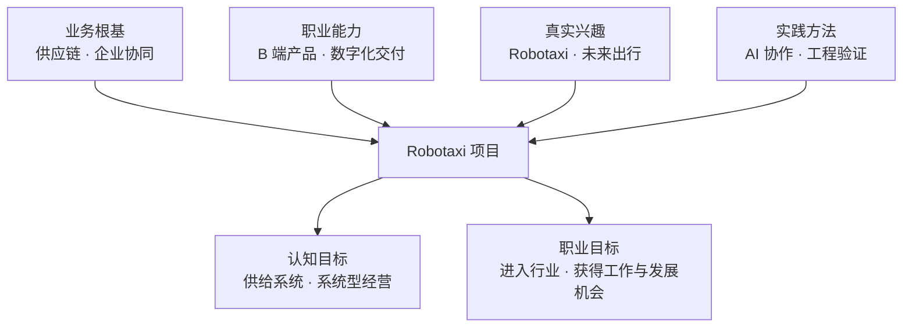
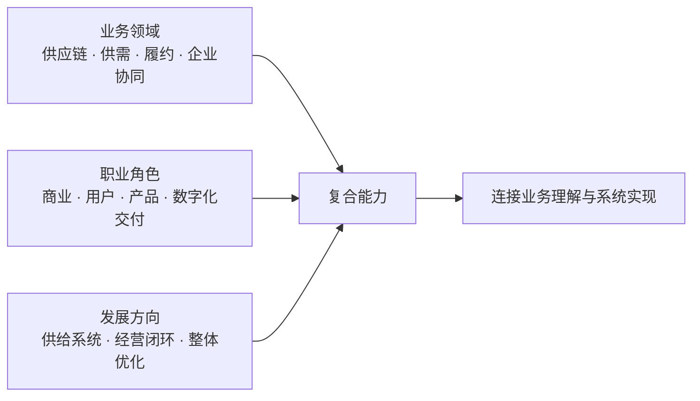
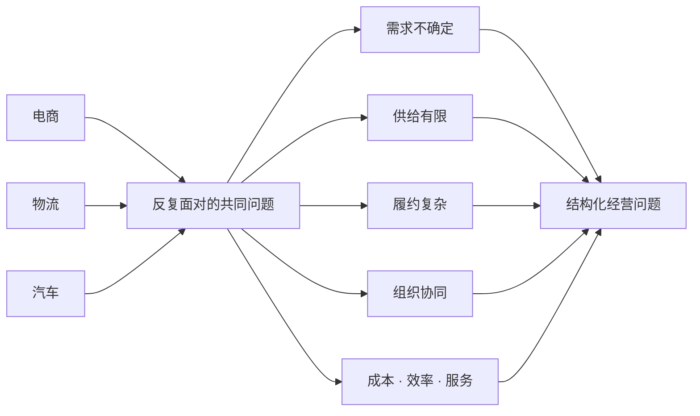
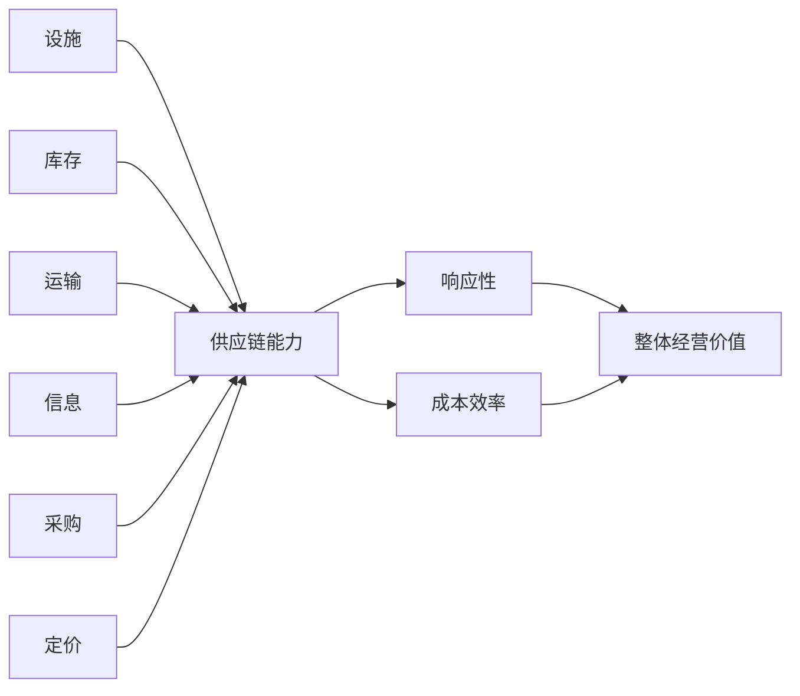
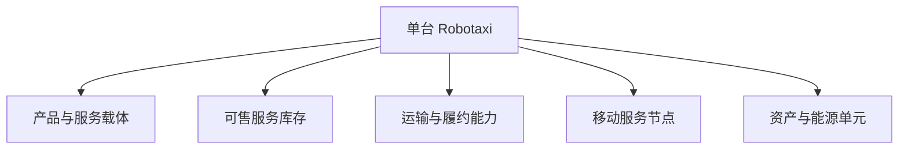
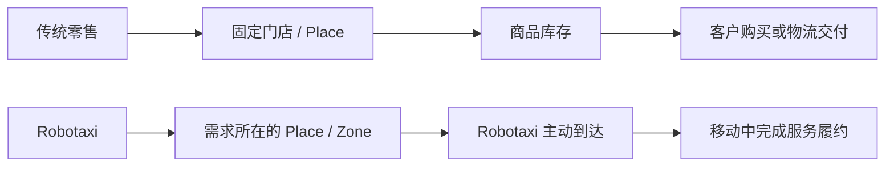
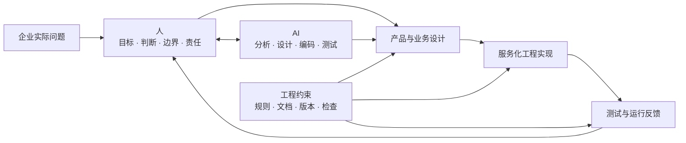
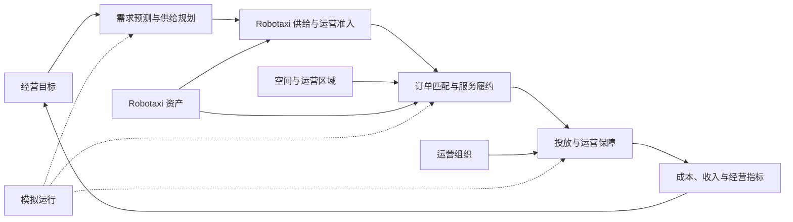
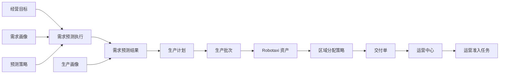

# Robotaxi 城市运营模拟平台

> 我的业务根基是供应链与企业协同，职业方法是 B 端产品设计与数字化价值交付，发展方向是理解并构建完整的供给经营系统。

## 为什么做这个项目

> 以供应链与企业协同经验为基础，以 B 端产品经理的产品化和数字化能力为方法，通过 Robotaxi 与 AI 协作实践，探索如何将复杂业务转化为可运行、可验证、可持续优化的供给经营系统。

我喜欢 Robotaxi，也希望进入这个行业工作。这是我做这个项目最直接、最现实的原因。

Robotaxi 把我长期关注的供需、履约、资产、调度、组织、成本和系统问题集中在一起，也代表着未来出行方式和运营模式的重要变化。我愿意持续学习它，并希望在其中找到能够发挥已有经验、继续成长和创造价值的位置。

这个项目对我有五层含义：

| 核心 | 含义 |
| --- | --- |
| 专业复盘 | 重新理解十多年供应链与企业协同经验的底层能力 |
| 行业学习 | 以 Robotaxi 为场景，学习复杂城市运营问题 |
| 认知升级 | 从业务与供应链问题，进一步理解完整供给系统和系统型经营闭环 |
| AI 实践 | 探索 AI 辅助产品设计、工程实现和持续验证的方法 |
| 职业探索 | 用实际作品表达兴趣和能力，争取进入行业工作的机会 |

我没有参与过真实的城市 Robotaxi 运营，也不是自动驾驶技术专家。如果只说“对行业感兴趣”，并不足以说明我能做什么。因此我选择把理解做成一个可以查看、运行和讨论的项目。

它不能证明我已经具备行业答案，也不会替代真实工作经验。它能诚实呈现的是：我如何理解问题、如何迁移过去的经验、如何借助 AI 完成产品与工程实践，以及我还缺少什么。我希望通过这个过程认真准备自己，并争取一个进入 Robotaxi 行业学习、工作和继续发展的机会。

## 我的专业结构

供应链是我的**业务领域**，B 端产品经理是我的**职业角色**，系统型经营是我的**发展方向**。三者不是替代关系，而是逐层扩展。

### 从经历到能力

### 当前沉淀的核心能力

> 把复杂供给问题结构化，并转化为可执行、可度量、可优化的产品与经营系统。

| 核心能力 | 具体表现 |
| --- | --- |
| 供需与资源配置 | 识别需求、供给、时间、空间和产能约束 |
| 履约与业务闭环 | 将过程拆成对象、状态、动作、异常和结果 |
| B 端产品与数字化 | 连接商业、用户、业务、产品设计和工程交付 |
| 经营分析与协同 | 平衡成本、效率、服务和风险，推动多角色协作 |

这些能力来自过去的实践，可以迁移到 Robotaxi，但不能替代对新行业的真实学习。

## 从供应链到 Robotaxi 供给系统

过去的业务实践让我逐渐认识到：供应链的本质，是用有限、受约束的供给响应不确定需求，在响应性与成本效率之间取得平衡，并提升整体经营价值。

### 供应链理论底座

这六个驱动因素在 Robotaxi 中仍然存在，只是形态发生了变化。

| 供应链驱动 | Robotaxi 中的对应能力 | 核心权衡 |
| --- | --- | --- |
| 设施 | 运营中心、充电、清洁、维修和服务区域 | 覆盖与固定成本 |
| 库存 | 可运营 Robotaxi、可服务时间、电量与位置 | 可用性与闲置成本 |
| 运输 | 接驾、载客、空驶和调度路径 | 响应速度与里程成本 |
| 信息 | 需求、位置、状态、任务、道路与经营数据 | 决策质量与系统成本 |
| 采购 | Robotaxi、能源、配件、服务资源与合作能力 | 供给保障与控制成本 |
| 定价 | 价格、时段、区域与服务策略 | 需求调节、体验与收益 |

### 一台 Robotaxi 是什么

传统零售通常是“客户到固定门店，门店持有商品库存”；Robotaxi 则是“服务能力主动移动到需求所在地，并在移动中完成履约”。

因此，单台 Robotaxi 不能只类比为传统车辆，也不能只类比为零售门店。更准确地说，它是“移动服务节点 + 可售服务库存 + 履约运力”的组合；Place 和 Zone 则更接近需求地点、商圈和服务区域。

### 我的认知升级

| 过去更多关注 | 现在进一步关注 |
| --- | --- |
| 单个供应链环节是否顺畅 | 整个供给系统是否形成经营结果 |
| 实物库存和物流履约 | 动态服务库存、时空匹配和服务履约 |
| 局部成本与响应速度 | 成本、效率、服务、增长和风险的整体平衡 |
| 依靠经验处理具体问题 | 将经验沉淀为可执行、可度量、可迭代的系统能力 |

这不是离开供应链，而是用供应链理论重新理解 Robotaxi，并把业务视角扩展为供给系统和系统型经营视角。

## 我对 Robotaxi 的阶段性判断

我将 Robotaxi 理解为一个**城市级实时动态供给系统**：有限、可移动且受状态约束的车辆，需要持续匹配分散、波动的需求，并平衡安全、服务、效率和成本。

以下是用于指导学习的阶段框架，不是行业定论。

| 阶段 | 核心问题 | 关键能力 |
| --- | --- | --- |
| 1. 有限区域可行性 | 能否安全、稳定地服务 | 自动驾驶、安全验证、道路适配、应急与合规 |
| 2. 最小运营闭环 | 需求、Robotaxi 和运营能否连接 | 供需匹配、履约、Robotaxi 运营保障、业务系统与基础指标 |
| 3. 区域规模运营 | 规模扩大后能否保持效率 | 动态调度、运力规划、标准作业、组织与单位经济性 |
| 4. 城市级经营 | 能否形成稳定的城市服务网络 | 城市供给规划、基础设施、治理、品牌与盈利模型 |
| 5. 城市复制与协同 | 能否跨城市复用和优化 | 标准化与本地化、资源配置、组织体系与数据复用 |

当前项目主要聚焦第 2 阶段，并为理解第 3 阶段建立基础。

## 我在团队中的位置

| 当前可以贡献 | 仍需重点学习 |
| --- | --- |
| 供需规划与资源配置 | 自动驾驶技术与安全工程 |
| 履约、异常和业务闭环设计 | 真实 Robotaxi 一线运营 |
| B 端产品与数字化系统设计 | 城市监管、治理与安全责任 |
| 经营指标、成本效率与复盘 | 真实数据下的调度算法验证 |
| 跨业务、运营、产品和研发协同 | Robotaxi 用户服务与商业化实践 |
| 业务目标、规则边界和验收标准 | 企业级 AI 协作流程与质量治理 |

我更适合连接经营目标、业务运营、产品设计和工程实现，而不是替代自动驾驶、安全、算法或一线运营专家。

## 通过项目探索 AI 协作

> AI 不替代业务判断和责任，而是帮助判断更快进入设计、实现和验证循环。

希望逐步形成的，不是完成单次任务的技巧，而是一套可复用、可验证、可维护的人机协作方法，用于解决企业真实问题。

## 项目当前验证什么

当前验证四个问题：需求能否形成订单、车辆能否在约束下完成匹配、业务动作能否形成可追溯闭环、经营结果能否支持策略优化。

系统坚持三个原则：业务单据是事实来源；车辆行为由业务服务驱动；模拟运行调用已有服务，不重新实现业务闭环。

当前经营规划与供应执行已经形成一条可操作、可解释的主链：

需求预测区分市场增长、经营目标、服务承载、现有资产和生产交付约束；预测结果提供日、周、月趋势、累计需求、生产交付节奏和剩余缺口。生产完成先形成待交付资产，交付到运营中心后才进入运营准入，避免把生产、物流和运营状态混为一体。

## 当前范围

| 已纳入验证 | 暂不纳入 |
| --- | --- |
| 虚拟区域、需求与服务订单 | 真实地图与道路网络 |
| 车辆资产、位置、电量和状态 | 自动驾驶感知、决策与控制仿真 |
| 匹配、接驾、载客与结算 | 强化学习等复杂调度算法 |
| 投放、充电、清洁、维修与异常 | 全城市真实交通流仿真 |
| 成本效率、服务指标与模拟运行 | 共享数据库、多人协作与多城市经营 |

## 查看项目

- 在线体验：<https://chizheng4.github.io/robotaxi/>
- 本地运行：双击 `start-robotaxi.command`，访问 `http://127.0.0.1:4173/`
- 数据边界：保存在访问者自己的浏览器中，不与其他访客共享

## 进一步了解

| 文档 | 内容 |
| --- | --- |
| [系统总览](doc/00-system-overview.md) | 系统分层、模块边界和业务闭环 |
| [版本记录](VERSION.md) | 当前版本与历史变化 |
| [字段字典](doc/rules/field-dictionary.md) | 业务对象、字段、状态和枚举 |
| [模拟运行架构](doc/rules/07-simulation-runtime-architecture-rules.md) | 业务服务与模拟运行边界 |
