# Robotaxi 城市运营模拟平台

> 我的业务基础来自供应链与企业运作，长期职业实践是 B 端产品与数字化系统建设。随着实践和学习，我逐渐认识到，自己持续在做的是理解企业如何运作，建立业务架构，并把它转化为能够运行和反馈的数字化系统。

## 为什么做这个项目

我喜欢 Robotaxi，也希望进入这个行业工作。这是我做这个项目最直接、最现实的原因。

> 我希望以供应链和企业运作经验为基础，以企业业务架构与 B 端产品能力为核心，通过 AI 协作，把对复杂企业的经营理解转化为可运行、可验证、可持续优化的系统；Robotaxi 是我选择用来检验这套认知和能力能否迁移的新行业。

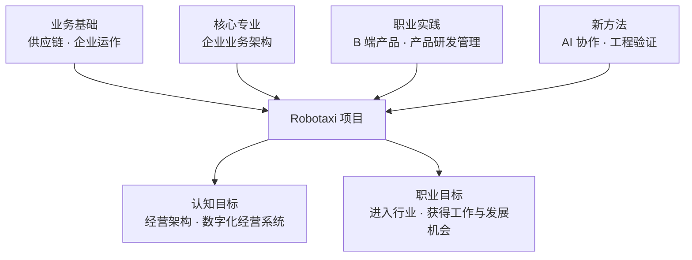

| 项目意义 | 我希望验证什么 |
| --- | --- |
| 专业复盘 | 过去十多年真正沉淀下来的能力是什么 |
| 认知升级 | 能否从业务流程进一步理解业务架构和经营架构 |
| 数字化实践 | 能否把经营认知转化为产品、数据和工程系统 |
| AI 协作 | 能否形成可复用、可验证的人机协作方法 |
| 行业与职业探索 | 能否在 Robotaxi 中创造价值并获得长期发展机会 |

## 当前经营架构

平台以业务单据生命周期作为经营事实底座，以统一经营模型连接规划、决策、执行与反馈。经营模型按需求、供给、决策、服务、资产、财务和经营反馈组织，不替代业务单据，也不在页面中复制计算逻辑。

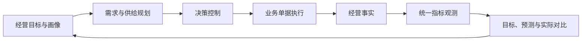

经营规划回答未来需要什么，决策控制统一观察跨价值流策略如何把规划转化为执行，业务执行形成真实单据和资产事实，经营分析回答实际结果与目标及预测存在什么差异。各层通过统一字段字典、指标语义合同和经营数据池连接；策略配置、执行和结果仍由所属价值流独立拥有。

我没有参与过真实的城市 Robotaxi 运营，也不是自动驾驶技术专家。这个项目不能证明我已经具备行业答案，更不能替代真实工作经验。它能诚实呈现的是：我如何理解问题、如何建立结构、如何把结构做成系统、如何根据运行结果修正判断，以及我仍然缺少什么。

## 我的专业定位

供应链是我的**业务起点**，企业业务架构是逐渐形成的**核心专业能力**，B 端产品和产品研发管理是长期的**职业实践**，数字化经营系统与系统型经营是继续探索的**发展方向**。

| 层次 | 当前定位 |
| --- | --- |
| 业务基础 | 供应链、供需、履约、企业职能与跨组织协作 |
| 核心专业 | 企业业务架构：能力、价值流、对象、规则、流程、组织和信息 |
| 职业角色 | B 端产品负责人及产品研发管理者 |
| 落地载体 | 产品架构、数据体系和数字化系统 |
| 向上延伸 | 经营架构、经营分析、资源配置和战略反馈 |
| 长期方向 | 数字化经营系统负责人及系统型经营能力 |

对外，我仍应使用与真实经历一致的 B 端产品、产品负责人或产品研发管理角色；“企业业务架构”用于定义我的核心能力，“系统型经营”用于表达长期方向，而不是包装成已经完成的身份。

### 我真正持续设计的是什么

> 不是先从软件出发，而是从企业应该如何运行出发；软件是经营结构和业务结构的一种数字化表达。

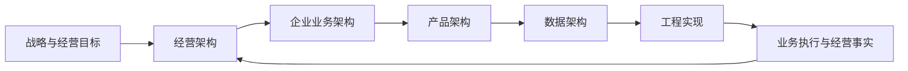

我的工作输入不只是某个用户提出的功能需求，还包括经营目标、业务运作、组织协作和真实问题。需要被定义清楚的，是业务能力、对象、边界、规则、流程、指标和闭环，然后才是产品与工程实现。

### 这些认知如何形成

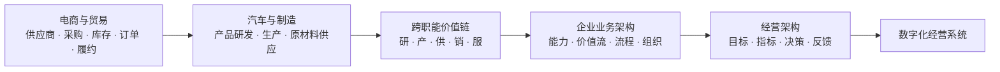

不同行业的业务形态不同，但都会面对需求不确定、供给受约束、履约复杂、组织协同，以及成本、效率和服务之间的取舍。我的积累不是掌握每个职能的全部专业细节，而是逐渐学会识别它们之间的关系，并将其组织成端到端闭环。

### 当前沉淀的核心能力

> 将复杂、分散的企业业务抽象为端到端业务架构，并通过产品、数据和工程系统，使其可执行、可协作、可度量和可迭代。

| 关键转化 | 形成的价值 |
| --- | --- |
| 隐性的业务经验 → 明确的对象与规则 | 让业务知识可以共享、执行和持续维护 |
| 割裂的企业职能 → 端到端价值流 | 减少局部最优和跨组织断点 |
| 人工低效协作 → 系统化协作机制 | 提升流程效率、责任清晰度和交付稳定性 |
| 事后经验判断 → 指标与反馈闭环 | 支持经营分析、决策调整和持续学习 |

领域专家提供真实业务深度，我负责与他们共同把不同专业连接为统一的业务结构、产品系统和经营闭环。这不是高于或替代领域专家，而是承担不同维度的价值。

## 从供应链到 Robotaxi 供给系统

过去的业务实践让我逐渐认识到：供应链的本质，是用有限、受约束的供给响应不确定需求，在响应性与成本效率之间取得平衡，并提升用户价值减去端到端总成本后的供应链盈余。

### 供应链理论底座

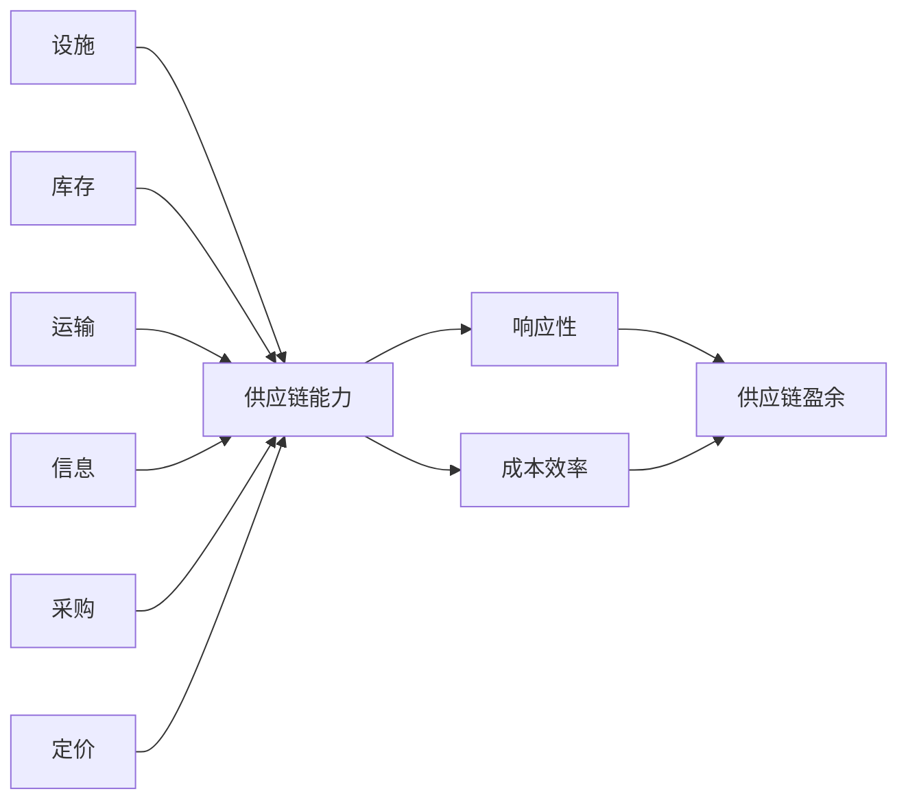

这六个驱动因素在 Robotaxi 中仍然存在，只是形态发生了变化。供应链层关注盈余，企业经营层还要平衡增长、利润、现金流、资本效率和风险，战略层则要形成可持续竞争优势。

| 供应链驱动 | Robotaxi 中的对应能力 | 核心权衡 |
| --- | --- | --- |
| 设施 | 运营中心、充电、清洁、维修和服务区域 | 覆盖与固定成本 |
| 库存 | 可运营 Robotaxi、可服务时间、电量与位置 | 可用性与闲置成本 |
| 运输 | 接驾、载客、空驶和调度路径 | 响应速度与里程成本 |
| 信息 | 需求、位置、状态、任务、道路与经营数据 | 决策质量与系统成本 |
| 采购 | Robotaxi、能源、配件、服务资源与合作能力 | 供给保障与控制成本 |
| 定价 | 价格、时段、区域与服务策略 | 需求调节、体验与收益 |

### 一台 Robotaxi 是什么

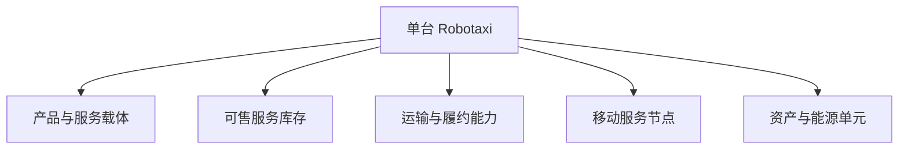

传统零售通常是“客户到固定门店，门店持有商品库存”；Robotaxi 则是“服务能力主动移动到需求所在地，并在移动中完成履约”。

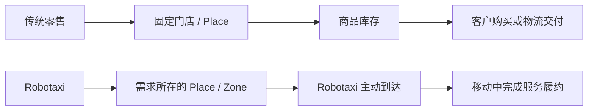

因此，单台 Robotaxi 不能只类比为传统车辆，也不能只类比为零售门店。更准确地说，它是“移动服务节点 + 可售服务库存 + 履约运力”的组合；Place 和 Zone 则更接近需求地点、商圈和服务区域。

### 我的认知升级

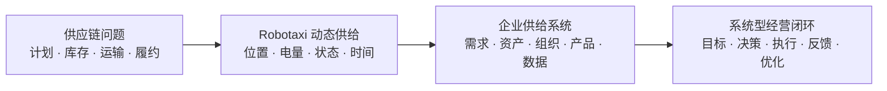

| 过去更多关注 | 现在进一步关注 |
| --- | --- |
| 单个供应链环节是否顺畅 | 整个供给系统是否形成经营结果 |
| 实物库存和物流履约 | 动态服务库存、时空匹配和服务履约 |
| 局部成本与响应速度 | 成本、效率、服务、增长和风险的整体平衡 |
| 依靠经验处理具体问题 | 将经验沉淀为可执行、可度量、可迭代的系统能力 |

这不是离开供应链，而是用供应链理论重新理解 Robotaxi，并把业务视角扩展为供给系统和系统型经营视角。

## 我对 Robotaxi 的阶段性判断

我将 Robotaxi 理解为一个**城市级实时动态供给系统**：有限、可移动且受状态约束的车辆，需要持续匹配分散、波动的需求，并平衡安全、服务、效率和成本。

以下是用于指导学习的阶段框架，不是行业定论。

| 阶段 | 核心问题 | 关键能力 |
| --- | --- | --- |
| 1. 有限区域可行性 | 能否安全、稳定地服务 | 自动驾驶、安全验证、道路适配、应急与合规 |
| 2. 最小运营闭环 | 需求、Robotaxi 和运营能否连接 | 供需匹配、履约、Robotaxi 运营保障、业务系统与基础指标 |
| 3. 区域规模运营 | 规模扩大后能否保持效率 | 动态调度、运力规划、标准作业、组织与单位经济性 |
| 4. 城市级经营 | 能否形成稳定的城市服务网络 | 城市供给规划、基础设施、治理、品牌与盈利模型 |
| 5. 城市复制与协同 | 能否跨城市复用和优化 | 标准化与本地化、资源配置、组织体系与数据复用 |

当前项目主要聚焦第 2 阶段，并为理解第 3 阶段建立基础。

## 我在团队中的位置

| 当前可以贡献 | 仍需重点学习 |
| --- | --- |
| 供需规划与资源配置 | 自动驾驶技术与安全工程 |
| 履约、异常和业务闭环设计 | 真实 Robotaxi 一线运营 |
| B 端产品与数字化系统设计 | 城市监管、治理与安全责任 |
| 经营指标、成本效率与复盘 | 真实数据下的调度算法验证 |
| 跨业务、运营、产品和研发协同 | Robotaxi 用户服务与商业化实践 |
| 业务目标、规则边界和验收标准 | 企业级 AI 协作流程与质量治理 |

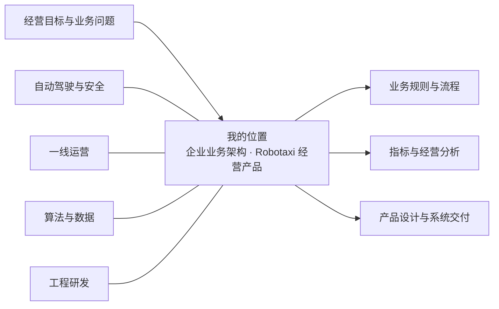

我更适合把经营目标和领域专家的知识转化为共同的业务结构、产品系统和反馈闭环，而不是替代自动驾驶、安全、算法或一线运营专家。

## 通过项目探索 AI 协作

> AI 不替代业务判断和责任，而是帮助判断更快进入设计、实现和验证循环。

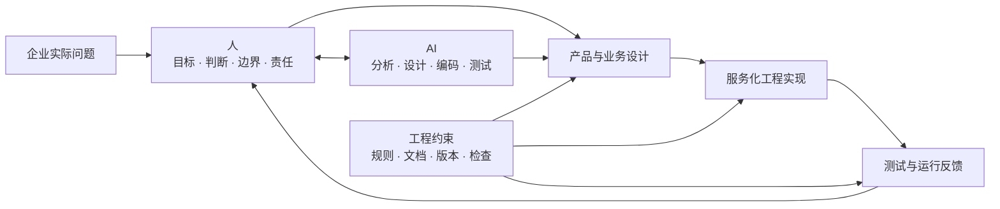

希望逐步形成的，不是完成单次任务的技巧，而是一套可复用、可验证、可维护的人机协作方法，用于解决企业真实问题。

## 项目当前验证什么

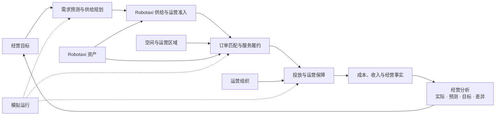

当前验证四个问题：需求能否形成订单、车辆能否在约束下完成匹配、业务动作能否形成可追溯闭环、经营结果能否支持策略优化。

系统坚持三个原则：业务单据是事实来源；车辆行为由业务服务驱动；模拟运行调用已有服务，不重新实现业务闭环。

当前已经形成长期供应规划与短期投放规划两条同构、可操作、可解释的价值流：

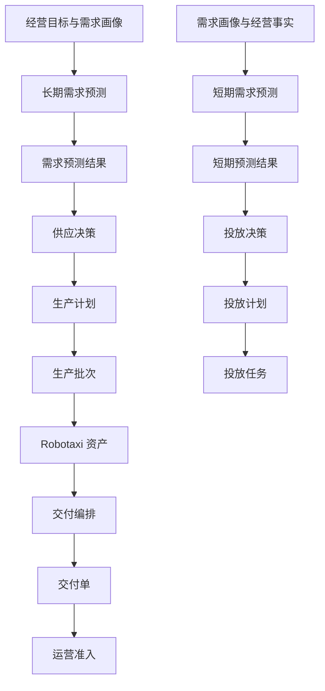

预测只回答未来需求，决策结合供给与经营约束直接形成计划，计划再分解为生产、交付或投放单据。长期链决定区域资产供给，短期链按小时或日滚动决定现有 Robotaxi 的时空投放；交付编排只选择具体车辆、运营中心和批次，不重新决定区域供给数量。生产完成先形成待交付资产，交付到运营中心后才进入运营准入，避免把预测、决策、生产、物流和运营状态混为一体。

预测结果和经营分析共用统一数据图表：完整展示周期与单位，支持鼠标、触摸和键盘读取具体数值；长周期只在图表内部浏览，避免影响桌面和手机页面布局。

经营分析进一步共用统一经营数据池：经营目标、需求预测和生产计划作为规划基线，服务订单、Robotaxi、收入与成本作为业务事实；页面统一展示实际值、同期预测值、目标值、差异、达成率和数据来源。经营分析只负责读取与解释，不在页面中重复计算，也不改变业务单据和模拟运行的服务边界。

指标定义、指标观测和计算记录使用同一对象详情框架：计算逻辑、字段解释、来源追溯、质量问题和建议处理方式按统一分组展示，部分成功仍保留可用结果并明确受影响范围。

## 当前范围

| 已纳入验证 | 暂不纳入 |
| --- | --- |
| 虚拟区域、需求与服务订单 | 真实地图与道路网络 |
| 车辆资产、位置、电量和状态 | 自动驾驶感知、决策与控制仿真 |
| 匹配、接驾、载客与结算 | 强化学习等复杂调度算法 |
| 投放、充电、清洁、维修与异常 | 全城市真实交通流仿真 |
| 成本效率、服务指标与模拟运行 | 共享数据库、多人协作与多城市经营 |

## 查看项目

- 在线体验：<https://chizheng4.github.io/robotaxi/>
- 本地运行：双击 `start-robotaxi.command`，访问 `http://127.0.0.1:4173/`
- 数据边界：保存在访问者自己的浏览器中，不与其他访客共享

## 进一步了解

| 文档 | 内容 |
| --- | --- |
| [系统总览](doc/00-system-overview.md) | 系统分层、模块边界和业务闭环 |
| [版本记录](VERSION.md) | 当前版本与历史变化 |
| [字段字典](doc/rules/field-dictionary.md) | 业务对象、字段、状态和枚举 |
| [模拟运行架构](doc/rules/07-simulation-runtime-architecture-rules.md) | 业务服务与模拟运行边界 |
