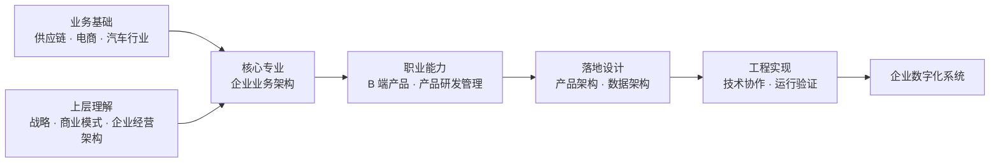
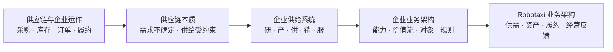
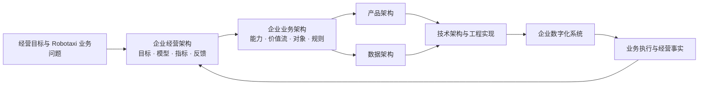
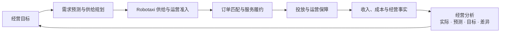

# Robotaxi 经营闭环模拟平台

> 从企业业务架构、B 端产品到工程实现的 Robotaxi 数字化实践。

“经营闭环”指项目连接经营目标、规划、决策、业务执行、经营事实、分析与反馈；“模拟”说明它用于认知和系统验证，不是真实城市的生产运营系统。这个项目也是我将供应链与企业运作经验、企业业务架构和 B 端产品能力迁移到 Robotaxi 的实践。

## 为什么做这个项目

我喜欢 Robotaxi，也希望进入这个行业工作。这是我做这个项目最直接、最现实的原因。

过去的业务实践主要来自供应链、电商和汽车行业，长期职业实践是 B 端产品设计与产品研发管理。随着实践和学习，我逐渐将关注点从局部业务流程扩展到企业如何经营和运作，以及如何把战略与经营理解转化为企业业务架构、产品架构、数据架构和能够运行的企业数字化系统。

Robotaxi 是我选择用来检验这套认知和能力能否迁移的新行业。这个项目主要承担四项任务：

- **专业复盘**：过去的行业和产品实践真正沉淀了什么能力。
- **认知升级**：能否从供应链和局部流程进一步理解企业供给系统、企业业务架构和企业经营架构。
- **能力迁移**：能否将这些认识转化为 Robotaxi 的 B 端产品、数据和工程系统。
- **职业探索**：能否在真实 Robotaxi 行业中创造价值，并获得长期工作和发展机会。

我没有参与过真实的城市 Robotaxi 运营，也不是自动驾驶技术专家。这个项目不能替代真实工作经验，也不能证明我已经具备行业答案。它能够诚实呈现的是：我如何理解问题、建立企业业务架构、形成产品与数据设计、完成工程验证，以及我仍然缺少什么。

## 我的专业定位与能力链

> 我以供应链与企业运作为业务基础，以企业业务架构为核心专业，通过 B 端产品、数据和工程系统，推动复杂经营问题数字化落地。

这条能力链不代表每一层都已经达到同等成熟度。

| 层次 | 当前定位 |
| --- | --- |
| 业务基础 | 供应链、供需、履约、复杂流程和跨组织协作 |
| 上层理解 | 战略、商业模式、企业经营架构、经营模型与反馈闭环 |
| 核心专业 | 企业业务架构：能力、价值流、职能、组织、流程、对象、规则和指标 |
| 职业能力 | B 端产品设计、产品架构、数据架构与产品研发管理 |
| 工程落地 | 与 Codex 协作完成技术细化、编码、测试、验证和持续迭代 |
| 长期方向 | 从企业数字化系统交付进一步走向经营结果和系统型经营能力 |

当前能够形成直接证据的核心能力是：

> 将复杂、分散的企业业务抽象为端到端企业业务架构，并通过 B 端产品、数据和工程系统，使其可执行、可协作、可度量和可持续优化。

| 核心能力 | 项目中的直接证据 |
| --- | --- |
| 企业业务架构 | 业务能力、价值流、对象生命周期、规则、组织协作和服务边界 |
| B 端产品设计 | 围绕经营、规划、订单、Robotaxi、履约和分析形成产品结构与交互 |
| 数据架构 | 区分经营目标、预测、计划、决策、执行结果和业务事实 |
| 产品研发管理 | 通过规则、文档、版本、验收和多轮迭代持续形成可运行结果 |
| AI 协作下的工程实现 | 将业务判断和产品设计转化为代码、测试与运行验证 |

领域专家提供真实业务深度。我的位置不是替代自动驾驶、安全、算法或一线运营专家，而是与他们共同把经营目标和不同专业知识连接为统一的企业业务架构、B 端产品和反馈闭环。

## 从行业经验到 Robotaxi 业务架构

供应链是我的业务起点，不是最终职业身份。它的重要性在于帮助我从真实业务中识别跨行业仍然存在的结构性问题：需求具有不确定性，供给受到资源、能力、时间和空间约束，企业必须持续平衡用户响应性与成本效率。

### 供应链到企业供给系统

供应链通过设施、库存、运输、信息、采购和定价组织供给，在响应性与成本效率之间进行权衡，并提升用户价值减去端到端总成本后的供应链盈余。

随着实践从电商、贸易扩展到汽车行业，我进一步认识到，企业的供给不仅包括采购、库存和物流，还包括产品与服务研发、生产制造、市场与销售、交易、履约和售后。由此形成了企业供给系统的理解：

> 企业围绕用户需求，组织资源、能力、产品与服务，通过研发、生产、采购、计划、交易、履约和服务持续形成有效供给。

企业供给系统不是我的新职业标签，而是从供应链经验走向企业业务架构的重要认知桥梁。

### Robotaxi 是城市级动态供给系统

Robotaxi 同样需要使用有限、可移动且受状态约束的供给，持续匹配分散、波动的需求，并平衡安全、服务、效率和成本。

| 供应链驱动 | Robotaxi 中的对应 | 核心权衡 |
| --- | --- | --- |
| 设施 | 运营中心、充电、清洁、维修和服务区域 | 覆盖与固定成本 |
| 库存 | 可运营 Robotaxi、可服务时间、电量和位置 | 可用性与闲置成本 |
| 运输 | 接驾、载客、空驶和运营保障行驶 | 响应速度与里程成本 |
| 信息 | 需求、位置、状态、任务、道路和经营数据 | 决策质量与系统成本 |
| 采购 | Robotaxi、能源、配件和服务资源 | 供给保障与控制成本 |
| 定价 | 价格、时段、区域和服务策略 | 需求调节、体验与收益 |

单台 Robotaxi 不能只被理解为传统车辆。它同时是产品与服务载体、可售服务库存、移动履约能力、移动服务节点，以及资产与能源单元。企业供给系统帮助我识别这些关系，企业业务架构则进一步把它们组织为可执行、可追踪的业务能力、价值流、对象和规则。

## 项目如何证明这些能力

这个项目不是从页面和功能清单开始，而是沿着已经固定的认知链路逐步形成：

平台以业务单据生命周期作为经营事实底座，以经营模型连接规划、决策、执行与反馈；页面负责展示和触发，不重新创造业务事实。

### 从企业业务架构到 B 端产品

项目逐步定义并实现了：

- 需求、订单、Robotaxi、运营任务、行驶记录和财务事实等业务对象。
- 需求到订单、订单到履约、供给准备和运营保障等价值流。
- 对象生命周期、状态、动作、规则和异常处理。
- 经营目标、预测、计划、决策、执行结果和实际事实的区别。
- 经营工作台、业务页面、对象详情、指标观测和反馈分析。

这些工程成果是企业业务架构和 B 端产品能力的直接表达，但不等于已经产生真实 Robotaxi 经营结果。

### 我和 Codex 如何协作

项目由我基于既有经验提出经营目标、业务判断、架构选择、规则边界和验收标准；我与 Codex 协作完成问题分析、产品与数据细化、技术实现、编码、测试和多版本迭代。

AI 协作不是独立于专业能力之外的新架构层，而是把企业业务架构、产品架构和数据架构更快转化为工程结果的方法。它证明的是在明确判断、约束和责任下使用 AI 完成复杂系统实现的能力，不等同于传统的独立编码能力。

## Robotaxi 阶段、我的价值与不足

以下阶段用于定位需要的能力和我的位置，不作为行业定论。

| Robotaxi 阶段 | 主要能力需求 | 当前可以贡献 | 仍然不足 |
| --- | --- | --- | --- |
| 技术与安全可行 | 自动驾驶、安全验证、道路适配和合规 | 连接产品需求与运营场景 | 不具备自动驾驶和安全工程深度 |
| 最小运营闭环 | 供需、订单、履约、运营保障和业务系统 | 企业业务架构、B 端产品和数字化系统 | 缺少真实一线运营经验 |
| 区域规模运营 | 供给规划、调度、资产效率、标准作业和单位经济性 | 供应链、企业供给系统、经营分析和跨组织协作 | 缺少真实规模数据和算法验证 |
| 城市级经营 | 资源配置、经营模型、组织治理、盈利与风险 | 企业经营架构是继续深化的方向 | 尚未承担完整经营结果责任 |
| 跨城市复制 | 标准化、本地化、组织和能力复用 | 企业业务架构和数字化系统具有潜在价值 | 尚无跨城市 Robotaxi 实践 |

当前项目主要聚焦最小运营闭环，并为理解区域规模运营建立基础。这里是现有能力最可能创造价值的位置，也是必须通过真实行业实践继续验证的位置。

## 项目当前验证什么

当前验证四个问题：

1. 需求能否形成订单。
2. Robotaxi 能否在约束下完成匹配和履约。
3. 业务动作能否形成独立、完整且可追溯的业务事实。
4. 经营结果能否支持分析、决策和持续调整。

系统坚持三个原则：

- 业务单据是事实来源。
- Robotaxi 行为由业务服务驱动。
- 模拟运行调用已有业务服务，不重新实现业务闭环。

平台当前已经形成长期供应规划与短期投放规划两条同构价值流。长期链根据经营目标和需求预测形成区域资产供给；短期链根据需求画像和经营事实滚动形成现有 Robotaxi 的时空投放。预测只回答未来需求，决策结合供给和经营约束形成计划，计划再分解为生产、交付或投放单据，最终形成可以追溯的执行事实。

长期供应链进一步连接生产工厂、周期排程、生产批次、质量检验和 Robotaxi 资产形成。生产完成按实际产量形成统一生产成本事实；质量检验支持全部合格、部分合格和全部失败，更新质量损失与合格单车成本，并把不足数量补入后续排期。供应跟踪和经营分析从同一批次、资产与成本记录读取结果。

经营分析共用统一经营数据：经营目标、需求预测和生产计划作为规划基线，服务订单、Robotaxi、收入与成本作为业务事实；系统展示实际值、预测值、目标值、差异、达成率和数据来源。经营分析只负责读取与解释，不在页面中重复计算，也不改变业务单据和模拟运行的服务边界。

## 当前范围

| 已纳入验证 | 暂不纳入 |
| --- | --- |
| 模拟网格与真实地理底图、双区域、需求与服务订单 | 真实城市道路数据生产与服务端路由引擎 |
| Robotaxi 资产、位置、电量和状态 | 自动驾驶感知、决策与控制仿真 |
| 匹配、接驾、载客与结算 | 强化学习等复杂调度算法 |
| 投放、充电、清洁、维修与异常 | 全城市真实交通流仿真 |
| 经营目标、规划、指标和反馈 | 共享数据库、多人协作与多城市经营 |

运营中控台支持真实地理地图与模拟网格双模式。Zone、地点、服务区域、道路、运营中心、Robotaxi 和选中路径均从现有业务对象投影，视图切换不会重置业务状态；外部底图不可用时仍保留运营对象图层并可回到模拟网格。当前真实地理模式用于空间经营表达和路径可视化，不代表自动驾驶导航能力。

## 查看项目

- 在线体验：<https://chizheng4.github.io/robotaxi/>
- 本地运行：双击 `start-robotaxi.command`，由系统默认浏览器访问 `http://127.0.0.1:4173/`
- 数据边界：数据保存在访问者自己的浏览器中，不与其他访客共享

## 进一步了解

| 文档 | 内容 |
| --- | --- |
| [系统总览](doc/00-system-overview.md) | 系统分层、模块边界和业务闭环 |
| [版本记录](VERSION.md) | 当前版本与历史变化 |
| [字段字典](doc/rules/field-dictionary.md) | 业务对象、字段、状态和枚举 |
| [模拟运行架构](doc/rules/07-simulation-runtime-architecture-rules.md) | 业务服务与模拟运行边界 |
