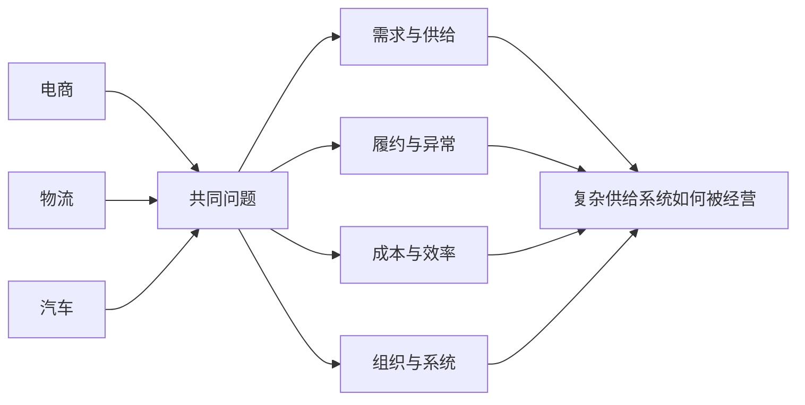
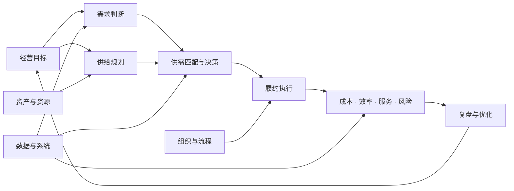
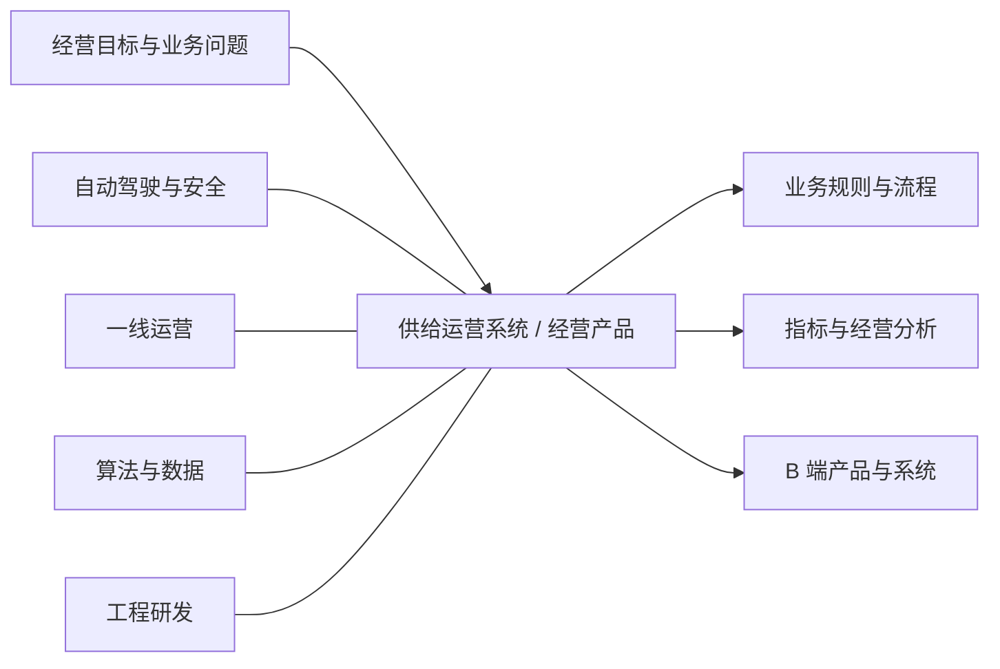
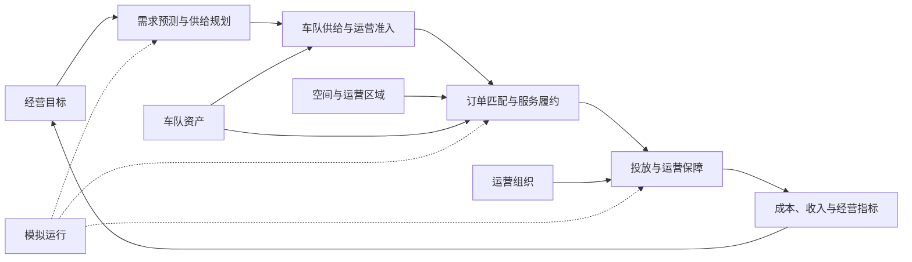

# Robotaxi 城市运营模拟平台

> 一个从供应链经验出发，学习和理解 Robotaxi 运营的长期实践项目。

## 我的出发点

过去十多年，我经历过电商、物流和汽车等行业。业务不同，但反复面对的问题相似：需求不确定、供给有限、履约复杂、协同困难，以及成本、效率和服务之间的取舍。

这些经历让我逐渐形成一个方向：从解决局部供应链问题，走向理解完整的企业供给系统；从供应链专家，继续探索成为一名**系统型经营者**。

## 我的核心能力

> 把复杂供给问题结构化，并转化为可执行、可度量、可优化的经营系统。

| 核心能力 | 具体表现 |
| --- | --- |
| 供需与资源配置 | 识别需求变化、供给约束以及时间、空间和产能关系 |
| 履约与业务闭环 | 将跨环节过程拆成对象、状态、动作、异常和结果 |
| 业务抽象与产品化 | 将经验沉淀为规则、流程、指标和 B 端系统能力 |
| 经营分析与协同 | 从整体结果出发，平衡成本、效率、服务和风险 |

这些是我从既有经历中沉淀出的可迁移能力，不等于我已经具备 Robotaxi 行业的完整答案。

## 我对企业供给系统的理解

企业供给系统的核心，不是单独优化某个环节，而是围绕经营目标，让需求、供给、履约、组织和数据形成闭环。

这个系统持续回答五个本质问题：

| 问题 | 核心内容 |
| --- | --- |
| 需求是什么 | 在什么时间、什么地点，需要什么服务 |
| 供给有什么 | 有多少资源可用，分别处于什么状态 |
| 如何匹配 | 资源应该如何分配，优先级如何确定 |
| 如何履约 | 怎样稳定完成服务并处理异常 |
| 如何变好 | 结果如何度量，策略如何持续修正 |

## 我对 Robotaxi 的阶段性判断

我将 Robotaxi 出行服务理解为一个**城市级实时动态供给系统**：

> 用有限、可移动且受状态约束的车辆，持续匹配分散、波动的出行需求，并在安全、服务、效率和成本之间形成经营闭环。

下面是我当前对行业发展阶段的理解。它不是行业定论，而是用于指导学习和项目推进的认知框架。

| 阶段 | 核心问题 | 关键能力 |
| --- | --- | --- |
| 1. 有限区域可行性 | 车辆能否安全、稳定地提供服务 | 自动驾驶、安全验证、道路适配、应急与合规 |
| 2. 最小运营闭环 | 需求、车辆和运营动作能否真正连接 | 供需匹配、服务履约、车队保障、业务系统与基础指标 |
| 3. 区域规模运营 | 规模扩大后能否保持体验和效率 | 动态调度、运力规划、标准作业、组织协同与单位经济性 |
| 4. 城市级经营 | 多区域能否形成稳定的城市服务网络 | 城市供给规划、基础设施、治理协同、品牌与盈利模型 |
| 5. 城市复制与协同 | 成功能力能否跨城市复用和持续优化 | 标准化与本地化、多城市资源配置、组织体系与数据复用 |

当前项目主要聚焦第 2 阶段，并为第 3 阶段建立认知基础。

## 我能贡献什么，也需要补足什么

| 当前可以贡献 | 仍需重点学习 |
| --- | --- |
| 供需规划与资源配置思维 | 自动驾驶技术与安全工程 |
| 履约流程、异常和业务闭环设计 | 真实车队的一线运营经验 |
| 经营指标、成本效率与复盘框架 | 城市监管、道路治理与安全责任 |
| B 端产品、业务对象和系统化表达 | 基于真实数据的调度算法验证 |
| 跨业务、运营、产品和研发的结构化协同 | Robotaxi 用户服务与商业化实践 |

在团队中，我更适合站在**供给运营系统与经营产品**的位置，连接经营目标、一线运营、产品设计、数据和工程实现。

这个位置不是替代自动驾驶、安全、算法或一线运营专家，而是理解各方约束，把它们连接成可执行、可反馈的经营闭环。

## 为什么做这个项目

我还没有真实经营一座城市 Robotaxi 车队的经验，也不希望把阶段性的理解包装成成熟答案。

这个项目是我的学习和验证工具：

- 把过去的供应链、履约和产品经验迁移到新的场景；
- 把行业判断拆成业务对象、生命周期、策略和指标；
- 让模拟运行暴露问题，而不是只停留在概念表达；
- 通过持续迭代发现不足，并修正对真实业务的理解。

我相信，有价值的成长不是重复已有经验，而是带着积累进入新的复杂问题，保持诚恳、耐心和行动。

## 项目当前验证什么

项目从“最小运营单元”开始，验证四个问题：

1. 需求能否被识别并转化为服务订单；
2. 有限车辆能否在时间、空间、电量和状态约束下完成匹配；
3. 履约、投放、补能、维修和异常能否形成可追溯的业务闭环；
4. 经营结果能否被度量，并支持策略比较与持续优化。

系统坚持三个原则：

- 业务单据是事实来源；
- 车辆行为由业务服务驱动；
- 模拟运行调用已有业务服务，不重新实现业务闭环。

## 当前范围

| 已纳入验证 | 暂不纳入 |
| --- | --- |
| 虚拟运营区域与模拟需求 | 真实地图与道路网络 |
| Robotaxi 资产、位置、电量和状态 | 自动驾驶感知、决策与控制仿真 |
| 订单匹配、接驾、载客与结算 | 强化学习等复杂调度算法 |
| 投放、充电、清洁、维修与异常任务 | 全城市真实交通流仿真 |
| 经营目标、成本效率与服务指标 | 真实账号、共享数据库与多人协作 |
| 统一时间下的自动运营模拟 | 多城市资源配置与经营优化 |

## 查看项目

- 在线体验：<https://chizheng4.github.io/robotaxi/>
- 本地运行：双击 `start-robotaxi.command`，通过 `http://127.0.0.1:4173/` 访问
- 当前数据：保存在访问者自己的浏览器中，不与其他访客共享

## 进一步了解

| 文档 | 内容 |
| --- | --- |
| [系统总览](doc/00-system-overview.md) | 系统分层、模块边界和核心业务闭环 |
| [版本记录](VERSION.md) | 当前版本与历史稳定版本变化 |
| [字段字典](doc/rules/field-dictionary.md) | 业务对象、字段、状态和枚举 |
| [模拟运行架构](doc/rules/07-simulation-runtime-architecture-rules.md) | 统一时间、业务服务与模拟系统边界 |

## 长期方向

这条路径只是当前方向。项目会从能够验证的小问题出发，根据新的认知和真实反馈持续调整，而不是预设一个一定正确的终点。
