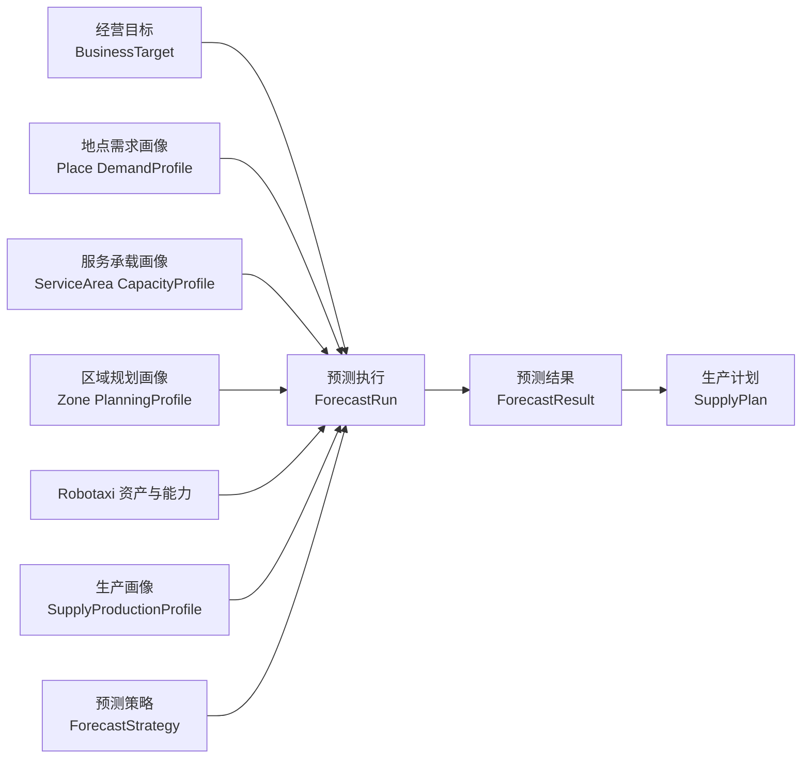
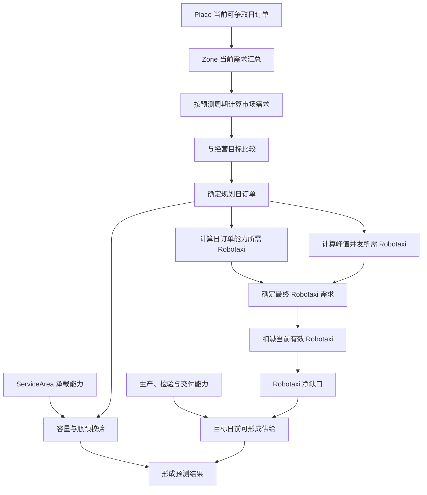

# 长期需求预测与 Robotaxi 容量规划设计

## 1. 设计定位

长期需求预测是经营规划层的确定性容量规划能力，用于回答：

1. 目标期末市场每天可能产生多少 Robotaxi 订单；
2. 企业决定服务多少订单；
3. 日常能力与峰值并发分别需要多少 Robotaxi；
4. 当前区域还缺多少 Robotaxi；
5. 目标日前能够生产、检验并交付多少 Robotaxi。

当前版本只实现参数化、可解释、可复盘的商业规划模型，不实现机器学习、随机预测、时间序列拟合、蒙特卡洛、价格弹性、实时调度或完整财务模型。

## 2. 对象与服务边界



- `BusinessTarget` 表达管理层希望达到的经营状态，不生成市场需求。
- `DemandProfile` 是独立画像对象；Place、ServiceArea、Zone 只保存空间事实和稳定关系。
- `ForecastStrategy` 保存计算规则和可配置参数，不保存市场事实。
- `ForecastRun` 是一次独立执行，冻结全部输入快照并记录校验结果。
- `ForecastResult` 是不可变的分析结论，不因后续配置变化而重算。
- `SupplyPlan` 消费预测结果形成生产单据，预测服务不得直接创建 Robotaxi。
- 页面只触发服务和展示结果，不在页面层拼装执行、结果或生产计划。
- 本闭环属于业务底层经营规划，默认不接入模拟运行主路径。

## 3. 空间经营关系

```text
Zone
  └── Place
        └── ServiceArea
```

约束：

- Place 是需求产生的唯一空间来源。
- 一个 Place 可以拥有多个 ServiceArea。
- 一个 ServiceArea 固定且只能归属一个 Place，通过 `parent_place_id` 表达。
- ServiceArea 不产生、分摊或折减需求，只描述 Robotaxi 等待、上车、下车和周转承载能力。
- Zone 汇总所属 Place 的需求和 ServiceArea 的承载能力，不重新生成需求。
- 不再使用 Place 到多个 ServiceArea 的需求概率分配，也不以 ServiceArea 需求反推 Zone 市场需求。

## 4. 完整计算链路



固定顺序：需求基线、周期增长、目标比较、规划订单、峰值并发、单车日产能、服务承载、当前资产、供给缺口、生产交付约束、基础经济性、最终结论。

## 5. 预测周期

|英文字段|中文字段|性质|说明|
|---|---|---|---|
|`forecast_period_unit`|预测周期单位|配置|`WEEK / MONTH / QUARTER / YEAR`|
|`forecast_period_count`|预测周期数量|配置|大于零的整数|
|`forecast_start_date`|预测开始日期|配置|本次规划起点|
|`forecast_end_date`|预测结束日期|计算|根据开始日期、单位和数量计算|
|`growth_rate_unit`|增长率周期单位|配置|必须与预测周期单位一致|
|`period_growth_rate`|周期增长率|配置/聚合|对应一个预测周期的增长率|

默认使用月度三十六期；短期观察可用周，经营规划优先使用月或季度，长期扩张可用年。V1 不静默转换增长率周期，单位不一致时执行失败。

## 6. Place 需求基线

### 6.1 配置字段

|英文字段|中文字段|
|---|---|
|`resident_population`|常住人口|
|`working_population`|工作人口|
|`daily_visitors`|日访客量|
|`resident_trip_weight`|居民出行权重|
|`worker_trip_weight`|工作人口出行权重|
|`visitor_trip_weight`|访客出行权重|
|`trip_generation_rate`|日出行产生率|
|`demand_weight`|地点需求强度系数|
|`robotaxi_adoption_rate`|Robotaxi 采用率|
|`service_acceptance_rate`|服务接受率|
|`competition_retention_rate`|竞争保留率|
|`place_period_growth_rate`|地点周期增长率|
|`growth_rate_unit`|增长率周期单位|
|`growth_rate_source`|增长率来源|
|`growth_rate_updated_at`|增长率更新时间|
|`busiest_hour_share`|最繁忙小时占比|

`growth_rate_source` 支持 `MANUAL_ASSUMPTION / SIMULATION_CONFIG / HISTORICAL_CALCULATION / EXTERNAL_INPUT`。所有比例必须位于 `[0, 1]`，增长率必须大于 `-1`。

### 6.2 计算字段与公式

```text
daily_population_exposure
= resident_population × resident_trip_weight
+ working_population × worker_trip_weight
+ daily_visitors × visitor_trip_weight

potential_daily_trips
= daily_population_exposure
× trip_generation_rate
× demand_weight

baseline_addressable_daily_orders
= potential_daily_trips
× robotaxi_adoption_rate
× service_acceptance_rate
× competition_retention_rate

baseline_peak_hour_orders
= baseline_addressable_daily_orders × busiest_hour_share
```

`trip_generation_rate` 与 `demand_weight` 是独立因素，只允许各参与一次计算。`baseline_addressable_daily_orders` 表示市场可争取需求，不代表当前一定能够完成。

## 7. ServiceArea 服务承载

### 7.1 配置字段

|英文字段|中文字段|
|---|---|
|`service_area_id`|服务区域编号|
|`parent_place_id`|归属地点编号|
|`waiting_robotaxi_capacity`|等待 Robotaxi 容量|
|`pickup_position_capacity`|上车位容量|
|`dropoff_position_capacity`|下车位容量|
|`average_service_time_min`|平均站点服务时间|
|`operating_hours_per_day`|每日开放小时数|
|`accessibility_factor`|可达性系数|
|`capacity_availability_rate`|容量可用率|

### 7.2 计算

```text
position_throughput_per_hour
= 60 / average_service_time_min

effective_position_capacity
= min(pickup_position_capacity, dropoff_position_capacity)

service_capacity_per_hour
= effective_position_capacity × position_throughput_per_hour

effective_peak_hour_capacity
= service_capacity_per_hour
× accessibility_factor
× capacity_availability_rate

effective_daily_capacity
= effective_peak_hour_capacity × operating_hours_per_day
```

Place 和 Zone 分别对所属 ServiceArea 容量求和。容量不足只形成约束和缺口，不得反向压低市场需求。

## 8. Zone 汇总与增长

```text
zone.baseline_addressable_daily_orders
= Σ Place.baseline_addressable_daily_orders

zone.baseline_peak_hour_orders
= Σ Place.baseline_peak_hour_orders

zone.effective_daily_capacity
= Σ ServiceArea.effective_daily_capacity

zone.effective_peak_hour_capacity
= Σ ServiceArea.effective_peak_hour_capacity

zone_period_growth_rate
= Σ(Place.baseline_addressable_daily_orders × Place.place_period_growth_rate)
  / Σ Place.baseline_addressable_daily_orders
```

Zone 增长率由 Place 当前可争取需求加权生成，禁止人工覆盖汇总结果。

策略可配置：

|英文字段|中文字段|
|---|---|
|`growth_scenario`|增长情景|
|`growth_adjustment_rate`|增长调整率|

`growth_scenario` 支持 `CONSERVATIVE / BASELINE / AGGRESSIVE`。

```text
effective_period_growth_rate
= zone_period_growth_rate + growth_adjustment_rate

复合增长：

growth_factor
= (1 + effective_period_growth_rate) ^ forecast_period_count

线性增长：

growth_factor
= max(0, 1 + effective_period_growth_rate × forecast_period_count)

market_forecast_daily_orders
= baseline_addressable_daily_orders × growth_factor
```

结果表达目标期末典型日订单水平，不表达预测期累计订单量。

## 9. 经营目标与基础经济性

经营目标至少包含：

|英文字段|中文字段|
|---|---|
|`target_end_daily_orders`|目标期末日订单|
|`target_order_fulfillment_rate`|目标订单履约率|
|`target_task_utilization_rate`|目标任务利用率|
|`target_minimum_robotaxi_quantity`|目标最低 Robotaxi 数量|
|`planning_mode`|规划模式|

规划模式：

- `MARKET_LED`：使用市场预测订单；
- `TARGET_LED`：使用经营目标订单并暴露市场支撑不足；
- `BALANCED`：使用市场预测与经营目标的较小值，作为默认模式。

```text
market_opportunity_gap
= max(0, market_serviceable_daily_orders - target_end_daily_orders)

target_market_shortfall
= max(0, target_end_daily_orders - market_serviceable_daily_orders)
```

其中 `market_serviceable_daily_orders = market_forecast_daily_orders × target_order_fulfillment_rate`，保证市场请求口径与目标完成订单口径一致。

基础经济性输入：

|英文字段|中文字段|
|---|---|
|`average_revenue_per_order`|单均收入|
|`average_variable_cost_per_order`|单均变动成本|
|`daily_fixed_operating_cost`|日固定运营成本|
|`minimum_contribution_margin_rate`|最低贡献毛利率|

```text
contribution_margin_per_order
= average_revenue_per_order - average_variable_cost_per_order

daily_contribution_margin
= planned_daily_orders × contribution_margin_per_order
- daily_fixed_operating_cost

contribution_margin_rate
= contribution_margin_per_order / average_revenue_per_order

maximum_feasible_daily_orders
= min(market_forecast_daily_orders,
      robotaxi_daily_capacity,
      service_area_daily_capacity)

break_even_daily_orders
= ceil(daily_fixed_operating_cost / contribution_margin_per_order)
```

系统计算可行区间并提示风险，不替代管理层自动决定经营目标。

## 10. Robotaxi 规模计算

所有计算字段统一使用 `robotaxi`，不使用 `vehicle` 或含义模糊的 `fleet` 数量字段。

```text
effective_service_cycle_min
= average_pickup_duration_min
+ average_trip_duration_min
+ average_turnaround_duration_min

buffered_daily_orders
= planned_daily_orders × (1 + demand_buffer_ratio)

robotaxi_theoretical_daily_orders
= robotaxi_available_hours_per_day × 60
  / effective_service_cycle_min

robotaxi_effective_daily_orders
= robotaxi_theoretical_daily_orders
× target_task_utilization_rate
× operational_availability_rate

daily_required_robotaxi
= ceil(buffered_daily_orders / robotaxi_effective_daily_orders)

planned_peak_hour_orders
= planned_daily_orders × busiest_hour_share

peak_concurrent_robotaxi
= planned_peak_hour_orders × effective_service_cycle_min / 60

peak_required_robotaxi
= ceil(peak_concurrent_robotaxi / operational_availability_rate)

service_required_robotaxi
= max(daily_required_robotaxi, peak_required_robotaxi)

required_robotaxi_quantity
= max(service_required_robotaxi, target_minimum_robotaxi_quantity)
```

结果必须保存 `requirement_driver`：`DAILY_ORDER_CAPACITY / PEAK_CONCURRENCY / BUSINESS_MINIMUM`，并分别展示三个来源，不只展示最大值。

## 11. 当前有效 Robotaxi 与缺口

```text
effective_current_robotaxi
= operational_robotaxi_quantity
+ committed_inbound_quantity
- committed_outbound_quantity
- planned_retirement_quantity

robotaxi_gap_quantity
= max(0, required_robotaxi_quantity - effective_current_robotaxi)
```

每台 Robotaxi 必须按真实 `zone_id`、交付和准入状态统计。禁止对特定 Zone 读取全部 Robotaxi，也不得把短期运维状态直接等同于长期不可规划资产。

## 12. 生产、检验与交付约束

|英文字段|中文字段|
|---|---|
|`production_lead_time_days`|生产提前期|
|`quality_inspection_lead_time_days`|质量检验周期|
|`ramp_up_periods`|产能爬坡期数|
|`production_capacity_period_unit`|生产能力周期单位|
|`production_capacity_per_period`|每期生产能力|
|`ramp_up_capacity_ratios`|爬坡产能比例|
|`delivery_capacity_per_period`|每期交付能力|

```text
production_ready_date
= forecast_start_date
+ production_lead_time_days
+ quality_inspection_lead_time_days

available_supply_days
= max(0, forecast_end_date - production_ready_date)

available_production_periods
= floor(available_supply_days / production_period_days)

feasible_manufacturing_quantity
= floor(Σ 每个可生产周期的有效生产能力)

feasible_delivery_quantity
= floor(delivery_capacity_per_period × available_delivery_periods)

feasible_supply_quantity
= min(feasible_manufacturing_quantity, feasible_delivery_quantity)

recommended_production_quantity
= robotaxi_gap_quantity

planned_production_quantity
= recommended_production_quantity

uncovered_robotaxi_gap
= max(0, robotaxi_gap_quantity - feasible_supply_quantity)
```

`recommended_production_quantity` 表达完整覆盖缺口需要生产的数量；`feasible_supply_quantity` 表达预测期内受产能和交付约束可完成的数量。`production_capacity_per_period` 是生产能力唯一配置真值；年度能力等其他口径只允许作为展示派生字段。必须分别输出首批可交付日期、预测期剩余缺口和全部计划供给完成日期。

## 13. 预测策略、执行与结果

### 13.1 策略职责

策略保存周期、增长情景、服务周期、Robotaxi 可用率、任务利用率、需求缓冲和计算方法。策略不保存需求画像、资产数量或生产事实。

### 13.2 执行快照

每次执行必须冻结：

- `strategy_snapshot`
- `business_target_snapshot`
- `place_demand_profile_snapshot`
- `zone_demand_snapshot`
- `service_area_capacity_snapshot`
- `robotaxi_capacity_snapshot`
- `robotaxi_inventory_snapshot`
- `production_profile_snapshot`
- `economic_assumption_snapshot`
- `calculation_parameter_snapshot`
- `input_validation_result`

执行状态：`SUCCEEDED / NO_RESULT / FAILED`。缺少经营目标、有效 Zone 画像、必要 ServiceArea 容量、Robotaxi 能力或生产画像时必须失败；输入合法但没有适用区域时才是无结果。

### 13.3 结果结构

结果至少保存：

- 市场需求：当前基线、周期增长率、增长因子、期末市场日订单；
- 经营目标：目标日订单、规划模式、规划日订单、机会差异和目标支撑缺口；
- 服务承载：日容量、峰值容量、等待容量及相应缺口；
- Robotaxi 需求：单车有效日产能、日常需求、峰值需求、经营最低量、最终数量和驱动来源；
- 当前资产：当前有效数量、调入、调出、退役和净缺口；
- 生产可行性：可生产、可交付、计划生产和未覆盖缺口；
- 经济性：盈亏平衡订单、贡献毛利率和经营目标可行区间；
- 解释质量：数据质量、缺失字段、默认假设、完整计算步骤。

固定 `confidence_level` 废弃。当前阶段使用 `data_quality_score / data_quality_level / missing_input_fields / assumption_fields` 表达输入质量，不伪造统计置信度。

## 14. 分析型前端

预测结果页面不是普通对象表格的放大版，主视图按分析决策组织：

1. 结论区：市场日订单、目标日订单、规划日订单、Robotaxi 缺口、承载缺口、可形成供给和剩余缺口；
2. 需求趋势：当前基线、各预测周期、期末值，同时展示市场、经营目标和能力上限；
3. 瓶颈判断：市场需求、Robotaxi 最大履约能力、ServiceArea 承载能力；
4. Robotaxi 规模拆解：日常、峰值、经营最低、当前有效和新增缺口；
5. 生产时间线：生产准备、首批交付、可生产期数、计划数量和未覆盖缺口；
6. 计算过程：默认展示摘要，可展开查看公式、输入、单位、中间结果、来源和校验。

需求趋势必须由预测领域服务生成并随结果冻结，不允许前端依据期末值反推。结果同时保存日、周、月三种时间粒度：增长趋势表达各时间点的市场日订单和规划日订单，累计趋势表达从预测起点到当前时间点的市场订单总量和规划订单总量。增长模型支持复合增长与线性增长，趋势终点必须与预测结果的期末值一致。

预测策略是可配置对象，预测执行是不可变过程记录，预测结果是不可变分析结果。已有独立执行和结果页面时，不在策略、执行或结果页面底部重复嵌入“最近任务事件”；只有具备生命周期动作的业务单据才使用事件区。

预测策略和预测执行仍采用标准对象列表；预测结果采用分析型页面，但保留结果记录切换和历史快照下钻。

## 15. 校验合同

- 比例字段位于 `[0, 1]`，增长率大于 `-1`；
- 周期数量、服务周期、运营小时、生产周期和交付能力大于零；
- `robotaxi_available_hours_per_day <= 24`；
- Place、ServiceArea、Zone 的归属链唯一且完整；
- ServiceArea 不参与市场需求生成；
- Zone 汇总需求等于所属 Place 需求之和；
- 增长率单位与预测周期单位一致；
- 画像不得提供本次执行的固定增长因子；
- 建议生产量不超过 Robotaxi 缺口；预测期内可形成供给受生产能力和交付能力约束；
- 当前有效 Robotaxi、未覆盖缺口不得小于零；
- 历史执行快照和结果不可被后续配置修改；
- 所有前端字段和枚举通过统一字段字典显示中文。

## 16. 兼容与迁移

旧字段只用于加载历史快照，不再作为新执行的主口径：

- `forecast_horizon_years`、`planning_horizon_years`；
- `forecast_years`、画像 `growth_factor`；
- `expected_robotaxi_demand`、`service_area_demand`；
- `vehicle_*`、`*_fleet_*` 数量字段；
- `annual_production_capacity`、`monthly_production_capacity`、`delivery_capacity`；
- `confidence_level`。

迁移层负责读取旧数据并转为新结构；服务内核、字段字典主定义和新前端不得继续产生这些旧字段。历史归档不修改。
