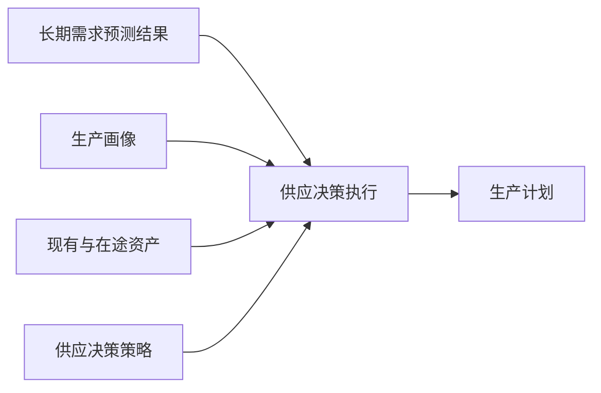

# 供应决策设计

## 定位

供应决策把长期需求预测结果转化为可执行生产计划。长期预测只回答目标区域需要多少 Robotaxi；供应决策结合生产画像、现有与在途资产、交付能力和安全余量，决定生产数量与节奏。

## 对象边界

|对象|职责|
|---|---|
|供应决策策略|配置覆盖率、安全余量、产能约束和区域优先规则|
|供应决策执行|冻结预测、生产画像和策略快照，记录成功失败及生成计划编号|
|生产计划|保存已决定的区域数量、开始日期和完成日期，确认后进入生产|

不建立独立“供应决策结果”对象。生产计划就是本次决策的可执行输出，执行记录通过 `supply_plan_id` 引用它。

## 区域与交付边界

供应决策必须在生产计划中明确目标 Zone 和数量。生产完成后的交付编排只选择具体 Robotaxi ID、目标运营中心和交付批次，不得重新决定区域供给数量。

## 模拟边界

本能力是业务底层人工闭环，默认不参与模拟运行扫描。未来自动化只能调度同一供应决策服务。
