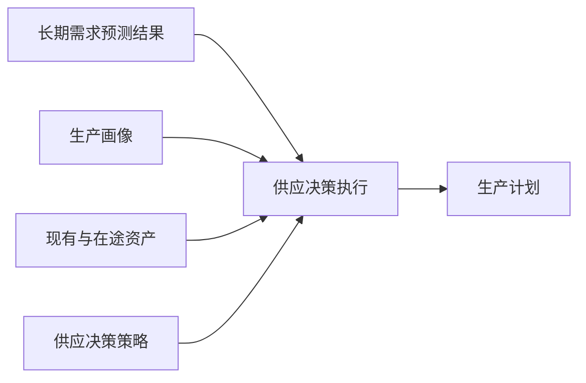
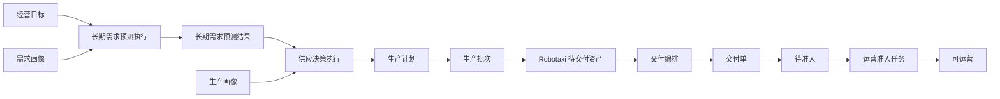

# 供应决策设计

## 定位

供应决策把长期需求预测结果转化为可执行生产计划。长期预测只回答目标区域需要多少 Robotaxi；供应决策结合生产画像、现有与在途资产、交付能力和安全余量，决定生产数量与节奏。

## 对象边界

|对象|职责|
|---|---|
|供应决策策略|配置覆盖率、安全余量、产能约束和区域优先规则|
|供应决策执行|冻结预测、生产画像和策略快照，记录成功失败及生成计划编号|
|生产计划|保存已决定的区域数量、开始日期和完成日期，确认后进入生产|

不建立独立“供应决策结果”对象。生产计划就是本次决策的可执行输出，执行记录通过 `supply_plan_id` 引用它。

## 业务闭环

- 当前供给来源只包含自有生产，因此不再增加语义宽泛的“供给计划”；供应决策的正式单据输出就是生产计划。
- 生产计划确认后才能生成生产批次；生产批次完成时通过 Robotaxi 对象服务创建具体资产，初始为待交付。
- 交付编排只选择具体 Robotaxi、运营中心和批次；交付完成后资产进入待准入，再由运营准入任务决定是否可运营。
- 策略、执行、计划、批次、资产和交付单均是独立对象，通过编号和服务动作关联，不共享状态机。

## 验证要求

供应决策不能只验证“生成了生产计划”。完整验收至少覆盖：

1. 策略页面可加载并可执行；
2. 执行记录冻结策略、预测和生产画像快照；
3. 生产计划确认后生成生产批次；
4. 生产批次开始、完成并创建正确数量的待交付 Robotaxi；
5. 交付编排和交付单不重新计算区域供给数量；
6. 交付完成进入待准入，运营准入通过后进入可运营。

## 区域与交付边界

供应决策必须在生产计划中明确目标 Zone 和数量。生产完成后的交付编排只选择具体 Robotaxi ID、目标运营中心和交付批次，不得重新决定区域供给数量。

## 模拟边界

本能力是业务底层人工闭环，默认不参与模拟运行扫描。未来自动化只能调度同一供应决策服务。
