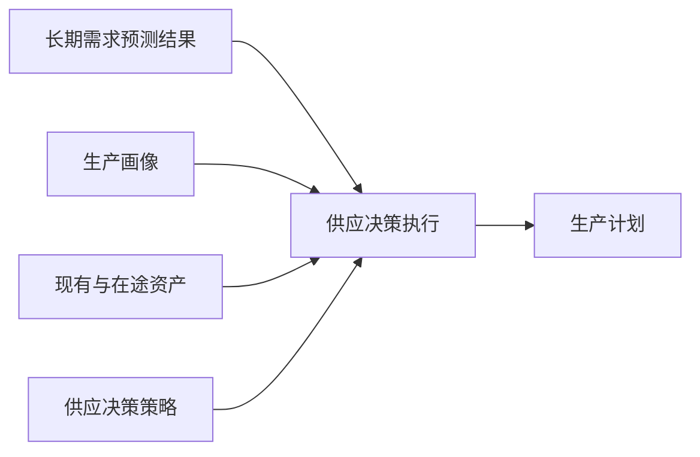
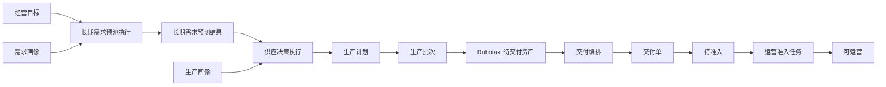

# 供应决策设计

## 定位

供应决策把长期需求预测结果转化为可执行生产计划。长期预测只回答目标区域需要多少 Robotaxi；供应决策结合生产画像、现有与在途资产、交付能力和安全余量，决定生产数量与节奏。

## 对象边界

|对象|职责|
|---|---|
|供应决策策略|配置覆盖率、安全余量、产能约束和区域优先规则|
|供应决策执行|冻结预测、生产画像和策略快照，记录成功失败及生成计划编号|
|生产计划|保存已决定的区域数量、开始日期和完成日期，确认后进入生产|

不建立独立“供应决策结果”对象。生产计划就是本次决策的可执行输出，执行记录通过 `supply_plan_id` 引用它。

供应决策必须从一条明确的需求预测结果触发。策略列表不提供脱离预测上下文的通用“执行”动作，避免系统隐式选择第一条预测结果。相同预测结果、供应策略版本和生产画像版本已经形成未取消生产计划时，服务返回既有计划，不新增失败执行或重复计划；任一输入版本变化后才允许重新决策。

## 业务闭环

- 当前供给来源只包含自有生产，因此不再增加语义宽泛的“供给计划”；供应决策的正式单据输出就是生产计划。
- 生产计划确认后才能生成生产批次；生产批次完成时通过 Robotaxi 对象服务创建具体资产，初始为待交付。
- 交付编排只选择具体 Robotaxi、运营中心和批次；交付完成后资产进入待准入，再由运营准入任务决定是否可运营。
- 策略、执行、计划、批次、资产和交付单均是独立对象，通过编号和服务动作关联，不共享状态机。

生产计划必须保存并展示统一字段：`forecast_result_id`、`supply_decision_run_id`、`supply_decision_strategy_id`、`supply_production_profile_id`、`required_robotaxi_quantity`、`effective_current_robotaxi`、`robotaxi_gap_quantity`、`required_supply_quantity`、`feasible_manufacturing_quantity`、`feasible_delivery_quantity`、`planned_robotaxi_count` 与 `uncovered_robotaxi_gap`。页面不得再读取 `fleet_gap_quantity / feasible_production_quantity / production_gap_quantity` 等旧字段。

供应决策不得按预测周期数量再次乘算生产能力。`feasible_manufacturing_quantity` 与 `feasible_delivery_quantity` 是需求预测结果已经按生产提前期、质检周期、爬坡产能和交付能力冻结的可行性事实；供应决策只按覆盖率和安全容量计算所需供给，再受这两个事实约束。

覆盖率和安全容量在配置界面以百分比输入和展示，领域策略统一保存为 `[0, 1]` 比例值。

运行态加载旧生产计划时，可以从其关联的预测结果、供应决策执行和生产画像补齐上述追溯与计算字段，但不得改写已经发生的预测结果或人为配置。旧别名只允许作为迁移输入，页面和新单据统一保存正式字段。

执行成功后，调用端必须进入新生成或已存在的生产计划并选中记录；失败时保留在来源预测结果，显示可理解的中文失败原因。动作状态统一为“执行供应决策 / 执行中 / 查看生产计划 / 重新决策”，不能在输入未变化时持续显示可重复执行。

## 验证要求

供应决策不能只验证“生成了生产计划”。完整验收至少覆盖：

1. 策略页面可加载并可执行；
2. 执行记录冻结策略、预测和生产画像快照；
3. 生产计划确认后生成生产批次；
4. 生产批次开始、完成并创建正确数量的待交付 Robotaxi；
5. 交付编排和交付单不重新计算区域供给数量；
6. 交付完成进入待准入，运营准入通过后进入可运营。

## 区域与交付边界

供应决策必须在生产计划中明确目标 Zone 和数量。生产完成后的交付编排只选择具体 Robotaxi ID、目标运营中心和交付批次，不得重新决定区域供给数量。

## 模拟边界

本能力是业务底层人工闭环，默认不参与模拟运行扫描。未来自动化只能调度同一供应决策服务。
