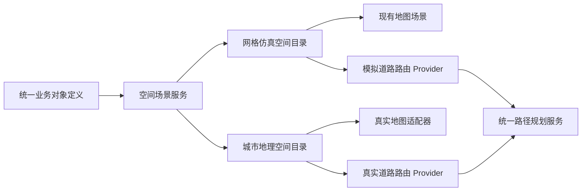
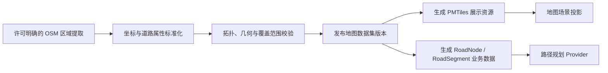
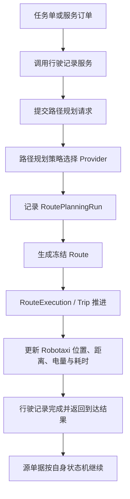
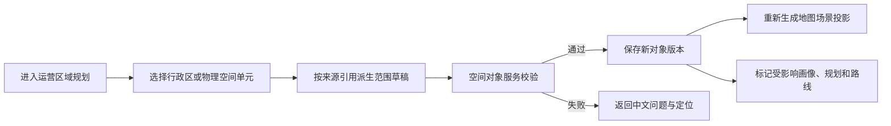

# 真实地理空间运营地图升级设计

## 1. 设计目标

本方案把现有规则网格地图升级为可承载真实地理空间、真实道路网络和路径规划的运营空间底座，同时保留当前模拟地图确定、快速、可验证的能力。

目标不是复制 Google Maps，也不是建设自动驾驶导航或安全决策系统，而是形成：

```text
真实地理空间
  + Robotaxi 经营对象
  + 道路路径规划
  + 业务单据行驶闭环
  + 空间经营分析
= 更接近真实城市运营的 Robotaxi 经营闭环模拟
```

地图不能只是页面背景。它必须使 Place、ServiceArea、Zone、运营中心、Robotaxi、道路和路径在同一空间关系中可定位、可解释、可计算、可追溯。

## 2. 当前基础与结构性缺口

### 2.1 已有正确基础

当前系统已经具备：

- `Map / Cell` 模拟空间；
- `Road / RoadNode / RoadSegment` 道路拓扑；
- `Place / ServiceArea / Zone` 运营空间对象；
- `RoutePlanningStrategy / RoutePlanningRun / Route` 路径规划结构；
- `RouteExecution / Trip` 行驶执行与事实记录；
- 地图场景投影、对象选择、Robotaxi 位置投影和多 Zone 场景；
- 业务单据通过行驶服务调用路径规划的服务边界。

这些能力是升级基础，不应因引入真实地图被推翻。

### 2.2 当前缺口

现有 Cell 坐标只能表达项目内部规则网格，不能直接回答：

- 对象在真实世界中的经纬度和边界；
- 道路几何、真实距离和道路连通关系；
- 版本化地理空间单元如何被运营对象引用、组合并形成可追溯范围；
- 同一个业务对象如何同时投影到模拟地图和真实地图；
- 路由引擎不可用时业务如何降级；
- 地图数据版本变化是否会改变历史 Route 和行驶事实。

因此本次升级的本质是增加地理空间能力层和适配层，而不是替换一张底图。

## 3. 核心架构决策

### 3.0 广州受控范围与双空间场景长期保留

首期真实地理能力只服务于广州市受控演示范围，不扩展为全球地图。受控范围足以验证多区域运营、空间规划、道路关系和路径规划，也能控制资源体积、外部依赖与公开演示成本。

现有模拟网格不是过渡页面，必须长期保留并可随时切换。两个场景统一命名为：

- `城市地理`：基于广州真实地理坐标、城市底图和城市原生空间对象；
- `网格仿真`：基于 Cell、模拟道路和确定性位置的离散仿真空间；
- 页面控件统一称为“空间场景”，不再使用含义模糊的“地理 / 网格”；
- 切换空间场景只改变当前查看和规划的空间，不重置业务数据、任务、订单、Robotaxi 或模拟运行；
- 用户最后一次选择保存在本地体验状态中，不成为业务事实。

两个场景不得通过页面投影混合。城市地理不能把 Cell、模拟道路、网格车辆位置或网格 Route 临时投影到广州底图后冒充城市地理事实；网格仿真也不能反向引用城市坐标完成 Cell 业务判断。

### 3.0.1 查看场景与业务运行场景分离

`当前查看场景`回答用户正在查看和编辑哪套空间；`业务运行场景`回答订单、任务、路径规划和模拟运行使用哪套空间事实。二者必须显式分离：

```text
当前查看场景
  ├─ 城市地理：真实底图浏览、城市运营空间规划
  └─ 网格仿真：现有业务运行与确定性模拟观察

业务运行场景
  └─ 网格仿真（当前有效）
```

城市地理场景只有同时具备版本化道路图、路由 Provider、上下车点和 Robotaxi 地理位置 Provider，并通过业务与性能验证后，才能通过专门的场景启用动作成为业务运行场景。用户仅切换地图查看方式不得隐式改变业务运行底座。

### 3.1 双空间场景

系统保留两种空间运行模式：

| 模式 | 定位 | 主要用途 |
| --- | --- | --- |
| 网格仿真 | 基于 Cell 的确定性离散空间 | 现有业务运行、高速模拟、回归测试 |
| 城市地理 | 基于经纬度、GeoJSON 和真实道路网络 | 广州空间展示、区域建模、后续真实道路路径规划 |

两种场景共享业务对象定义和能力接口，不共享空间事实、空间目录、道路图、位置、Route 或运行快照。跨场景只允许通过明确的对象映射关系关联，不允许把一个场景的坐标当作另一个场景的原生事实。



### 3.1.1 空间场景合同

每个空间场景至少固定：场景编号、场景类型、地图数据集、空间目录版本、路由 Provider、位置 Provider、业务运行能力和状态。页面只能通过空间场景服务读取这些能力，不能依据当前地图组件自行推断。

首期能力门禁如下：

| 场景 | 原生对象目录 | 道路与路由 | Robotaxi 位置 | 业务运行 |
| --- | --- | --- | --- | --- |
| 网格仿真 | 已具备 | Cell 道路图已具备 | `current_cell_id` | 启用 |
| 城市地理 | 广州原生 GeoJSON 与运营空间方案 | 尚未具备城市道路图 | 尚未具备地理位置 Provider | 仅规划，不启用 |

城市地理首期只展示城市原生对象和已发布运营空间方案；道路、Robotaxi、Route 图层为空是正确的能力表达，不允许用网格投影补齐视觉。

### 3.2 唯一事实和投影边界

地图页面只消费空间场景投影：

### 3.2.1 地理事实与运营对象分层

城市地理不能以用户绘制的多边形作为地理事实。空间底座固定为四层：

```text
地图渲染资源
  → 版本化地理事实（城市、行政区，后续道路、建筑和水系）
  → 运营空间对象（Zone、Place、ServiceArea）
  → 经营、调度和模拟运行
```

- 广州市、荔湾区等边界来自已登记的数据集、来源编号和版本；
- Zone 保存来源空间单元引用，几何由来源引用派生，不能由页面复制一份无来源坐标；
- 直接采用荔湾区时，一个行政区形成一个一级 Zone；
- 组合多个相邻行政区时，多个来源单元共同形成一个一级 Zone；
- 绘制只是一种选择手势。后续自定义范围应由被选中的道路、建筑或其他物理空间单元组成，不能把自由多边形本身当作物理事实；
- 城市范围是数据作用域和硬约束。超出广州市的空间单元不会进入候选集合，因此不是绘制后再报错。

当前行政区边界使用公开、版本化的广州行政区 GeoJSON 快照，满足演示、追溯和工程验证；它不是法定测绘成果，后续若用于真实经营必须替换为具备相应许可和精度的数据源。

```text
场景内空间对象唯一事实
  ↓
空间场景与空间对象服务
  ↓
地图场景投影服务
  ↓
MapLibre 地图图层
```

地图样式、缩放级别、标签层级、悬浮信息字段属于展示配置；对象名称、状态、位置、边界、画像和业务关系不允许在地图页面维护副本。

同一个逻辑经营对象可以在两个场景中存在映射，但每个场景的几何、位置和来源版本独立。映射只用于说明“它们代表同一个经营对象”，不能替代空间事实本身。

### 3.3 Route 是规划结果

`Route` 继续是路径规划策略执行结果，不回退为地图初始化中的静态对象。地图只负责展示 Route 几何，业务单据仍通过统一路径规划服务获得 Route。

## 4. 业务对象边界

| 对象 | 固定职责 | 真实地理升级后的变化 |
| --- | --- | --- |
| Map | 空间容器与空间模式 | 增加坐标参考、地理边界和地图数据版本 |
| Cell | 模拟运行最小离散单元 | 保留；可增加与真实地理网格的映射，不作为真实几何唯一来源 |
| RoadNode | 道路拓扑连接点 | 增加地理点位和外部道路节点引用 |
| RoadSegment | 最小可通行道路片段 | 增加 LineString 几何、真实距离和外部路段引用 |
| Road | 道路语义聚合 | 聚合真实 RoadSegment，保持名称、类型和状态语义 |
| Place | 需求产生地点 | 增加 Point/Polygon 几何，不承担服务承载 |
| ServiceArea | 接驾、送达、等待和周转承载空间 | 增加 Polygon 几何，仍不产生或分摊需求 |
| Zone | 经营和运营聚合区域 | 增加 Polygon/MultiPolygon 几何，仍只汇总需求与承载 |
| OpsCenter | 运营中心资源对象 | 关联真实位置和覆盖范围，不并入 Place 或 Zone |
| Robotaxi | 运营资产 | 增加当前位置地理坐标；Cell 位置继续支持模拟模式 |
| Route | 一次路径规划结果 | 保存冻结的路线几何、道路片段、距离、时间和数据版本 |

Place 产生需求、ServiceArea 表达服务承载、Zone 聚合需求与承载的既有规则保持不变。地理几何只回答“在哪里”和“覆盖什么”，不得改变对象经营语义。

### 4.1 城市空间对象关系与两级 Zone

城市地理场景固定采用以下空间关系，不复制网格场景的 Cell 事实：

```text
城市
  └─ 一级 Zone（正式经营规划、画像、预测和供应归属）
       ├─ Place + ServiceArea（扁平模式）
       └─ 二级 Zone（可选）
            └─ Place + ServiceArea（两级模式）
```

- Zone 最多两级。一级 Zone 的 `parent_zone_id` 为空；二级 Zone 必须直接归属一级 Zone，禁止继续建立更深层级；
- 是否建立二级 Zone 由规划人员按区域复杂度决定。没有二级 Zone 时，Place 和 ServiceArea 直接归属一级 Zone；存在二级 Zone 时，它们直接归属二级 Zone，并继承一级 Zone；
- 当前长期需求画像、需求预测、供应决策和区域交付仍以一级 Zone 为正式经营口径。二级 Zone 首期只保存空间层级，后续可用于短期供需平衡、区域投放和服务分析；
- Place 是地理位置或设施位置，住宅区、办公区、商业区、学校、医院、交通枢纽、运营中心和工厂都是 Place 类型；类型不同不改变其可能产生出行需求的属性；
- `Place(type=OPS_CENTER)` 只表达运营中心的地理位置和边界，`OpsCenter` 继续是独立运营资源对象，通过 `place_id` 关联；工厂采用同一结构，首期只建立 `FACTORY` 地点类型，后续独立 Factory 对象再通过 `place_id` 接入生产闭环；
- ServiceArea 是接驾、送达、临停、待命等服务承载面，必须关联一个 Place 和直接归属 Zone。上下车点是后续独立点对象，位于或关联 ServiceArea 并吸附到可通行道路，不能把 ServiceArea 本身误当成上下车点。

城市空间对象与网格空间对象可以表达相同经营概念，但拥有独立编号、几何、关系和目录版本。当前发布城市空间方案只更新城市目录，不修改网格 Zone、Place、ServiceArea、Cell、道路、Robotaxi 位置或模拟运行事实。

### 4.2 几何包含是层级关系的硬约束

对象编号只能声明业务归属，不能覆盖真实几何事实。城市空间目录必须同时满足以下条件：

- 二级 Zone 的完整边界位于其一级 Zone 内；
- Place 与 ServiceArea 的完整边界位于其直接归属 Zone 内；
- ServiceArea 与关联 Place 归属同一个直接 Zone；
- 边界必须闭合且不能自交；对象任何边界段越过父级边界都必须阻止发布；
- 一级 Zone、二级 Zone、Place 和 ServiceArea 的层级关系由完整候选目录统一校验，不能只校验当前正在编辑的对象。

地图视觉上的包含关系是目录关系的投影，不得通过图层叠放制造并不存在的父子关系。

## 5. 空间数据合同

### 5.1 坐标体系

内部地理事实统一使用 `EPSG:4326` 经纬度。渲染适配器可以转换为 Web Mercator，但不得把渲染坐标写回业务对象。

中国区域如接入其他坐标体系，必须通过明确的坐标转换适配器处理，并保存原始坐标系与转换版本；不得在页面中隐式偏移。

### 5.2 拟新增字段

以下字段是后续实施候选，不代表当前代码已经具备：

| 字段 | 所属对象 | 含义 |
| --- | --- | --- |
| `spatial_mode` | Map | 模拟网格或真实地理模式 |
| `coordinate_reference_system` | Map/Geometry | 坐标参考系 |
| `geometry_geojson` | 空间对象 | 对象标准几何 |
| `centroid_longitude / centroid_latitude` | 面对象 | 地图定位中心点 |
| `geographic_bounds` | Map/Zone | 地理边界 |
| `source_dataset_id / source_dataset_version` | 空间对象/Route | 空间数据来源与版本 |
| `external_feature_id` | RoadNode/RoadSegment/Place | 外部数据对象引用 |
| `current_longitude / current_latitude` | Robotaxi | 当前地理位置 |
| `route_geometry_geojson` | Route | 冻结的路线几何 |
| `routing_provider / routing_profile` | RoutePlanningRun/Route | 路由 Provider 与车辆成本模型 |
| `cell_geography_mapping_version` | Map/Cell | Cell 与地理空间映射版本 |

正式实施时必须先完成字段去重、字段性质、中文名、单位、来源和兼容关系评审，再同步文档与代码字段字典。

### 5.3 历史不可变

地图数据或道路版本更新不得改变历史 Route、RoutePlanningRun、RouteExecution 和 Trip。一次路径规划必须冻结：

- 起终点；
- 空间模式；
- 路由 Provider 和策略版本；
- 地图数据版本；
- 路线几何；
- 道路片段序列；
- 规划距离和预计时间。

## 6. 技术组件与责任

| 能力 | 推荐组件 | 项目责任边界 |
| --- | --- | --- |
| 地图渲染 | MapLibre GL JS | 只负责 WebGL 地图、图层、视口和交互事件 |
| 基础地图 | OSM 派生矢量数据 | 提供道路与地理背景，必须保留来源说明 |
| 静态瓦片 | PMTiles + CDN/对象存储 | 按需读取选定区域，降低服务器和维护成本 |
| 几何绘制 | Terra Draw | 提供点、线、面编辑交互，不直接持久化业务对象 |
| 空间计算 | Turf.js | 距离、包含、相交、中心点和面积等轻量计算 |
| 首期汽车路由 | OSM 道路导入 + 现有图路由算法 | 在受控区域形成版本化 Road 图，适配当前静态公开站和确定性模拟 |
| 后续服务化路由 | OSRM Provider | 区域扩大或需要服务端统一计算时接入，不作为首期硬依赖 |
| 后续复杂路由 | Valhalla Provider | 仅在需要动态成本、等时圈、地图匹配时评估 |

禁止把公共 OSM 标准瓦片服务作为不可替换的正式依赖。底图来源必须可配置，地图不可用时业务对象列表和模拟网格模式仍需可用。

### 6.1 当前阶段选型结论

首期采用“小区域、离线数据、静态发布、统一服务”的最小充分方案：

```text
OSM 区域数据提取
  ↓
道路与几何标准化
  ↓
生成版本化 PMTiles + RoadNode/RoadSegment 数据集
  ↓
EdgeOne 或 GitHub Pages 分发静态地图资源
  ↓
浏览器通过现有路径规划服务计算受控区域路线
```

这一选择的原因是：当前网站是静态公开站，MapLibre 和 PMTiles 可以静态部署，但 OSRM/Valhalla 属于持续运行的路由服务。首期强行引入服务端会增加部署、网络、可用性和费用风险，且会形成公开演示的单点故障。

当演示区域、道路规模或路径规则超出浏览器图路由能力时，再把统一 `RoutingProvider` 切换为 OSRM；业务单据、Route 和前端不随 Provider 更换而改造。

### 6.2 地图数据生产链

基础地图与业务道路必须来自同一已登记的数据集版本，不能由页面分别加载后临时推断关系：



地图数据集发布失败时，旧版本继续有效；不得出现底图已更新而路径规划仍使用未知旧道路的隐式状态。

## 7. 服务架构

### 7.0 运营区域方案对象

地图绘制不能直接修改 Zone、Place 或 ServiceArea。系统通过独立的 `OperatingSpatialPlan`（运营区域方案）承接一次地图建模工作的草案、校验、预览和发布：

| 内容 | 责任 |
| --- | --- |
| 方案 | 记录编号、名称、地图数据集、版本、状态和发布时间 |
| 空间要素 | 记录目标对象类型、目标对象编号、名称、GeoJSON 几何和归属关系 |
| 校验结果 | 记录边界、几何、包含关系、重叠和数据版本问题 |
| 影响预览 | 说明将覆盖哪些地理投影、哪些画像需要重算、哪些路线需要重新评估 |

状态固定为：`草稿 → 已校验 → 已发布`；草稿可取消，已发布版本不可原地改写。再次调整必须形成新版本。

当前发布语义是“发布城市空间目录版本”：

- 已有关联对象编号时，发布新几何和关系版本，不原地改写历史方案；
- 新要素在草稿创建时获得稳定城市对象编号，发布后成为城市目录中的 Zone、Place 或 ServiceArea；
- 发布前必须校验 Zone 两级上限、父子包含、Place 直接归属 Zone、ServiceArea 关联 Place 与 Zone，以及广州受控范围；
- 新城市对象不自动生成网格 Cell、画像、道路、运营资源或 Robotaxi 位置，不进入模拟运行和正式单据匹配；
- 页面只提交绘制命令，校验、版本和发布都由运营空间方案服务处理。

城市地理正式目录初始为空。Zone、Place、ServiceArea 必须由规划人员在广州真实底图上绘制、校验并发布后形成；页面、初始化数据和网格仿真都不得预置不可调整的城市空间对象。后续若引入导入数据，也必须通过同一方案发布和目录版本机制进入，不得成为页面私有标记。

初始化对象与后续新增对象遵守同一治理能力：均可从地图选中后调整；不再使用的对象通过版本化方案执行软停用并退出当前有效场景，禁止页面硬删除。停用 ServiceArea 可独立完成；停用 Place 前必须处理其有效 ServiceArea 和运营中心关系；停用 Zone 前必须处理其有效子 Zone、Place、ServiceArea 和运营中心。历史几何、来源方案和版本继续保留。新建、编辑和停用是三种不同意图：新建始终从空草稿开始，编辑必须先选择已发布对象并载入有效几何，停用只出现在已发布对象管理中；三者不得复用一个含义不明的目标对象选择器。

广州城市地图在低缩放层级显示“广州市行政范围”，用于说明当前地图数据集的可规划边界。它采用固定版本的行政边界 GeoJSON 快照，不得用地图包围盒矩形代替；它是地图数据集参考，不是经营意义上的 Zone，不参与画像、预测、供应、单据或模拟运行，也不可通过运营区域规划功能编辑。正式 Zone 只能由当前城市空间规划合同创建、校验和发布。城市参考范围使用轻量填色和持续可见的边界线表达；正式空间对象的区域面与文字标签共享同一悬停、选中和详情交互，不能出现“看得到名称但选不中对象”。

规划操作固定为以下顺序：

```text
选择空间对象、对象类型与名称
  → 系统按地图视角推荐对象层级，用户作出最终选择
  → 开始绘制，在父级边界内依次标记边界点并明确完成绘制，或载入已发布对象后调整顶点和中点
  → 识别当前地图数据集中的道路、建筑、地点、水域等参考要素
  → 校验几何、层级、底图覆盖和可服务性
  → 预览影响并发布不可变目录版本
```

底图参考要素用于帮助规划人员理解“边界覆盖了什么”，不是新的 Zone、Place、ServiceArea 或 Road 业务事实。方案只保存紧凑的来源引用和分类快照；正式道路拓扑、建筑对象和上下车点仍必须通过后续地图数据生产链和独立对象服务形成。服务区域只覆盖水域等明显不可服务空间时禁止发布；地点或服务区域没有识别到道路时给出规划提示，由用户调整边界或确认地图缩放和数据覆盖。

底图要素采集必须遵守稳定性合同：

- 绘制完成是显式服务调用，不依赖伪造键盘事件或浏览器偶然触发的绘制事件；
- 地图、样式或瓦片尚未加载完成时必须阻止形成方案，并说明等待原因；
- 采集同时读取当前地图数据源与可见图层，不得仅依赖某个缩放级别下已经渲染的标签；
- 没有识别到底图参考要素时不得静默保存空快照，用户调整视角或边界后才能重试；
- 同一几何和同一地图数据版本重复执行，必须形成一致的校验结论。

地图视角为规划对象提供粗略推荐，不直接替用户决定对象类型：城市视野推荐一级 Zone；区域视野推荐可选二级 Zone；地点视野推荐 Place；道路与建筑视野推荐 ServiceArea。规划人员仍按“空间对象 → 类型 → 名称”明确选择，缩放变化不得覆盖正在编辑的选择。最终合法性由几何与层级合同决定：二级 Zone 必须完整位于一级 Zone 内，一级 Zone 不能被另一个一级 Zone 包含，Place 和 ServiceArea 必须满足各自直接父级关系。

绘制结束后，空间关系服务依据完整几何自动推断父级 Zone、直接归属 Zone、关联 Place 和被完整包含的下级对象。部分交叠不是合法包含关系，必须作为边界冲突阻止发布；ServiceArea 必须位于或紧邻唯一 Place，并与其属于同一直接 Zone。页面不得提供可绕过几何事实的手工父级选择。

已发布对象的调整固定采用版本化编辑：

```text
选择已发布对象
  → 载入当前有效几何与关系
  → 调整边界或属性，或者申请停用
  → 形成新方案版本
  → 校验完整城市目录
  → 发布新版本并保留旧版本
```

- 已发布对象不原地改写；历史方案继续可追溯，不能被改成“已取消”；
- 发布校验必须针对应用全部方案后的完整城市目录，不只校验当前单个多边形；
- 一级 Zone 由扁平模式切换为两级模式时，父 Zone、全部二级 Zone、Place 和 ServiceArea 归属必须在同一方案中整体通过校验，禁止出现部分对象仍直挂一级 Zone 的中间状态；
- 空间目录版本只在有效发布发生后变化，场景合同、目录初始化与页面投影必须引用同一个版本。
- 城市空间方案带有显式合同版本；旧合同方案继续保留为历史证据，但不得自动物化为当前有效城市目录，也不得在地图上形成无法解释、不可调整的固定范围。

### 7.1 空间对象服务

负责：

- 创建和更新地理位置与几何；
- 校验几何类型、坐标系、边界和对象归属；
- 维护 Place、ServiceArea、Zone、Road 与 OpsCenter 的关系；
- 产生空间对象版本和变更事件；
- 生成模拟 Cell 与地理几何的映射。

页面绘制完成后只能提交编辑命令，由空间对象服务校验并保存。

### 7.2 地图场景投影服务

负责把当前业务对象派生为 MapLibre Source/Layer 所需的只读 GeoJSON，并处理：

- 图层可见性；
- 当前视口对象集合；
- 标签层级；
- Robotaxi 聚合；
- 选中、悬停和详情引用；
- 画像关键字段投影。

它不得写业务状态或复制画像事实。

### 7.3 路由 Provider 合同

统一路径规划服务通过 Provider 接口选择算法：

```text
SimulationGridRoutingProvider
ImportedRoadGraphRoutingProvider
OsrmRoutingProvider（后续可选）
```

Provider 输入至少包含起终点、空间模式、车辆类型、道路限制和策略快照；输出统一候选 Route，不直接修改 Robotaxi、任务、订单或行驶记录。

### 7.4 地图数据目录服务

负责记录底图、道路图和对象几何的数据集版本、启用状态、覆盖范围、更新时间和来源。生产环境更换数据版本必须显式发布，不能在用户刷新时静默改变业务路由结果。

## 8. 路径规划与行驶闭环



关键约束：

1. 地图页面不能创建 RouteExecution；
2. 路由 Provider 只返回规划结果；
3. 运营行驶记录和履约行驶记录继续拥有自己的状态机、时间线和成本事实；
4. 模拟运行只调度统一业务动作服务；
5. 真实时间人工操作和模拟时间自动化必须复用同一规划与行驶服务；
6. Provider 超时、无路和数据缺失必须形成路径规划执行结果，不得伪造直线到达。

## 9. 运营区域规划闭环

空间编辑与日常浏览必须分离：



校验至少包含：

- 来源空间单元存在、属于当前数据集版本和广州市作用域；
- 派生 GeoJSON 类型与坐标合法；
- Zone、Place、ServiceArea 归属关系；
- ServiceArea 是否位于可服务道路附近；
- RoadSegment 连通性；
- OpsCenter 位置与职能区域关系；
- 与当前有效业务对象是否冲突；
- 是否需要重算画像或重新发布地图数据版本。

初期支持行政区直接采用与组合，不提供修改行政区、OSM 底图或其物理事实的能力。Place、ServiceArea 的物理要素选择目录尚未完成前，原有自由绘制仅作为过渡能力，不得用于创建城市或行政区事实。

## 10. 用户体验合同

### 10.1 浏览模式

- 地图是运营中控台主场景，不放入装饰卡片；
- 拖动、缩放、复位和图层切换使用通用图标控件；
- 缩放层级决定 Zone、Place、ServiceArea、道路和 Robotaxi 标签密度；
- 悬停只显示对象名称、类型和最多三项关键运营信息；
- 点击固定选中并展开统一详情，点击有效空白区域清除选择；
- 路线选中后显示起点、终点、路径、距离、预计时间和关联规划执行编号。
- 两种空间场景共用一套地图工具合同：左上角先显示空间场景切换，下一行显示当前场景动作；右下角统一显示放大、缩小、复位和图层入口。控件只调用当前场景适配器，不允许城市地图和网格地图分别形成两套视觉和交互。

城市地图采用语义缩放，继承 OpenFreeMap 的道路、建筑、水系、行政区域和文字视觉，不在业务图层上重绘一套粗糙底图：

| 视野层级 | 主要业务对象 |
| --- | --- |
| 城市级视野 | 城市边界与多个一级 Zone；隐藏细碎业务标签 |
| 一级 Zone 视野 | 一级 Zone 与可选二级 Zone |
| 二级 Zone 视野 | 二级 Zone、主要 Place |
| 地点视野 | Place 与关联 ServiceArea |
| 道路和建筑视野 | ServiceArea、道路参考、后续上下车点和车辆位置 |

已发布范围采用轻量半透明填充、细边界和地图原生标签避让。桌面端鼠标经过显示名称、对象类型与最多三项关键关系，点击保持选中并进入统一详情；手机端不提供规划能力，轻触显示同一摘要，再次操作进入详情。缩放只改变当前层级的显示密度，不修改对象事实。

层级切换使用 MapLibre 图层的 `minzoom`、`maxzoom` 和对象类型过滤完成；字体不会随地图无限放大。放大只增加适合当前决策层级的信息，不允许所有层级同时覆盖地图。

### 10.1.1 城市空间视觉语言

城市空间对象不是装饰色块，而是业务对象几何的地图投影。每类面对象统一由四层表达组成：

1. 低饱和半透明填充，用于识别对象范围并保留道路、建筑和地名；
2. 独立边界线，用于在相邻对象和复杂底图上保持轮廓；
3. 按语义缩放显示的轻量标签，不随地图无限放大；
4. 统一悬停和选中状态，选中边界强于悬停，悬停强于默认状态。

颜色表达遵循业务语义而不是随机分色：

- 城市边界使用低饱和蓝灰，只表达受控城市范围；
- 一级运营区域使用沉稳青绿，二级子区域使用偏蓝青色；
- 地点按住宅、办公、商业、医疗、交通、运营中心和工厂等类型使用克制的多色语义；
- 服务区域使用同一青绿色系，通过边界样式与地点区分；
- 当前选中统一使用品牌蓝边界，不以大面积高饱和填充抢占底图。

地图不得采用游戏领地式高饱和拼色，也不得把全部对象同时铺满。默认状态首先回答“这里是什么范围”，悬停回答“它承担什么运营职能”，点击后再由统一详情回答完整字段与关系。

### 10.2 编辑模式

- 明确显示正在编辑的对象类型、形成方式、来源空间单元和草稿状态；
- 一级 Zone 默认采用行政区直接选择：搜索或点击荔湾区，预览版本化边界，形成草稿，校验后发布；
- 行政区来源型 Zone 调整时修改来源引用并形成新版本，不允许拖拽行政区边界；
- 保存前展示影响范围，不因拖动立即改业务对象；
- 支持撤销、重做、取消和保存；
- 没有权限或对象正在被业务使用时禁用编辑，并给出原因。
- 桌面端必须支持“选择已有对象后调整”与“新建对象后绘制”两条清晰路径；默认不直接进入绘制，避免用户误以为地图上的初始化对象不可管理；
- 编辑器必须显示当前对象、对象类型、直接归属和草稿状态，校验失败保留草稿并给出可处理的问题；发布成功后退出编辑并保持对象选中，刷新页面后仍读取已发布版本。

### 10.3 手机端

- 单指移动、双指缩放，不依赖悬停；
- 轻触显示摘要，再按需展开底部或侧边详情；
- 首期不提供运营区域规划入口和多边形编辑，只提供已发布对象浏览、选择、摘要与详情；
- 地图交互不得造成页面级横向溢出或阻断纵向页面返回操作。

### 10.4 编辑闭环体验验收

运营区域规划不能只通过静态页面检查。每次改动必须由实际用户路径验证至少一次：选择一个已发布 Place，进入调整，修改几何，校验，查看影响，发布，退出编辑，刷新后确认新版本仍有效，同时确认网格业务数据、模拟运行和手机查看未改变。验收记录必须说明实际操作阻力和本轮改进，不能只报告函数或脚本通过。

## 11. 性能与稳定性预算

1. 地图使用矢量瓦片、GeoJSON Source 和 WebGL 图层，不为每个 Cell 或 Robotaxi 创建独立 DOM；
2. 基础地图按当前视口和缩放级别加载，禁止预取整座城市；
3. Robotaxi 使用批量 Source 更新，数量较多时聚合或按层级简化；
4. 静态空间投影只在对象版本变化时重算；相机移动不写业务状态；
5. 路由计算不在 React 渲染循环中执行；
6. 地图、路由和业务运行态分别设置超时、错误和降级边界；
7. 首期只加载一个受控演示区域，不直接引入全国或全球数据；
8. 地图交互目标保持 60fps，单帧主线程工作目标不超过 16.7ms；
9. 路由结果必须有超时和缓存键，重复请求不得重复计算；
10. 公开演示站在底图或路由服务不可用时自动切换为模拟地图或只读降级，而不是白屏。

## 12. 数据、合规与隐私

- 基础地图和道路数据必须记录来源、许可、版本和必要署名；
- 不向第三方地图或路由服务发送客户身份、订单隐私或内部备注；
- 公开演示只使用模拟位置与模拟订单；
- 如使用中国境内真实地理数据，正式上线前必须单独核查数据许可、地图展示要求、坐标体系和服务可用性；
- 第三方 Token 不得写入前端仓库；可公开使用的样式地址也必须可替换。

真实地理演示区域必须在实施门禁中明确选择。若中国境内公开地图数据的许可、坐标或展示要求尚未核清，首期不得以“真实运营地图”名义发布该区域，可先使用许可清晰的受控区域验证工程闭环。

## 13. 失败与降级合同

| 异常 | 系统行为 |
| --- | --- |
| 底图加载失败 | 保留业务图层与错误提示，允许切换模拟地图 |
| 路由服务超时 | 路径规划执行失败或待重试，不生成虚假 Route |
| 起终点无法吸附道路 | 返回明确中文原因并保留输入快照 |
| 地图数据版本不匹配 | 阻止保存或规划，要求刷新空间目录 |
| 几何编辑校验失败 | 保留草稿并定位问题，不覆盖有效对象 |
| 手机性能不足 | 降低标签、车辆和几何细节，不改变业务事实 |

## 14. 可验证的最小闭环

首个可运行版本必须同时证明：

1. 同一 Place、ServiceArea、Zone、Road 和 Robotaxi 可以在模拟地图与真实地图投影；
2. 编辑一个业务区域后，经空间对象服务保存并重新投影；
3. 选择两个服务位置后，通过真实道路 Provider 生成 RoutePlanningRun 和 Route；
4. 行驶记录消费 Route，推进距离、时间、电量和 Robotaxi 位置；
5. 到达结果返回源单据，源单据按自身状态机继续；
6. 历史 Route 保持原地图数据版本和几何；
7. 桌面与手机均可浏览、选择对象和查看路径；
8. Provider 失败时系统按降级合同运行且不白屏；
9. 模拟网格既有业务基线和模拟性能不回归。

只有以上闭环全部通过，才能称为真实地理空间升级完成。只显示一张可拖动底图不算完成。

## 15. 演进边界

本阶段不实现：

- 实时道路交通和事故数据；
- 车道级导航和自动驾驶决策；
- 语音导航；
- 全国离线地图；
- 真实用户定位与真实订单；
- 多路径动态重规划和实时交通预测。

后续只有在真实道路模式稳定、Route 与业务单据闭环验证完成后，才评估等时圈、地图匹配、动态成本、热力图和跨城市地图数据。
