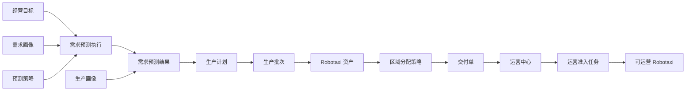

# 供应管理总览

## 1. 定位

供应管理消费经营规划输出，把长期 Robotaxi 缺口转化为资产形成、区域分配、物流交付和运营准入。经营规划回答“需要多少、何时需要”，供应管理回答“如何生产、分配和交付”。

## 2. 唯一主流程

## 3. 对象职责

|对象|职责|不得承担|
|---|---|---|
|`LongTermDemandForecastResult`|冻结需求、资产缺口和供应可行性|创建资产或执行生产|
|`SupplyPlan`|确认生产数量、节奏和来源预测结果|直接创建 Robotaxi|
|`ProductionBatch`|执行一批生产并形成具体资产|决定资产交付区域|
|`Robotaxi`|保存独立资产、位置和生命周期事实|被上游页面直接拼装|
|`FleetAllocationStrategy/Run/Result`|决定哪些 Robotaxi 分配到哪些区域和运营中心|创建 Robotaxi|
|`RobotaxiDeliveryOrder`|占用已分配资产并完成物流交付|生产资产或执行准入|
|`ReadinessCheckTask`|逐车完成运营准入检查|代替交付或生产|

## 4. 关键状态边界

1. 生产批次完成：创建 `PENDING_DELIVERY` Robotaxi，当前位置和目标运营中心为空。
2. 区域分配完成：记录目标 Zone、目标运营中心和具体 Robotaxi ID，不改变实际位置。
3. 交付开始：Robotaxi 进入运输中，不可参与运营分配。
4. 交付完成：写入运营中心 Cell，Robotaxi 进入 `PENDING_ADMISSION`，逐车创建运营准入任务。
5. 准入通过：Robotaxi 进入 `AVAILABLE`，才可参与投放和服务订单匹配。

## 5. 独立单据原则

生产计划、生产批次和交付单都是独立业务单据，必须分别拥有自己的状态、动作、状态时间线和事件。单据关联只能通过服务动作驱动，不得把下游单据状态写入上游状态时间线。

## 6. 模拟运行边界

当前首先完成业务底层人工闭环，不接入模拟运行主扫描。未来模拟运行只能统一时间并调用这些业务服务，不得复制生产、交付或准入逻辑。
