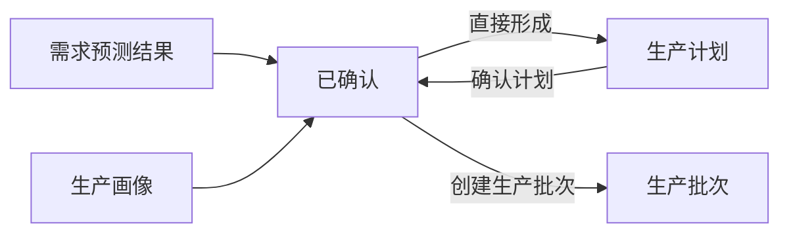

# SupplyPlan：生产计划

## 1. 对象定位

`SupplyPlan` 是供应决策执行的正式输出，也是可执行生产安排的独立业务单据。它回答目标区域缺多少 Robotaxi、决定生产多少、何时开始以及预计何时完成。生产计划不创建车辆资产。

## 2. 事实来源

|内容|唯一来源|
|---|---|
|区域车辆缺口|需求预测结果 `robotaxi_gap_quantity`|
|计划生产数量|供应决策按预测缺口与生产画像约束计算|
|预测期内可形成供给|供应决策读取生产画像计算|
|生产完成日期|供应决策按生产与质检周期计算|
|产能约束|生产画像 `supply_production_profile_id`|

预测缺口是需求事实，计划生产数量是决策结果；预测期内可形成供给受提前期、产能与交付能力约束。三者不得混为一个字段。

## 3. 核心字段

`supply_plan_id`、`plan_name`、`plan_status`、`forecast_result_id`、`forecast_run_id`、`target_zone_id`、`supply_production_profile_id`、`planned_robotaxi_count`、`required_robotaxi_quantity`、`effective_current_robotaxi`、`robotaxi_gap_quantity`、`feasible_manufacturing_quantity`、`feasible_delivery_quantity`、`uncovered_robotaxi_gap`、`planned_start_date`、`planned_end_date`、`created_at`、`updated_at`。

## 4. 状态与动作

|状态|中文|动作|下一状态|
|---|---|---|---|
|`DRAFT`|草稿|确认计划 / 取消计划|`CONFIRMED` / `CANCELLED`|
|`CONFIRMED`|已确认|创建生产批次|不改变计划状态|
|`CANCELLED`|已取消|查看|无|

创建、确认、取消均通过 `businessPlanningService`，每次状态变化只写入本单据自己的状态时间线。当前版本一张确认计划创建一个生产批次；后续拆批只能扩展服务，不改变上游合同。

## 5. 边界

- 只能由供应决策执行生成，不允许页面或预测服务拼装。
- 不创建 Robotaxi，不分配区域，不执行交付。
- 当前不进入模拟运行主路径；未来模拟只能调用相同服务动作。
