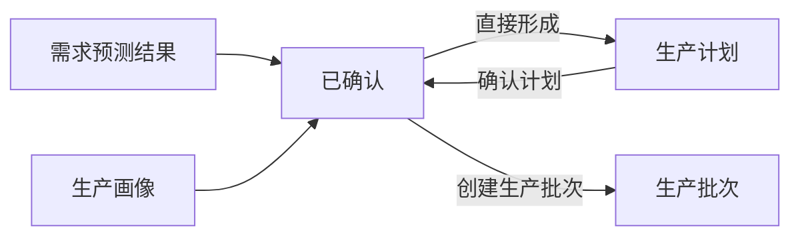

# SupplyPlan：生产计划

## 1. 对象定位

`SupplyPlan` 是供应决策执行的正式输出，也是可执行生产安排的独立业务单据。它回答目标区域缺多少 Robotaxi、决定生产多少、何时开始以及预计何时完成。生产计划不创建车辆资产。

## 2. 事实来源

|内容|唯一来源|
|---|---|
|区域车辆缺口|需求预测结果 `robotaxi_gap_quantity`|
|计划生产数量|供应决策按预测缺口与生产画像约束计算|
|预测期可生产数量|生产画像在预测周期内按提前期、产能周期和爬坡比例计算的生产能力上限|
|预测期可交付数量|生产画像在预测周期内按质量检验和交付约束计算的供应能力上限|
|生产完成日期|供应决策按生产与质检周期计算|
|产能约束|生产画像 `supply_production_profile_id`|

预测缺口是需求事实，预测期可生产和可交付数量是能力事实，计划生产数量是决策结果。供应决策必须冻结生产画像，并按预测周期、生产提前期、产能爬坡、质量检验周期和交付能力重新计算能力上限，再与需补充供应数量共同确定计划数量。

## 3. 核心字段

`supply_plan_id`、`plan_name`、`plan_status`、`forecast_result_id`、`forecast_run_id`、`target_zone_id`、`supply_production_profile_id`、`planned_robotaxi_count`、`required_robotaxi_quantity`、`effective_current_robotaxi`、`robotaxi_gap_quantity`、`feasible_manufacturing_quantity`、`feasible_delivery_quantity`、`uncovered_robotaxi_gap`、`planned_start_date`、`planned_end_date`、`created_at`、`updated_at`。

## 4. 状态与动作

|状态|中文|动作|下一状态|
|---|---|---|---|
|`DRAFT`|草稿|确认计划 / 取消计划|`CONFIRMED` / `CANCELLED`|
|`CONFIRMED`|已确认|生成下一期批次|`IN_EXECUTION`（首批开始生产时）|
|`IN_EXECUTION`|执行中|生成下一期批次、查看批次|全部排程完成后进入 `COMPLETED`|
|`COMPLETED`|已完成|查看批次与成本|终态|
|`CANCELLED`|已取消|查看|无|

创建、确认、取消和批次下达均通过 `businessPlanningService`，每次状态变化只写入本单据自己的状态时间线。计划确认时冻结生产工厂、生产画像、单位生产成本和分期排程；每次只下达一个到期排程期次。当前批次完成生产阶段后，下一期才可下达，质量检验可以与下一期生产并行。

生产计划以累计质量合格数量作为完成依据。实际生产不足或质检损失必须补充未下达排程；实际合格数量超过批次计划时，只能冲减尚未下达排程，不修改已经下达的批次事实。质检失败批次保留为独立事实，不得删除或改写为成功批次。

计划预算成本只用于规划，不形成实际成本记录。实际成本由生产批次完成生产时形成。

## 5. 边界

- 只能由供应决策执行生成，不允许页面或预测服务拼装。
- 不创建 Robotaxi，不分配区域，不执行交付。
- 当前不进入模拟运行主路径；未来模拟只能调用相同服务动作。
