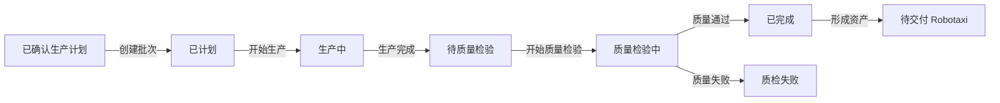

# ProductionBatch：生产批次

## 1. 对象定位

`ProductionBatch` 是生产计划的执行单据。批次生产完成后必须经过质量检验，只有质量检验通过时才通过 Robotaxi 对象服务形成指定数量的车辆资产；资产不提前获得运营中心、当前位置或运营准入资格。



## 2. 核心字段

`production_batch_id`、`batch_name`、`batch_status`、`supply_plan_id`、`target_zone_id`、`planned_robotaxi_count`、`produced_robotaxi_count`、`produced_robotaxi_ids`、`production_started_at`、`production_completed_at`、`created_at`、`updated_at`。

## 3. 状态与动作

|状态|中文|动作|下一状态|
|---|---|---|---|
|`PLANNED`|已计划|开始生产|`IN_PRODUCTION`|
|`IN_PRODUCTION`|生产中|生产完成|`AWAITING_QUALITY_INSPECTION`|
|`AWAITING_QUALITY_INSPECTION`|待质量检验|开始质量检验|`IN_QUALITY_INSPECTION`|
|`IN_QUALITY_INSPECTION`|质量检验中|质量通过|`COMPLETED`|
|`IN_QUALITY_INSPECTION`|质量检验中|质量失败|`QUALITY_FAILED`|
|`COMPLETED`|已完成|查看生成资产|无|
|`QUALITY_FAILED`|质检失败|查看失败信息|无|
|`CANCELLED`|已取消|查看|无|

## 4. 资产形成合同

新车辆必须满足：

```text
availability_status = PENDING_DELIVERY
available_for_dispatch = false
current_cell_id = null
target_ops_center_id = null
production_batch_id = 当前批次
planned_target_zone_id = 计划目标区域
```

生产批次承接生产计划中的一个排程期次。生产完成时生成统一生产成本记录；质量检验通过后形成资产，并把合格单车生产成本写入 Robotaxi。供应决策和生产计划已经确定目标区域；交付编排只选择具体 Robotaxi、运营中心和物流批次，交付完成后才写入当前位置并进入 `PENDING_ADMISSION`。

生产成本记录以批次为唯一来源：生产完成生成一次，质量检验只补充合格数量、质量损失和合格单车成本，不重复增加成本总额。

## 5. 边界

- 只能由已确认生产计划创建。
- 只记录本批次状态，不写入生产计划或交付单状态。
- 车辆形成必须调用对象服务，页面不得批量拼装。
- 当前不进入模拟运行主路径。
