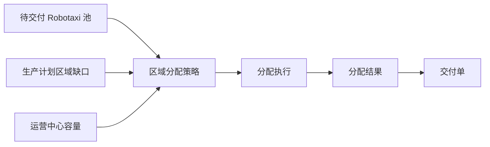

# FleetAllocationStrategy：区域分配策略

## 1. 对象定位

区域分配策略决定待交付 Robotaxi 应分配到哪个 Zone、哪个运营中心，并明确具体车辆编号。它采用标准的策略、执行、结果结构。

## 2. 对象边界

|对象|职责|
|---|---|
|`FleetAllocationStrategy`|保存算法、区域范围、单次交付上限和策略状态|
|`FleetAllocationRun`|保存一次执行、策略快照、成功或失败原因|
|`FleetAllocationResult`|保存目标区域、运营中心、分配数量和具体 Robotaxi 列表|

结果粒度是“某区域获得哪些 Robotaxi”，不是“某个 Robotaxi 有多少辆”。当前只有有限区域时仍执行相同策略合同，便于未来扩展多区域紧急度、容量和成本约束。

## 3. 当前计算

1. 输入只接受 `availability_status = PENDING_DELIVERY` 的车辆。
2. 根据生产计划目标区域形成候选池。
3. 受计划数量、候选数量和单张交付单上限约束。
4. 结果保存 `allocated_robotaxi_ids` 和完整策略快照。
5. 生成交付单后结果标记为 `USED_FOR_DELIVERY`。

## 4. 边界

- 不创建 Robotaxi，不写车辆当前位置，不执行交付。
- 执行和结果是过程事实，不显示“最近任务事件”；策略配置页的执行动作才记录最近策略执行。
- 当前不进入模拟运行主路径。
