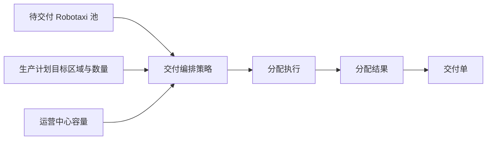

# FleetAllocationStrategy：交付编排兼容服务

## 1. 对象定位

该技术对象保留旧快照兼容，但业务职责收敛为交付编排：目标 Zone 和数量必须来自生产计划，本服务只选择目标运营中心、具体 Robotaxi 和交付批次，不重新进行区域供应决策。

## 2. 对象边界

|对象|职责|
|---|---|
|`FleetAllocationStrategy`|保存运营中心选择、批次上限和交付编排规则|
|`FleetAllocationRun`|保存一次执行、策略快照、成功或失败原因|
|`FleetAllocationResult`|保存目标区域、运营中心、分配数量和具体 Robotaxi 列表|

结果粒度是“生产计划中的目标区域由哪些 Robotaxi、交付到哪个运营中心履约”。区域数量是供应决策和生产计划事实，不允许本服务覆盖。

## 3. 当前计算

1. 输入只接受 `availability_status = PENDING_DELIVERY` 的车辆。
2. 根据生产计划目标区域形成候选池。
3. 受计划数量、候选数量和单张交付单上限约束。
4. 结果保存 `allocated_robotaxi_ids` 和完整策略快照。
5. 生成交付单后结果标记为 `USED_FOR_DELIVERY`。

## 4. 边界

- 不创建 Robotaxi，不写车辆当前位置，不执行交付。
- 执行和结果是过程事实，不显示“最近任务事件”；策略配置页的执行动作才记录最近策略执行。
- 当前不进入模拟运行主路径。
