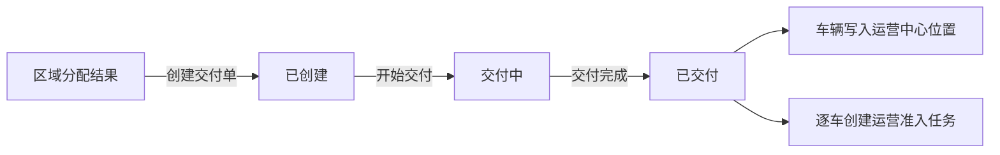

# RobotaxiDeliveryOrder：区域交付单

## 1. 对象定位

区域交付单是一张可包含多台 Robotaxi 的物流单据，负责把区域分配结果中的车辆交付到目标运营中心。只有交付完成，车辆才获得真实运营位置并进入待准入。

## 2. 核心字段

`delivery_order_id`、`delivery_order_name`、`delivery_status`、`fleet_allocation_result_id`、`fleet_allocation_run_id`、`target_zone_id`、`target_ops_center_id`、`robotaxi_ids`、`robotaxi_count`、`delivered_robotaxi_ids`、`readiness_task_ids`、`delivery_started_at`、`delivery_completed_at`、`created_at`、`updated_at`。

## 3. 状态与动作

|状态|中文|动作|下一状态|
|---|---|---|---|
|`CREATED`|已创建|开始交付|`IN_DELIVERY`|
|`IN_DELIVERY`|交付中|交付完成|`DELIVERED`|
|`DELIVERED`|已交付|查看准入任务|无|
|`CANCELLED`|已取消|查看|无|

## 4. 完成交付合同

完成动作必须原子化调用服务：

1. 交付单进入 `DELIVERED` 并记录自己的状态时间线；
2. 每台车辆写入目标 Zone、目标运营中心及运营中心 Cell；
3. 每台车辆进入 `PENDING_ADMISSION`，不可参与调度；
4. 每台车辆创建一张运营准入任务；
5. 交付单只保存准入任务编号，不混入准入任务状态。

## 5. 边界

- 不生产车辆，不决定车辆分配。
- 不把准入任务状态写入交付单时间线。
- 当前不进入模拟运行主路径；未来物流时效只能调用同一交付服务。
