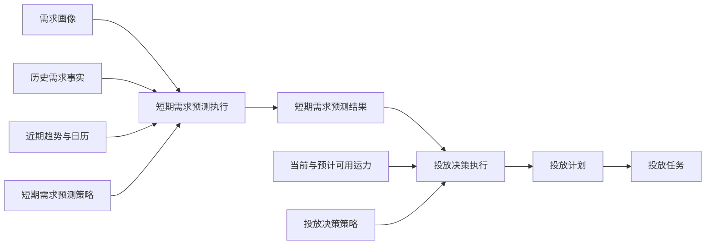

# 短期需求预测与投放决策设计

## 定位

运营阶段使用两个独立能力：短期需求预测回答“未来几小时或几天，哪里会产生多少真实需求”；投放决策回答“现有 Robotaxi 应在何时投放到哪里”。旧“供需平衡”同时计算需求和投放建议，职责混合，停止作为新闭环事实来源。



## 短期需求预测

### 输入

- Place、ServiceArea 和 Zone 需求画像；
- 服务订单请求事实与履约事实；
- 预测时点、预测时长、时间粒度和日期类型；
- 历史同期、近期趋势与画像基线权重。

预测的是客户请求需求，不只统计已完成订单，避免供给不足时低估市场需求。历史不足时使用需求画像冷启动。

### 最小可解释模型

```text
预测需求
= 画像基线 × 画像权重
+ 历史同期需求 × 历史权重
+ 近期需求均值 × 近期趋势系数 × 趋势权重

时间分布
= 日需求 × 时段系数 × 日期类型系数
```

结果按 `Zone / Place / ServiceArea × 时间桶` 保存基准值、上下界、趋势、数据质量和输入快照。预测结果不读取 Robotaxi 当前供给，也不产生投放建议。

## 投放决策

投放决策读取短期预测结果、Robotaxi 综合状态、当前位置、现有任务队列、预计可用时间和经营目标，计算供给缺口、优先级、预计收入、投放成本和预计利润。

策略执行直接生成投放计划，不建立重复的“投放决策结果单”。投放计划至少保存目标时间段、目标 Zone、服务区域、计划车辆数、供给缺口、优先级和经济性。

## 投放计划与任务

- 投放计划是批量、可确认、可取消的业务单据；
- 确认后调用统一投放任务服务，为符合任务规划策略的具体 Robotaxi 创建投放任务；
- 投放任务及运营行驶记录继续使用现有独立生命周期；
- 计划不得直接拼装 Robotaxi、行驶记录或任务状态。

## 模拟边界

本版本只接入人工业务闭环，不加入模拟运行主扫描。未来模拟运行只能按时间触发短期预测、投放决策和计划确认服务，不能复制计算与任务创建逻辑。
