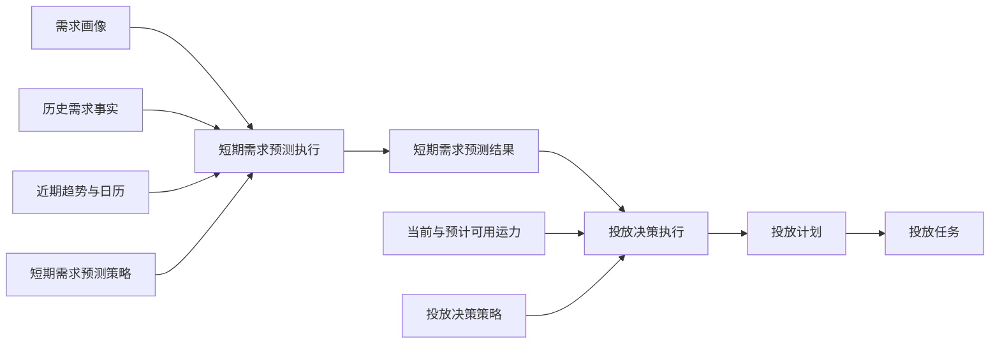

# 短期需求预测与投放决策设计

## 定位

运营阶段使用两个独立能力：短期需求预测回答“未来几小时或几天，哪里会产生多少真实需求”；投放决策回答“现有 Robotaxi 应在何时投放到哪里”。旧“供需平衡”同时计算需求和投放建议，职责混合，停止作为新闭环事实来源。



## 短期需求预测

### 输入

- Place、ServiceArea 和 Zone 需求画像；
- 服务订单请求事实与履约事实；
- 预测时点、预测时长、时间粒度和日期类型；
- 历史同期、近期趋势与画像基线权重。

预测的是客户请求需求，不只统计已完成订单，避免供给不足时低估市场需求。历史不足时使用需求画像冷启动。

历史事实必须按预测执行时点截取最近窗口并按发生时间排序。空间归属以请求上车位置为主，不能同时用上车和下车位置重复表达同一份投放需求。历史同期、近期趋势和日期类型必须保留各自快照，不能依赖集合顺序推断“最新数据”。

### 最小可解释模型

```text
预测需求
= 画像基线 × 画像权重
+ 历史同期需求 × 历史权重
+ 近期需求均值 × 近期趋势系数 × 趋势权重

时间分布
= 日需求 × 时段系数 × 日期类型系数
```

结果按 `Zone / Place / ServiceArea × 时间桶` 保存基准值、上下界、趋势、数据质量和输入快照。预测结果不读取 Robotaxi 当前供给，也不产生投放建议。

## 投放决策

投放决策显式读取某一次成功的短期预测执行结果，以及 Robotaxi 综合状态、当前位置、现有任务队列、预计可用时间和经营目标，计算供给缺口、优先级、预计增量收入、调位成本、履约变动成本和预计增量利润。

```text
单车周期服务能力
= 预测周期小时 × 60 ÷ 平均履约时长 × 目标利用率

预计车辆需求
= 向上取整（预测订单量 ÷ 单车周期服务能力）

可新增覆盖订单
= min（未覆盖需求量，计划投放车辆数 × 单车周期服务能力）

预计增量利润
= 可新增覆盖订单 × 平均订单收入
- 可新增覆盖订单 × 单均履约变动成本
- 计划投放车辆数 × 平均调位距离 × 单位调位成本
```

策略执行直接生成投放计划，不建立重复的“投放决策结果单”。投放计划至少保存目标时间段、目标 Zone、服务区域、计划车辆数、供给缺口、优先级和经济性。

## 投放计划与任务

- 投放计划是批量、可确认、可取消的业务单据；
- 确认后调用统一投放任务服务，为符合任务规划策略的具体 Robotaxi 创建投放任务；
- 任务生成数量小于计划数量时，计划进入部分下发，保存已生成数量、剩余数量和失败原因；不得把部分成功标记为全部下发；
- 部分下发计划可继续调用同一批量服务，直到剩余数量为零后进入已下发；
- 投放任务及运营行驶记录继续使用现有独立生命周期；
- 计划不得直接拼装 Robotaxi、行驶记录或任务状态。

## 对象与状态边界

|对象|职责|关键状态|
|---|---|---|
|短期预测策略|配置窗口、粒度、画像/历史/趋势权重与日期系数|启用、草稿、归档|
|短期预测执行|冻结输入窗口、策略及需求事实快照|成功、失败|
|短期预测结果|保存时间桶与空间对象的预测量和上下界|已生成|
|投放决策策略|配置利用率、经济性、供给缺口和优先级规则|启用、草稿、归档|
|投放决策执行|绑定一次预测执行并记录车辆快照和计划数量|成功、失败|
|投放计划|承载批量投放意图并分解任务|草稿、已确认、部分下发、已下发、已取消|
|投放任务|单车投放履约单据|使用投放任务自身状态机|

旧“供需平衡策略 / 执行 / 结果”只作为历史快照兼容数据保留，不再进入菜单、工作区和新指标事实；新代码不得继续调用旧服务。

## 验证要求

1. 三类策略页面必须通过真实浏览器加载，不得只验证导航注册；
2. 短期预测必须验证时间窗口、发生顺序、上车空间归属、冷启动和数据质量；
3. 投放决策必须显式绑定预测执行，并验证供给缺口和增量经济性；
4. 投放计划必须通过统一批量服务生成任务，验证全部成功、部分成功和无候选三种结果；
5. 生成的投放任务必须继续调用任务规划、运营行驶记录和原有到达闭环；
6. 本能力默认不进入模拟运行扫描，模拟运行现有路径不得受到影响。

## 模拟边界

本版本只接入人工业务闭环，不加入模拟运行主扫描。未来模拟运行只能按时间触发短期预测、投放决策和计划确认服务，不能复制计算与任务创建逻辑。
