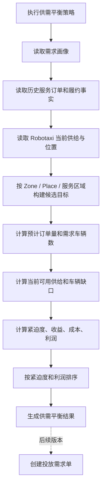

# 供需平衡策略设计

## 1. 定位

供需平衡策略属于运营阶段的短期供需投放预测，不属于虚拟需求模拟，也不替代经营规划中的长期需求预测。

- 长期需求预测：服务经营战略和供给准备，输出区域长期 Robotaxi 需求，用于生产计划和供应管理。
- 虚拟需求模拟：在模拟运行中生成客户需求、上车点和下车点，用于形成服务订单。
- 供需平衡策略：在运营阶段消费需求画像、历史订单和当前 Robotaxi 供给，判断区域内 Place / 服务区域的 Robotaxi 缺口、需求紧迫度和投放优先级，输出可转化为投放需求单的经营结果。

当前版本只形成策略、执行和结果，不接入现有投放任务单触发逻辑。未来接入时，应由供需平衡结果调用“投放需求单”服务，投放需求单再按自身闭环决定是否创建投放任务。

## 2. 业务对象

|对象|含义|边界|
|---|---|---|
|供需平衡策略|运营阶段短期供需预测和投放优化的配置对象|只定义模型、权重、窗口和约束|
|供需平衡执行|一次策略执行事实|记录输入快照、执行状态、结果数量和失败原因|
|供需平衡结果|Place / 服务区域 / Zone 维度的投放需求建议|只沉淀缺口、优先级、经济性和后续投放需求单合同|

## 3. 输入

1. 需求画像：地点、服务区域和 Zone 画像，提供潜在需求、预计 Robotaxi 需求、高峰需求、服务能力和增长因素。
2. 历史订单：已创建和已完成服务订单，结合履约行驶记录计算真实需求、完成率、平均收入、平均履约距离和服务效率。
3. 当前供给：Robotaxi 的运营状态、当前位置、目标区域、当前任务和服务区位置，用于计算目标对象当前可用供给。
4. 空间关系：Zone 包含 Place 和服务区域，服务区域包含 cell，Robotaxi 当前 cell 反推目标区域和服务区域。
5. 策略配置：预测窗口、目标区域、需求权重、供给缺口权重、紧迫度权重、利润权重、单车每小时可履约能力、空驶成本和单均收入兜底值。

## 4. 输出模型

供需平衡结果按目标对象生成，当前包含 Zone、Place、服务区域三类结果。

核心字段：

- `forecast_order_count`：短期窗口内预计订单量。
- `expected_demand_quantity`：换算后的 Robotaxi 需求量。
- `current_supply_quantity`：当前可参与运营且已在目标对象范围内的 Robotaxi 数量。
- `robotaxi_gap_quantity`：Robotaxi 缺口。
- `demand_urgency_score`：需求紧迫度评分。
- `deployment_priority_rank`：投放优先级排序。
- `recommended_deployment_quantity`：建议投放 Robotaxi 数量。
- `expected_revenue_amount`：预计收入。
- `estimated_deployment_cost_amount`：预计投放成本。
- `expected_profit_amount`：预计利润。
- `deployment_demand_order_id`：未来投放需求单编号，当前为空。

## 5. 计算逻辑

### 5.1 预计订单量

`forecast_order_count = max(画像预计需求, 历史订单折算需求) × 预测窗口小时 / 24`

如果历史订单不足，则以需求画像为主；如果存在历史订单，则历史订单和画像共同修正。

### 5.2 需求车辆数

`expected_demand_quantity = ceil(forecast_order_count × 平均履约分钟 / (单车每小时可履约能力 × 60 × 预测窗口小时))`

### 5.3 供给缺口

`robotaxi_gap_quantity = max(0, expected_demand_quantity - current_supply_quantity)`

当前可用供给只统计可参与运营、没有执行中任务，并且位置属于目标 Zone / Place 附近服务区域 / 服务区域的 Robotaxi。

### 5.4 紧迫度

`demand_urgency_score = 需求强度得分 × 需求权重 + 缺口得分 × 缺口权重 + 履约压力得分 × 紧迫度权重 + 利润得分 × 利润权重`

其中利润得分来自预计利润归一化，用于避免只追求订单量而忽略空驶和投放成本。

### 5.5 经济性

预计收入按历史平均实收价格优先，缺失时使用策略默认单均收入。

预计投放成本按建议投放数量、平均调度距离和单位投放成本估算。

`expected_profit_amount = expected_revenue_amount - estimated_deployment_cost_amount`

## 6. 服务边界

供需平衡策略必须是独立业务服务。

- 页面只触发策略执行，不拼装结果。
- 执行服务只生成供需平衡执行和结果，不直接创建投放任务。
- 模拟运行不直接扫描或执行供需平衡策略；未来如需接入模拟，必须声明模拟接入合同。
- 投放需求单尚未实现时，结果只保留后续触发字段。

## 7. 前端放置

菜单位置：

运营管理 → 供需投放

三级页面：

1. 投放任务单
2. 供需平衡策略
3. 供需平衡执行
4. 供需平衡结果

策略页面下方显示最近策略执行，结果页面展示目标对象、缺口、紧迫度、优先级、建议投放数量、预计收入、预估成本和预计利润。

## 8. 当前版本验收

1. 默认初始化一条启用状态的供需平衡策略。
2. 点击策略执行后生成一条执行记录和多条结果。
3. 结果包含 Zone、Place 和服务区域维度。
4. 不创建投放任务单，也不接入模拟运行主路径。
5. 字段、状态、枚举全部通过统一字段字典中文展示。
