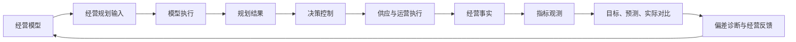

# Robotaxi 经营模型总览

## 1. 定位

经营模型是经营规划与经营分析共同使用的语义和因果合同。它解释需求、供给、服务、资产、收入、成本和利润如何关联，不替代业务单据，也不直接推进模拟运行。

业务单据生命周期仍是底层经营事实，经营模型只统一规划、指标和反馈语义；模拟运行仍是调用既有业务服务的上层扩展。

## 2. 经营结构

|模型域|核心问题|规划输入|经营事实|关键输出|
|---|---|---|---|---|
|需求|市场需要多少出行服务|经营目标、需求画像、增长假设|服务订单|需求规模、增长与预测偏差|
|供给|需要形成多少 Robotaxi|生产画像、需求预测|生产计划、生产批次、交付单|供给规模、缺口与交付进度|
|决策控制|策略是否可靠执行并改善经营|经营目标、策略能力目录|策略执行、策略结果、业务结果|执行质量、异常、效果评价|
|服务|供给能否完成需求|服务率、车辆可用率、时效假设|匹配、行驶、履约|履约率、耗时与服务质量|
|资产|车辆是否被有效使用|目标利用率、最低规模|Robotaxi 状态与任务事实|资产覆盖率、利用率与可用率|
|财务|经营是否形成可持续收益|收入、成本和利润目标|收入记录、成本记录|收入、成本、贡献利润与差异|

## 3. 分层对象

1. `OperatingModelDefinition`：经营结构、模型域、关系、指标集合和版本，是整体模型合同。
2. `MetricDefinition`：单个指标的名称、业务含义、公式、单位、时间、维度、来源和质量规则，是指标语义合同。
3. 经营规划输入：`BusinessTarget`、`DemandProfile`、`SupplyProductionProfile` 和策略配置。
4. 模型执行：需求预测执行、供给计算和指标计算各自保留独立运行记录；它们共享执行合同，但不混成一个业务对象。
5. 结果事实：预测结果、生产计划、指标观测和经营比较结果。
6. 业务事实：业务单据、Robotaxi、行驶、成本和收入继续由原服务拥有。
7. 决策控制：跨价值流读取策略、执行和结果，引用统一经营指标，不复制源对象；完整设计见 `03-decision-control/00-decision-control-center.md`。

字段字典回答字段叫什么，指标定义回答单个度量如何形成，经营模型回答整个经营系统如何运转。三者不能互相替代。

## 4. 唯一数据流

- 经营规划和经营分析必须引用同一经营模型版本和指标定义版本。
- 经营目标、画像和策略是模型输入，不在页面中复制公式。
- 需求预测、指标计算等执行记录用于审计、重算和解释部分成功，不作为普通经营用户的主要阅读入口。
- 指标观测和经营比较结果统一进入经营数据池；页面只读取，不自行计算。
- 模型版本变化不覆盖历史预测、指标观测或计算记录。

## 5. 产品交付

经营用户首先看到经营结构、核心结果、趋势、差异和原因。单个指标的简要含义应直接显示或通过说明提示获得；完整公式、来源、质量规则和版本按需展开。指标定义和计算记录保留为数据治理与诊断能力。

经营模型页面按“需求 → 供给 → 决策控制 → 服务 → 资产 → 财务 → 反馈”展示结构，并允许查看每个模型域的输入、输出和关键指标。它不是新的计算页面，也不产生第二套经营数据。

## 6. 工程边界

- `operatingModelService` 拥有模型定义和验证，不拥有业务事实。
- 统一经营数据池消费模型、指标和事实，生成只读分析视图。
- 经营规划服务消费模型输入形成预测结果；经营分析消费同一模型解释实际与规划差异。
- 模拟运行只调用既有业务服务并在结束后触发一次经营数据更新，不逐 Tick 执行经营模型。
- 导航、页面标题和页面展示类型由独立注册表管理，不决定对象生命周期或服务权限。

## 7. 验收标准

- 一个模型域、指标和字段只有一个中文含义与正式编号；
- 规划结果和经营分析能够追溯模型版本、输入和指标口径；
- 菜单调整不修改任何业务服务；
- 经营规划和经营分析共用分析画布与移动端响应式规则；
- 桌面和手机均不发生页面级横向溢出，长图表只在图内浏览。
