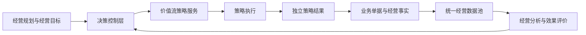

# Robotaxi 决策控制中心设计

## 1. 定位

决策控制层连接经营规划和业务执行，回答“当前有哪些策略、执行了什么、产生了什么结果、是否异常、是否改善经营表现”。它是跨价值流的治理与观察能力，不是新的业务单据，也不是第二套策略数据源。

## 2. 对象与服务边界

1. `DecisionCapabilityDefinition` 是代码级能力目录，声明策略所属价值流、配置页、执行页、结果页和效果指标，不持久化业务状态。
2. 策略、执行和结果对象继续由原领域服务拥有，拥有独立编号、状态、生命周期和来源引用。
3. `DecisionControlView` 是按当前事实即时生成的只读投影，统一执行状态、决策过程和统计口径，不回写源对象。
4. `MetricDefinition` 与 `MetricObservation` 负责决策过程和经营效果指标；决策中心只读取统一经营数据池。
5. 暂不建立“决策单”。未来只有人工干预需要独立审批、状态和审计闭环时，才新增干预单据。

## 3. 决策能力目录

|价值流|决策能力|源对象|
|---|---|---|
|经营规划|长期需求预测|预测策略、预测执行、预测结果|
|供应管理|区域分配|分配策略、分配执行、分配结果|
|供需投放|供需平衡|平衡策略、平衡执行、平衡结果|
|Robotaxi|路径规划|路径规划策略、路径规划执行、Route|
|出行服务|动态定价、订单匹配|策略、执行、结果|
|运维支持|运维触发、运维调度、任务规划|策略、执行、结果|
|运营模拟|虚拟需求|模拟策略、模拟执行、模拟结果|

配置、执行和结果只在确有独立审计和复用价值时保持三层结构。一个执行若没有独立结果对象的必要性，可以把结果摘要保存在执行记录中，但仍须符合统一执行合同。

## 4. 统一投影

决策控制投影包含：

- 能力总览：策略数、启用策略数、执行数、成功数、部分成功数、失败数、无动作数和结果数；
- 执行监控：策略、触发方式、执行状态、开始时间、完成时间、候选量、结果量和下游对象量；
- 异常视图：保留每次异常执行，同时按调用它的业务单据聚合为一个决策过程，区分异常尝试次数、受影响单据数和最终业务影响；
- 效果摘要：引用统一经营数据池中的服务、匹配、路径、资产、财务和供需指标。

订单匹配等允许重试的能力必须同时保留三个粒度：

1. **执行事件**：每次策略调用及其结果，用于技术和策略下钻；
2. **决策过程**：同一能力围绕同一业务单据的一组连续尝试，用于运营监控；
3. **业务影响**：最终恢复、仍在重试或已形成终局失败，用于判断真实影响范围。

`无可用 Robotaxi` 仍属于需要治理的资源不足异常，但 100 次重试同一服务订单只能表达为“1 个受影响订单、100 次异常尝试”，不得显示成影响了 100 个订单。

异常分类至少包含：资源不足、对象资格冲突、空间能力不足、策略执行异常、系统异常和部分结果。分类只属于决策监控投影，不改变源执行记录。

投影必须提供来源记录数、来源更新时间、来源数据版本、指标计算时间和指标是否待重算。业务事实变化时决策运行视图即时更新；经营效果指标继续由统一经营数据池按计算批次刷新。

状态归一化只服务观察，不改变源状态：`成功`、`部分成功`、`失败`、`无动作`、`执行中`、`未知`。

## 5. 指标模型

第一阶段决策过程指标：

|指标|公式|用途|
|---|---|---|
|策略执行次数|统计周期内全部策略执行数|观察决策活动规模|
|策略执行成功率|成功执行数 / 已结束执行数|观察执行可靠性|
|决策结果覆盖率|形成结果的执行数 / 全部执行数|识别执行无结果|
|异常尝试数|失败与部分成功执行事件数|观察策略重复失败压力|
|异常决策过程数|存在异常尝试的决策过程数|观察实际受影响范围|
|决策异常率|异常决策过程数 / 已结束决策过程数|观察受影响决策过程比例|
|异常尝试率|异常尝试数 / 已结束执行数|观察策略重试和资源不足压力|
|受影响业务对象数|异常过程关联的唯一业务单据数|避免把重试次数误解为订单数量|
|异常恢复数|异常后最终成功的决策过程数|观察重试恢复能力|
|终局影响数|最终进入失败或取消的业务对象数|识别真实经营损失|
|平均决策耗时|已结束执行耗时合计 / 有效执行数|观察决策效率|

效果评价不在决策中心重复建模。每项决策能力关联统一经营指标，例如订单匹配成功率、路径规划成功率、履约率、资产覆盖率和贡献利润；经营分析计算后供决策中心引用。

## 6. 前端交付

- 决策中心采用全宽分析画布，无右侧详情、搜索筛选和最近任务事件。
- 首屏展示决策摘要、受影响对象和最终影响，其后展示能力矩阵、最近执行、异常过程和效果指标。
- 每项能力提供到原策略配置、执行和结果页面的导航，不复制编辑功能。
- 桌面以紧凑分区展示；手机单列展示，宽表仅在内部横向浏览。
- 页面所有字段、状态和指标名称统一使用字段字典中文服务。

## 7. 性能与模拟边界

- 投影在源集合变化时一次性计算并复用，禁止渲染单元格时反复扫描全量集合。
- 能力目录是静态冻结配置；执行和结果通过索引关联。
- 模拟运行只继续调用原业务服务；决策投影不进入逐 Tick 主路径。
- 模拟结束后的统一经营数据更新可以计算决策指标，人工操作仍由“更新经营数据”统一触发。
