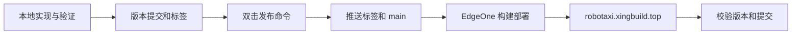

# EdgeOne 正式站点发布

## 1. 正式边界

Robotaxi 经营闭环模拟平台的唯一正式网站为：

`https://robotaxi.xingbuild.top/`

GitHub 仓库继续承担源代码、提交、标签和贡献记录管理，不再通过 GitHub Pages 形成第二个生产站点。EdgeOne 监听 `main` 分支并完成静态构建、全球访问和个人域名托管。

## 2. 发布链路

- 本地入口：`start-robotaxi.command`
- 生产构建：`node scripts/build-github-pages.mjs`
- 产物检查：`node scripts/verify-github-pages-build.mjs`
- 一键发布：`publish-robotaxi.command`
- 发布目录：`dist/`，为生成目录，不提交 Git

构建和检查脚本暂时保留旧文件名，以兼容 EdgeOne 已配置的构建命令；脚本内容和部署清单均以 EdgeOne 正式站点为准。

## 3. 持续更新

1. Codex 完成本地验证、版本提交和标签。
2. 用户决定上线时双击 `publish-robotaxi.command`，无需再点击 `Commit or push`。
3. 命令先推送标签，再推送 `main`。
4. EdgeOne 自动构建并部署。
5. 发布命令轮询正式域名的 `deployment-manifest.json`；版本号和提交一致后才报告上线完成。

发布命令优先探测 Clash Verge 本地代理 `127.0.0.1:7897`，代理不可用时回退直连。可使用 `ROBOTAXI_GITHUB_PROXY` 临时覆盖代理地址，不修改 Git 全局配置。

## 4. 缓存与回退

入口资源和动态模块使用 Git 提交哈希作为缓存版本，避免旧 bundle 与新模块混用。正式站点运行时会检查部署清单；发现新版本后刷新到最新资源。

需要回退时，恢复目标稳定提交并形成一个新的版本提交和标签，再走同一发布链路。不得删除历史标签。

## 5. GitHub Pages 退役

仓库不再保留 GitHub Pages 自动部署工作流。确认个人正式域名已经运行最新版本后，在 GitHub 仓库 `Settings` → `Pages` 中停用或取消发布旧站点，避免旧地址继续传播过期内容。

旧地址和历史发布记录仅作为历史事实保留，不再作为 README、产品入口或发布完成标准。
