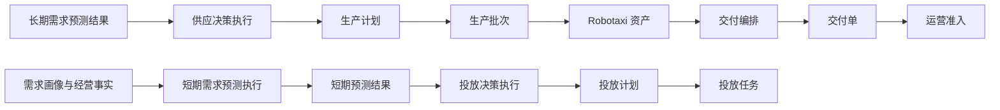

# v046 需求、供应与投放规划闭环执行计划

## 目标

将经营规划和运营投放统一为“预测产生预测结果、决策执行产生计划、计划分解执行单据”的两条同构价值流，并消除旧供需平衡与区域分配中的职责重叠。

## 任务清单

1. 更新长期需求预测、供应管理、短期需求预测和投放计划正式方案。
2. 新增供应决策策略与执行，由执行直接生成生产计划。
3. 新增短期需求预测策略、执行和按时间空间粒度形成的预测结果。
4. 新增投放决策策略与执行，由执行直接生成投放计划。
5. 投放计划确认后通过既有投放任务服务生成具体投放任务。
6. 将区域分配收敛为交付编排，只选择具体 Robotaxi 与运营中心，不重新决定区域供给数量。
7. 接入初始化、旧快照恢复、页面注册、字段字典、决策中心和统一前端控件。
8. 保持模拟运行边界不变，新增规划对象默认不进入模拟扫描。
9. 线上演示分别幂等补齐长期与短期预测数据，但不自动替用户执行供应或投放决策。
10. 完成服务合同、字段显示、页面架构、Bundle、真实浏览器和完整提交前验证。

## 验收闭环

- 两条链路均可由页面人工触发并通过服务跑通。
- 策略执行保留输入与配置快照；计划是唯一可执行业务单据，不建立重复的决策结果单。
- 文档、字段、代码、页面和验证保持一致。

## 执行状态

- 状态：已完成
- [x] 差异与职责冲突识别
- [x] 正式方案更新
- [x] 服务与对象实现
- [x] 前端与运行态接入
- [x] 验证与版本收口
