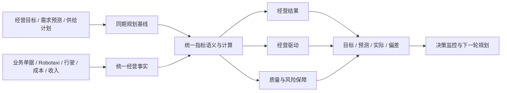

# v047 经营分析模型重构执行计划

## 目标

把经营分析从“指标目录与页面卡片”升级为连接经营规划、业务事实、经营结果、驱动因素和反馈决策的统一经营分析系统。

## 任务清单

1. 固定需求、供给、服务、资产、财务和保障六个经营域，以及结果、驱动、保障三类指标角色。
2. 区分截止点状态、期间流量和派生指标，状态事实不得混入期间比率。
3. 清理重复、停用和错名指标；一个经营含义只保留一个指标编号、公式和计算函数。
4. 修复统计周期过滤：全量周期保留业务事实；最近模拟日窗口严格按模拟发生时间归集。人工真实时间窗口不得与模拟窗口混算，后续按独立时间口径扩展。
5. 按 Zone、预测结果版本和相对经营周期点对齐目标、预测、计划和实际，不再用期末值冒充同期值。
6. 修正订单、匹配、履约、资产和财务指标的分母及命名；缺少事实的指标明确为不可计算。
7. 将生产、交付、准入、投放等供给事实纳入统一数据池，补齐供给状态和执行达成指标。
8. 决策过程指标只消费决策中心统一投影，不保留旧指标计算器的第二套异常口径。
9. 将经营分析页面收敛为经营总览、需求服务、供给资产、财务效率和经营诊断，共用同一分析模型与图表控件。
10. 补充指标语义、周期、规划对齐、页面合同、Bundle、桌面与手机真实浏览器和提交前验证。

## 经营闭环

## 验收标准

- 同一指标在总览和专业页面引用同一观测，不重复计算。
- 最近一天和最近七天严格按事实发生时间归集。
- 预测比较使用相同 Zone 和相同预测周期点，期末目标单独表达。
- 履约车辆覆盖率不再显示为资产利用率；真实时间利用率无事实时显示不可计算。
- 财务区分变动运营成本、资产折旧、经营贡献和模拟运营利润。
- 经营分析五个页面共用统一数据池、分析画布、响应式和中文展示合同。
- 模拟运行仍只在结束后刷新一次指标，不进入逐 Tick 计算。

## 执行状态

- 状态：已完成
- [x] 差异、语义冲突和根因核查
- [x] 方案与任务计划固定
- [x] 指标语义与计算服务重构
- [x] 规划对齐与统一数据池重构
- [x] 分析页面重构
- [x] Bundle、专项合同、完整门禁、桌面与手机真实页面验证
- [x] 归档和版本收口
