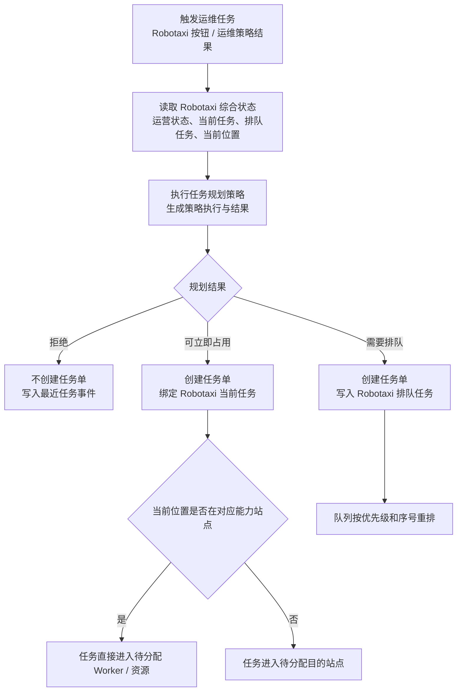
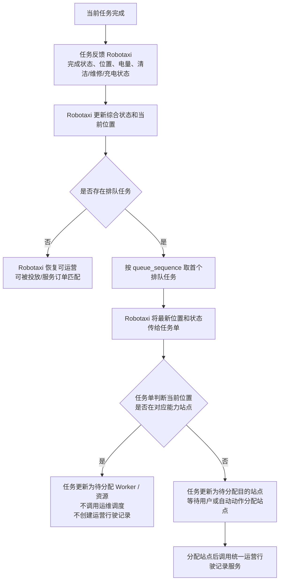

# v040.21 排队任务接管与经营指标展示闭环小迭代

状态：已完成

## 问题汇总

1. Robotaxi 上一个运维任务完成后，会触发下一个排队任务，但下一个任务没有稳定接收 Robotaxi 最新位置和综合状态，导致已经位于具备维修能力站点时仍进入“待分配维修站”。
2. 运维调度服务缺少“Robotaxi 已在具备能力站点”的底层防线，用户继续点击分配站点时会生成无效调度执行、调度结果和运营行驶记录。
3. 任务创建阶段与排队任务接管阶段边界混淆：任务创建要调用任务规划策略；已生成的排队任务被 Robotaxi 接管时不应再次调用任务规划策略，而应由 Robotaxi 将最新状态传给任务单。
4. 经营分析中“财务结果 / 服务效率 / 过程质量”等区域仍可能显示内部指标编号或 `undefined`，根因是指标观测合并指标定义时没有稳定使用统一默认指标定义兜底。
5. 本次更新必须保持模拟运行边界：模拟运行只调用已有业务服务，不重新实现业务闭环；本次未改造运营行驶记录底层闭环。

## 闭环流程图

### 任务创建阶段

### 排队任务接管阶段

## 迭代计划与执行结果

1. 服务层：把排队任务接管抽象为任务单接收 Robotaxi 最新状态的能力，写入最新起点位置、目标站点和目标 Cell。已完成。
2. 服务层：运维调度增加幂等防线，Robotaxi 已在对应能力站点时跳过调度执行和行驶记录创建，直接进入作业分配状态。已完成。
3. 页面层：页面按钮只响应服务返回结果；调度跳过时只记录事件，不再创建运营行驶记录。已完成。
4. 经营分析：指标展示统一合并默认指标定义和运行态指标定义，未知指标不再把内部编号当中文名展示。已完成。
5. 验证：新增 v040.21 合同脚本，覆盖排队维修任务接管、调度跳过、经营指标展示兜底，并纳入提交前检查。已完成。
6. 版本：更新 `VERSION.md` 和小迭代归档，重建 bundle 并运行提交前检查。已完成。

## 验证结果

- `node scripts/verify-v040-21-task-takeover-and-metric-display.mjs`
- `node scripts/verify-v040-8-fleet-operation-lifecycle.mjs`
- `bash scripts/check-before-commit.sh`
- `node scripts/verify-browser-load.mjs`

以上均通过。

## 边界声明

- 本次没有改造运营行驶记录服务化闭环。运维任务仍通过统一运营行驶记录服务创建和推进需要行驶的任务。
- 本次没有把新的业务闭环塞入模拟运行主路径。模拟运行只会继续调用已有业务服务，最多体现为任务匹配成功或失败，不独立实现运维闭环。
