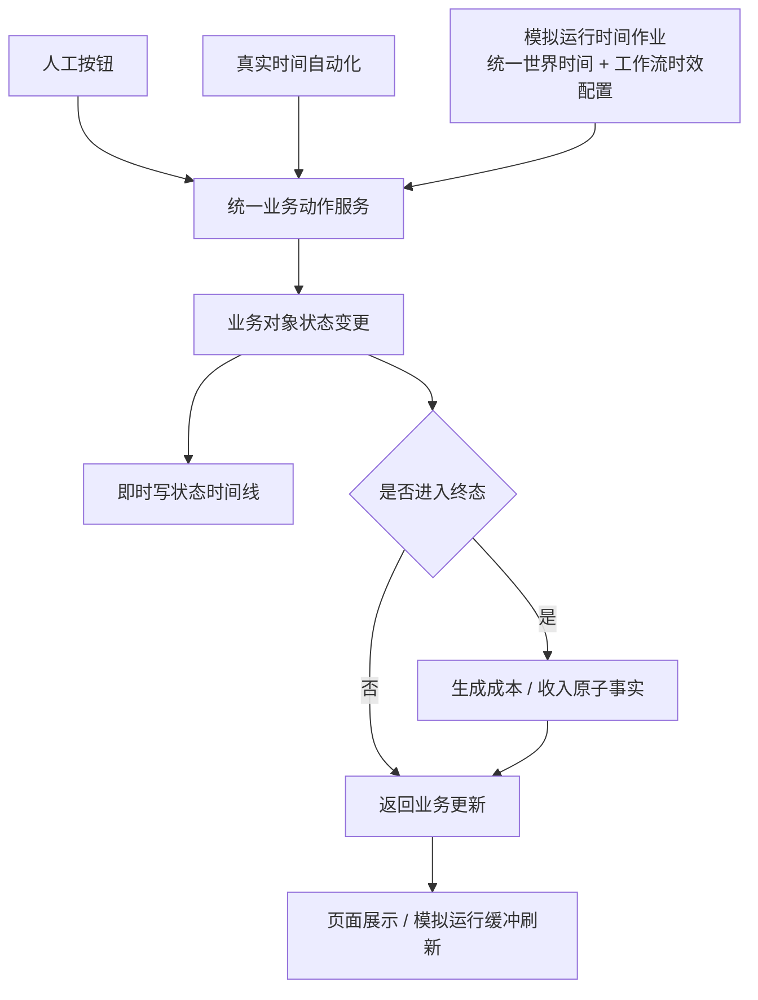
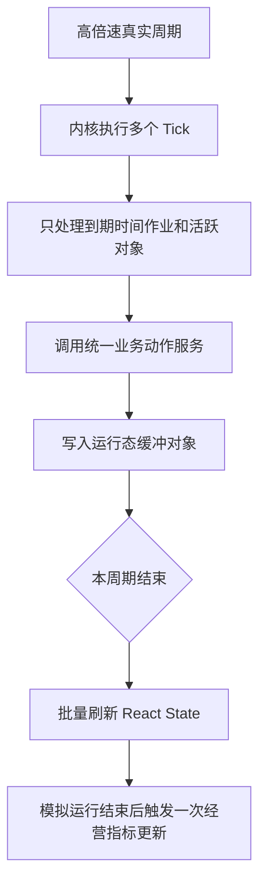
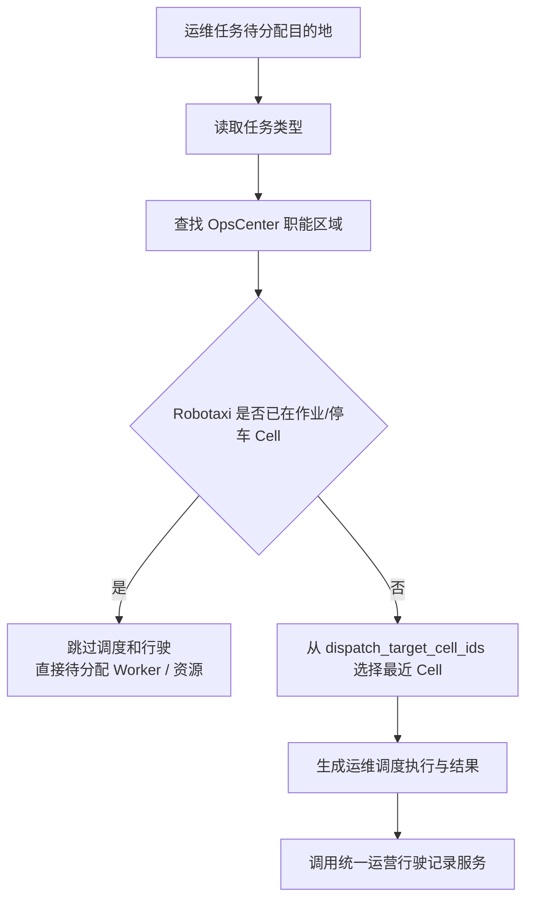

# v040.22 业务事实、运维区域与模拟运行边界小迭代

状态：已完成

## 本轮问题

1. 运维调度策略当前直接使用 `OpsCenter.cell_ids` 和能力布尔值，缺少按清洁、充电、维修等职能划分的可作业 Cell 容器，容易把接入道路、待命区和内部作业区混用。
2. `C-35-31` 是 `RS-014` 接入道路 Cell，不属于 `P-006 / OC-001` 内部作业 Cell；调度目的地不能选择道路接入点作为作业目的地。
3. 状态时间线应在业务动作导致状态变更时即时记录，而不是模拟运行结束后统一计算出来。
4. 人工按钮、真实时间自动化、模拟运行时间作业不能形成两套状态变更逻辑；它们必须调用同一个业务动作服务。
5. 单据完成后应生成成本 / 收入原子事实，但不应每个单据完成都触发全局经营指标重算。
6. 模拟运行现有高速推进、时间作业、工作流时效配置是正确方向，本轮不得用逐条同步刷新拖慢高倍速模拟。

## 业务边界

- 业务单据生命周期是底层事实。
- 模拟运行只维护统一时间、调度到期动作、调用业务动作服务。
- 状态时间线、成本事实和收入事实由业务动作服务沉淀。
- 经营指标计算仍由“更新经营数据”或模拟运行结束后的一次自动刷新触发。
- 模拟运行中的批量状态时间线计算只能作为补算、校验和历史修复，不能覆盖业务动作已沉淀的事实时间线。

## 流程图

### 人工与模拟统一动作入口

### 模拟运行性能边界

### 运维调度目的地选择

## 执行结果

1. 运维区域模型：在 `OC-001` 初始化中增加 `operation_capability_zones`，明确清洁、充电、维修、故障、退役的作业 Cell、停放 Cell、待命 Cell、接入道路 Cell 和调度目的 Cell。已完成。
2. 运维调度服务：目的地从 `dispatch_target_cell_ids` 读取；已在作业/停放 Cell 时跳过调度；接入道路 Cell 不再被判定为已在作业点。已完成。
3. 状态时间线：业务动作服务即时状态时间线补充真实发生时间、模拟发生时间、时间模式、触发来源和业务对象编号。已完成。
4. 财务事实：准入、运营行驶、投放、Trip、服务订单支付，以及运维任务完成接入增量成本 / 收入事实生成，并按来源对象幂等替换。已完成。
5. 模拟运行性能：成本 / 收入集合接入模拟运行缓冲层，仍按真实周期批量刷新 React state。已完成。
6. 经营指标边界：保留模拟运行结束后一次自动更新经营数据；单据完成只写原子事实，不触发全局指标重算。已完成。
7. 验证：新增 v040.22 合同脚本并纳入提交前检查。已完成。

## 验证结果

- `node scripts/verify-v040-22-business-facts-and-simulation-boundary.mjs`
- `node scripts/verify-v040-21-task-takeover-and-metric-display.mjs`
- `node scripts/verify-v040-8-fleet-operation-lifecycle.mjs`
- `node scripts/verify-cost-model-calculation.mjs`
- `bash scripts/check-before-commit.sh`
- `node scripts/verify-browser-load.mjs`

以上均通过。
