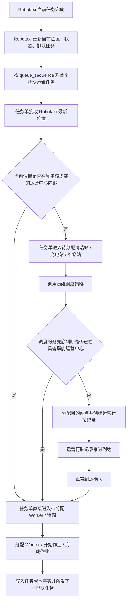

# v040.23 运维位置兜底、状态时间线与成本事实闭环

## 目标

本轮修复运维任务单在 Robotaxi 上一个任务完成后接管下一排队任务时，未正确识别最新位置和运营中心职能区域的问题，并补齐人工运维任务与运维行驶记录的即时状态时间线和成本事实。

## 根因

1. 运维任务服务与运维调度服务都只把职能作业网格视为“已在站点”，没有把 Robotaxi 已经处于具备对应职能的运营中心内部视为无需调度。
2. 排队任务接管时虽然重新读取 Robotaxi 最新位置，但状态判断仍依赖过窄的职能网格，导致任务错误进入“待分配站点”。
3. 运维调度缺少“已在清洁站 / 充电站 / 维修站，无需分配”的兜底语义，导致同一运营中心内部被分配到另一个 cell，并继续创建无意义运营行驶记录。
4. 运维任务服务状态变更只更新状态字段，没有统一写入 `simulation_status_transition_history`。
5. 运维行驶记录正常到达完成后未生成增量行驶成本事实，导致行驶记录详情缺少成本闭环。

## 业务闭环

## 迭代计划

1. 修复运维中心位置判断：具备对应职能且 Robotaxi 当前 cell 位于运营中心内部时，认定为已在可作业位置。
2. 修复运维调度兜底：已在具备职能运营中心时返回 `dispatchSkipped`，任务单接收后直接进入待分配 Worker / 资源，不生成调度执行、不生成运营行驶记录。
3. 运维任务服务增加统一状态时间线沉淀，覆盖任务创建、接管、目的地分配、行驶、到达、分配 Worker、作业开始、作业完成。
4. 运维行驶记录服务路径增加状态时间线沉淀，覆盖创建 / 行驶中、到达、正常到达、异常到达和异常重规划。
5. 运维行驶记录正常完成时生成增量行驶成本事实；运维任务完成继续生成人工作业成本事实。
6. 新增 v040.23 合同验证，并纳入提交前检查。
7. 重建 bundle，运行提交前检查和浏览器加载验证。

## 不改变

- 不改变模拟运行主路径，不把未声明模拟接入合同的运维任务加入模拟扫描。
- 不改造运营行驶记录的基础服务边界，只让运维任务调用同一类行驶能力并沉淀事实。
- 不在页面层拼装任务状态、调度结果或行驶记录。

## 已完成

1. 运维任务服务与运维调度服务均改为：具备对应职能且 Robotaxi 当前 cell 位于运营中心内部时，认定为已在可作业位置；接入道路 cell 不被误判。
2. 排队运维任务接管后会使用 Robotaxi 最新位置重新判断，已在运营中心内部时直接进入待分配 Worker / 资源。
3. 运维调度服务返回无需分配兜底结果时，不生成调度执行、不生成调度结果、不创建运营行驶记录。
4. 运维任务服务写入统一状态时间线，覆盖创建、接管、目的地分配、行驶、到达、分配 Worker、作业开始、作业完成。
5. 运维行驶记录正常完成时生成增量行驶成本事实；运维任务完成时生成作业成本事实。
6. 新增 `scripts/verify-v040-23-fleet-operation-location-timeline-cost.mjs`，并纳入提交前检查。

## 验证

- `node scripts/verify-v040-23-fleet-operation-location-timeline-cost.mjs` 通过。
- `bash scripts/check-before-commit.sh` 通过。
- `node scripts/verify-browser-load.mjs` 真实浏览器加载验证通过。
