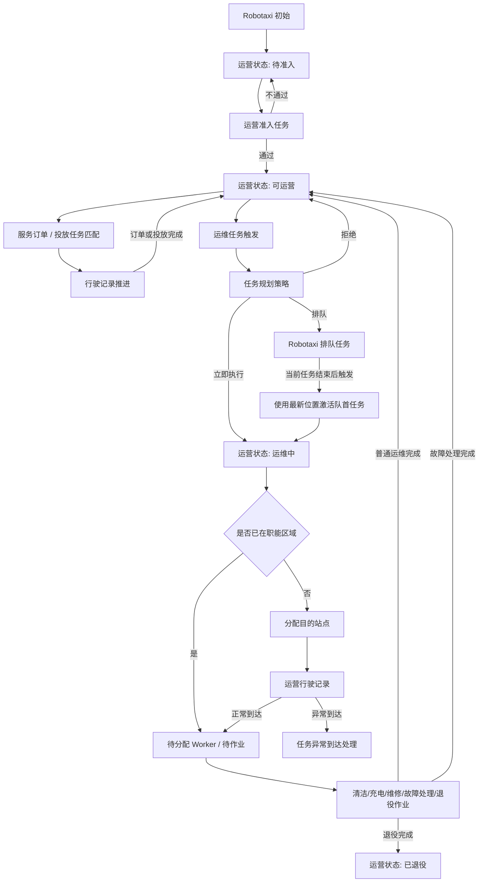
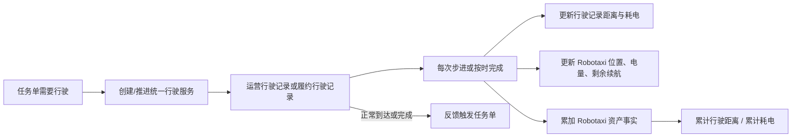

# v040.24 Robotaxi 运营状态与资产事实闭环迭代方案

## 版本判断

本轮规划为 v040 小版本，不升级为新大版本。原因是本轮仍属于 v040 已确立的 Robotaxi 运维闭环、任务规划策略、运营行驶记录和经营分析数据闭环的收口，不改变平台一级业务域。

## 根本边界

- 业务单据生命周期是底层事实，模拟运行是上层时间驱动器。
- Robotaxi 是否可被服务订单、投放任务、运维任务占用，由 Robotaxi 综合状态与任务规划策略判断。
- 运营行驶记录和履约行驶记录负责行驶事实，任何任务需要行驶时只调用统一行驶服务，不把行驶逻辑写成某个任务私有逻辑。
- 模拟运行继续按统一世界时间与工作流时效配置推进，不重新实现业务闭环。

## 已确认问题清单

1. Robotaxi 主运营状态仍混用 `不可运营`、`待运维检查`、`运维状态`、`需要清洁/充电/维修` 等旧容器，导致状态来源不统一。
2. 运维任务触发后仍会写入 `needs_*` 标记，真实任务单和标记重复表达，页面也因此出现重复、英文或不清晰字段。
3. 服务订单、投放任务、运营准入和运维任务使用的 Robotaxi 可分配判断仍存在旧状态判断，需要统一接入任务规划策略。
4. Robotaxi 正在运维中时，新的运维任务应仍可触发并由任务规划策略决定拒绝、排队或重排，而不是直接被运营状态拦截。
5. 排队任务激活时必须使用 Robotaxi 最新位置与综合状态，由任务单判断是否已在对应职能区域；不能重复分配同区域站点和创建无效行驶记录。
6. 运营行驶记录、履约行驶记录行驶过程中应同步更新距离、电量消耗和 Robotaxi 当前位置、电量、累计行驶事实。
7. Robotaxi 管理需要新增资产运营事实：累计行驶距离、累计耗电、已服务订单数、已清洁次数、已充电次数、已维修次数。
8. 运维任务完成后应恢复或更新 Robotaxi 主状态：清洁、充电、维修、故障处理完成均回到可运营；退役完成才进入已退役。
9. 初始 Robotaxi 应为待准入；运营准入通过后才可运营。
10. 字段字典和前端中文展示必须同步，旧字段保留兼容但不作为主要展示和流程依据。

## 目标状态模型

Robotaxi 主运营状态收敛为四类：

- 待准入：初始状态，只能进入运营准入任务。
- 可运营：可参与服务订单、投放任务，也可触发运维任务。
- 运维中：正在被运维/退役类任务接管，不可被服务订单或投放任务匹配，但仍允许新的运维任务进入任务规划策略。
- 已退役：生命周期终态，不再参与任何任务分配。

`不可运营` 不再作为主状态，只作为用户理解上的集合概念：待准入、运维中、已退役都不可被外部运营任务分配。

## 闭环流程图

## 行驶事实闭环

## 迭代计划

1. 建立统一 Robotaxi 状态服务：主状态判断、状态转换、行驶事实累加、完成计数累加。
2. 更新领域默认值和初始化数据：初始状态改为待准入，新增累计行驶与完成次数字段。
3. 更新任务规划策略：准入、外部运营分配、运维任务触发统一使用主状态；运维中仍可进入任务规划策略。
4. 更新运维任务服务：立即执行进入运维中，排队不改变主状态；完成时按任务类型恢复可运营或已退役；旧 `needs_*` 不再作为主流程写入。
5. 更新行驶服务：运营行驶记录与履约行驶记录步进/按时完成时同步距离、电量和 Robotaxi 资产事实。
6. 更新业务动作服务和页面手动动作：调用统一服务后写回同一份 Robotaxi 事实。
7. 更新 Robotaxi 管理展示字段：主状态、当前位置、当前任务、排队任务、累计事实优先；隐藏弱化旧重复状态字段。
8. 同步字段字典文档和前端字段字典，补齐新状态和新字段中文。
9. 增加 v040.24 验证脚本，覆盖状态转换、运维排队、行驶耗电、累计事实、服务订单计数。
10. 编译 bundle，运行提交前检查和浏览器加载验证。

