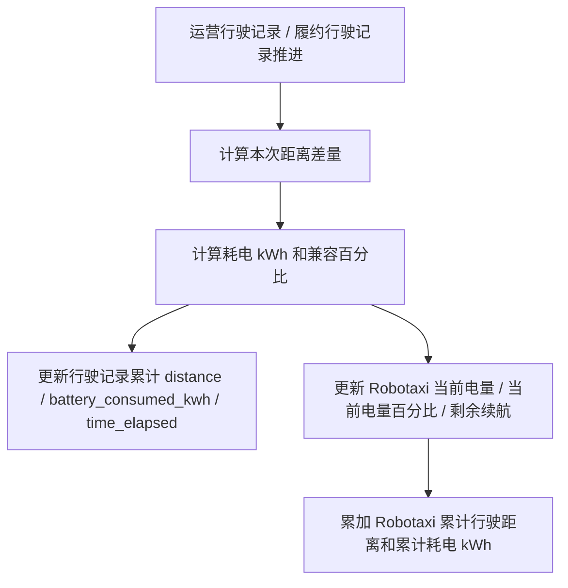
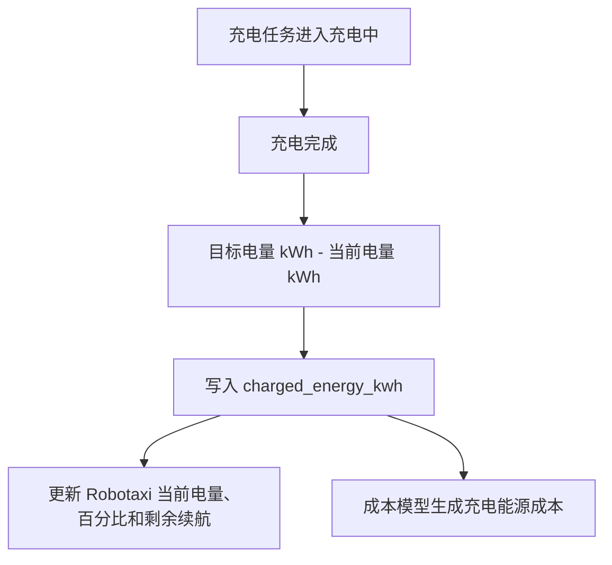
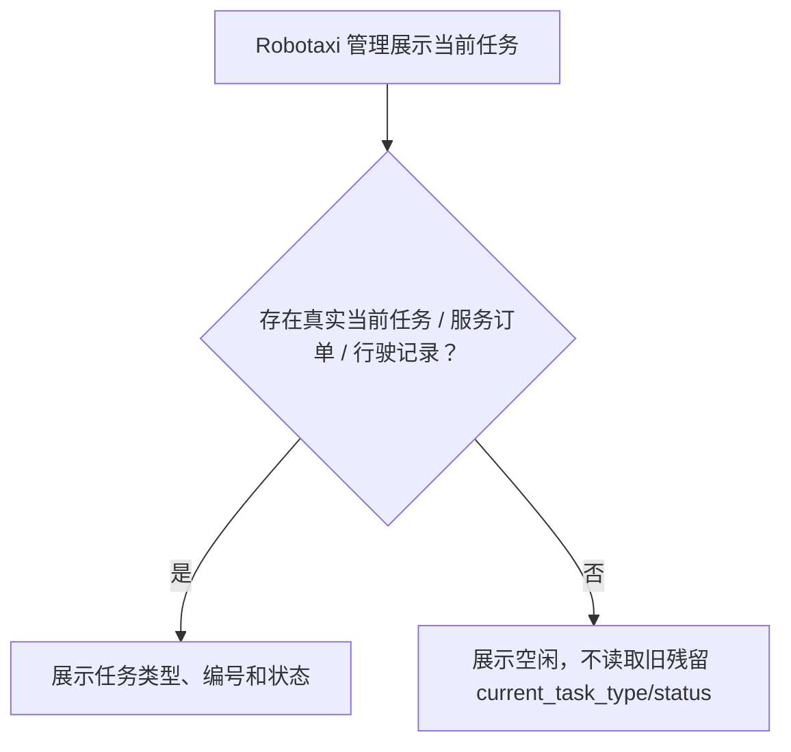

# v040.25 能量事实与当前任务展示闭环归档

## 版本判断

本轮为 v040.25 小版本。它延续 v040.24 的 Robotaxi 主运营状态与资产事实闭环，补齐能量单位、行驶记录字段和当前任务展示一致性，不新增独立业务域。

## 问题与根因

1. 运营行驶记录缺少 `battery_consumed_kwh`，履约行驶记录也主要以百分比表达耗电，无法支撑充电费用和累计耗电。
2. 百分比只能表达当前电池容量比例，不适合作为累计耗电和充电成本的业务事实。
3. Robotaxi 只展示当前电量百分比，缺少总电量、当前电量 kWh、总续航和剩余续航的完整资产事实。
4. `AVAILABLE` 存在旧中文名残留，根因是局部页面或文档绕过字段字典写死中文。
5. Robotaxi 当前任务展示会在找不到真实任务时回退到旧残留字段，导致表格显示“运营投放 / 行驶中”，顶部摘要却显示空闲。

## 业务口径

- 总电量：`battery_capacity_kwh`，Robotaxi 固定能力。
- 总续航：`max_range_km`，Robotaxi 固定能力。
- 当前电量：`current_battery_kwh = battery_capacity_kwh × battery_percent / 100`。
- 当前电量百分比：`battery_percent`，只表达当前剩余比例。
- 当前剩余续航：`estimated_range_km = max_range_km × battery_percent / 100`。
- 行驶已消耗电量：`battery_consumed_kwh = distance_delta_km × energy_consumption_kwh_per_km`，按行驶记录累计。
- 兼容耗电百分比：`battery_consumed_percent = battery_consumed_kwh / battery_capacity_kwh × 100`，仅作为兼容字段。
- 累计耗电：`lifetime_battery_consumed_kwh`，由运营行驶记录和履约行驶记录差量累加。
- 充电补能：`charged_energy_kwh`，由充电任务从充电前当前电量补到目标电量计算，作为充电能源成本依据。

## 流程图

## 执行内容

- `robotaxiStateService` 增加当前电量 kWh、耗电 kWh 和累计耗电 kWh 计算能力，去除把旧累计百分比当 kWh 兜底的错误逻辑。
- `routePlanningService`、`tripService`、`businessActionService` 和 `main.jsx` 行驶推进逻辑同步写入 `battery_consumed_kwh`，并更新 Robotaxi 电量、续航和累计事实。
- `fleetOperationTaskService` 在充电完成时写入 `charged_energy_kwh`，并同步 Robotaxi 当前电量和剩余续航。
- `costModelCalculator` 基于 `battery_consumed_kwh` 计算行驶能源成本，基于 `charged_energy_kwh` 计算充电任务能源成本。
- Robotaxi 管理表格和详情补齐总续航、总电量、当前电量、当前电量百分比、剩余续航、累计行驶、累计耗电和当前任务编号。
- 字段字典代码和文档同步新增 / 调整相关字段中文，`AVAILABLE` 统一为“可运营”，`motion_status` 统一为“运动状态”。
- 当前业务说明文档同步清理旧中文名，避免后续迭代继续引用旧口径。

## 验证结果

- `node scripts/verify-v040-25-energy-and-current-task.mjs` 通过。
- `bash scripts/check-before-commit.sh` 通过。
- `ROBOTAXI_BROWSER_VERIFY_URL=http://127.0.0.1:4173/?verifyBrowserLoad=1 node scripts/verify-browser-load.mjs` 通过。
