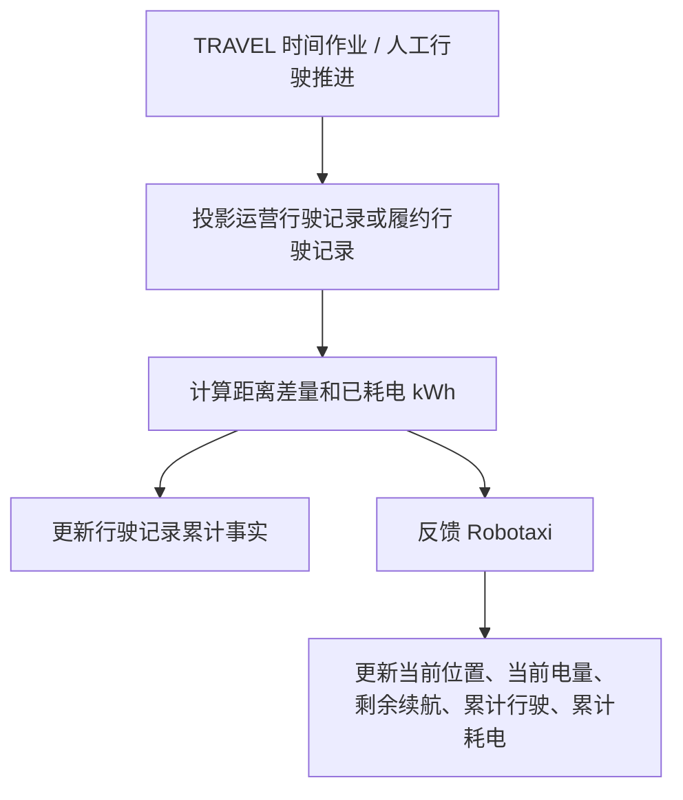
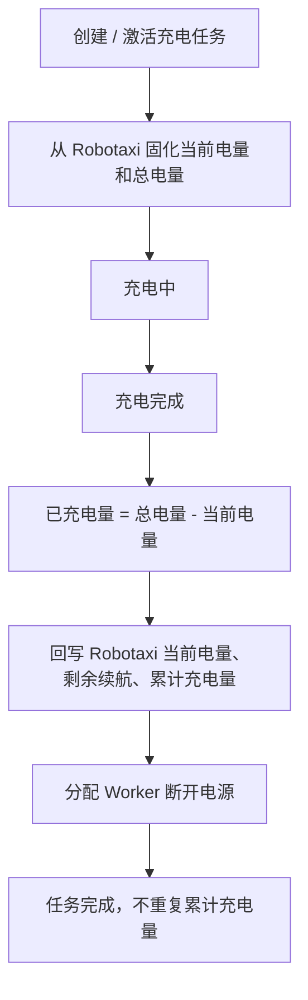

# v040.26 行驶耗电与充电资产台账闭环归档

## 版本判断

本轮为 v040.26 小版本。它延续 v040.25 的能量事实设计，补齐运营行驶投影、模拟运行中的 Robotaxi 资产反馈，以及充电任务到 Robotaxi 累计充电量的台账闭环。

## 业务结论

- 行驶过程不是等单据完成才更新 Robotaxi；每次行驶推进或模拟投影产生距离 / 耗电差量时，就应反馈 Robotaxi。
- 单据完成仍负责完成态事实，例如服务订单数、清洁次数、充电次数、维修次数。
- 充电任务创建或激活时应固化 Robotaxi 当前电量和总电量；充电完成时计算已充电量，并只累计一次到 Robotaxi。
- 模拟运行只调度时间作业和调用业务服务，不单独实现 Robotaxi 资产台账。

## 流程图

## 执行内容

- `routePlanningService.projectRouteExecutionTravelProgress` 增加 `battery_consumed_kwh` 投影，运营行驶记录在模拟进度中也能显示“已耗电（千瓦时）”。
- `simulationLoop` 在 TRAVEL 时间作业快照 / 到期投影时，使用行驶记录差量调用 Robotaxi 状态服务，更新 Robotaxi 资产事实。
- `robotaxiStateService` 增加 `applyChargingDelta` 和按电量百分比统一推导剩余续航的能力。
- `fleetOperationTaskService` 在充电任务创建、排队激活和充电完成阶段固化并更新当前电量、总电量、已充电量和 Robotaxi 累计充电量。
- Robotaxi 列表与详情新增“累计充电量（千瓦时）”；充电任务列表与详情新增“当前电量（千瓦时）”“总电量（千瓦时）”“已充电量（千瓦时）”。
- 字段字典代码版和文档版同步新增字段，并将 `battery_consumed_kwh` 中文改为“已耗电（千瓦时）”。

## 验证结果

- `node scripts/verify-v040-26-travel-charging-ledger.mjs` 通过。
- `node scripts/verify-v040-25-energy-and-current-task.mjs` 通过。
- `bash scripts/check-before-commit.sh` 通过。
- `ROBOTAXI_BROWSER_VERIFY_URL=http://127.0.0.1:4173/?verifyBrowserLoad=1 node scripts/verify-browser-load.mjs` 通过。
