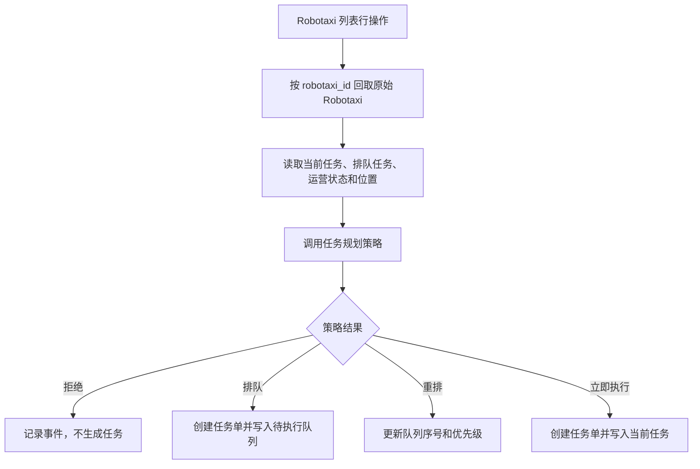
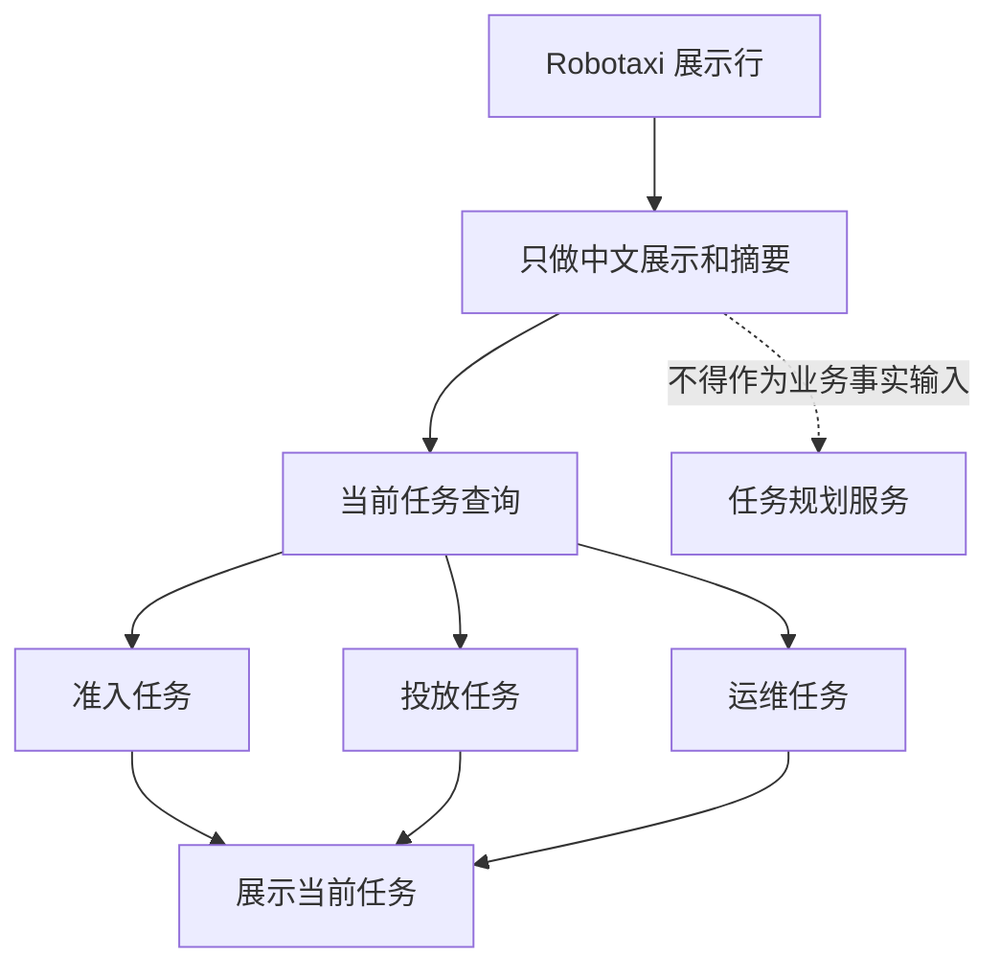

# v040.27 Robotaxi 任务规划展示输入源修复归档

## 版本判断

本轮为 v040.27 小版本。它不重写任务规划策略，也不改模拟运行主路径，只修复 Robotaxi 管理页面展示层与业务任务规划输入源之间的边界回归。

## 问题汇总

- 菜单显示“Robotaxi 列表”，打开后的页签却显示“Robotaxi 管理”，页面命名来源不一致。
- Robotaxi 触发清洁、充电、维修等运维任务后，Robotaxi 已进入运维中，但当前任务和排队任务在页面上消失。
- 行操作使用表格展示行作为业务输入。展示行此前没有识别运维任务，会把 `current_task_id`、`current_task_type`、`current_task_status` 展示为缺失，后续再次触发任务时可能误导任务规划判断。
- 核心结构必须保持：Robotaxi 综合状态 + 任务规划策略决定拒绝、排队、重排优先级或立即执行。

## 根因

- `getPageLabel` 优先读取 `tableConfig.title`，而不是菜单中文名，导致菜单和页签命名冲突。
- `enrichRobotaxiForDisplay` 和详情补全当前任务时只查运营准入任务和运营投放任务，漏掉运维任务集合。
- Robotaxi 行操作把展示层对象直接传入任务规划服务。展示层对象是 UI 派生数据，不能作为 Robotaxi 综合状态事实来源。

## 修复方案

- 页面页签名称优先读取菜单中文名，`tableConfig.title` 只作为兜底。
- Robotaxi 列表和详情统一把全部运维任务传入当前任务查询，保证清洁、充电、维修、故障、退役任务都能被识别。
- Robotaxi 运维任务创建入口和可触发动作入口按 `robotaxi_id` 回取 `data.robotaxis` 中的原始 Robotaxi，再调用任务规划策略。
- 新增合同验证，防止后续再把展示对象当业务事实输入。

## 流程图

## 验证结果

- `node scripts/verify-v040-25-energy-and-current-task.mjs` 通过，确认当前任务展示未重新依赖旧残留字段。
- `node scripts/verify-v040-27-robotaxi-planning-display-source.mjs` 通过，验证页签中文名、运维当前任务展示接入、原始 Robotaxi 输入源和排队序号合同。
- `bash scripts/check-before-commit.sh` 通过。
- `ROBOTAXI_BROWSER_VERIFY_URL=http://127.0.0.1:4173/?verifyBrowserLoad=1 node scripts/verify-browser-load.mjs` 通过。
