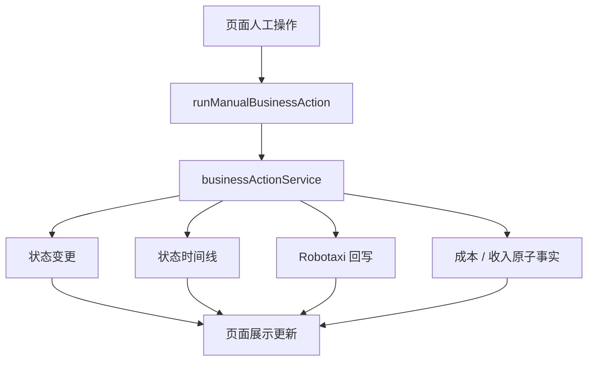
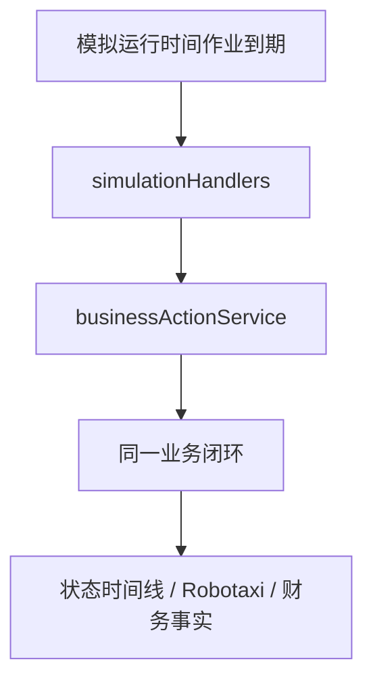
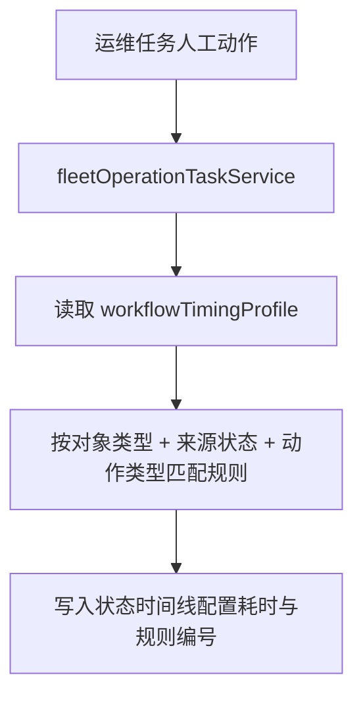

# v040.28 业务单据底层闭环修复归档

## 版本判断

本轮为 v040.28 小版本。目标是把早期业务单据的人工操作收敛到服务层闭环，并补齐运维任务作业时效配置。模拟运行仍作为上层时间调度能力，不新增模拟主路径，不改变高倍速运行策略。

## 问题根源

- 运营准入、运营投放、服务订单和履约行驶属于较早实现的底层业务单据，部分页面按钮仍直接拼装状态、Trip、运营行驶记录或结算结果。
- 后续运维任务已经逐步沉淀了状态时间线和增量成本事实，但早期单据没有完全反向接入同一服务能力，造成“新旧单据闭环标准不一致”。
- 运维任务清洁、充电、维修、故障处理和退役的人工动作存在固定作业时长，未完整进入工作流时效配置。
- 履约行驶记录缺少“自动到达”入口，用户只能逐步点击继续行驶；而运营行驶记录已经具备自动到达能力。

## 业务边界

- 业务单据生命周期是底层事实来源。人工点击、策略触发、真实时间自动化和模拟运行都应调用同一业务服务。
- 模拟运行只维护统一时间、调度到期动作并调用业务服务；不在模拟循环中补造状态时间线、成本、收入或业务状态。
- 本轮不扩大新增业务对象接入模拟主扫描路径，只修复已存在的底层闭环和人工入口。

## 流程图

## 执行内容

- `src/main.jsx` 增加人工业务动作统一入口，页面只调用 `businessActionService` 并应用服务返回的业务集合更新。
- 服务订单人工匹配、创建履约行驶、结算、支付改为服务层闭环。
- Trip 继续行驶改为服务层推进，并新增自动到达行操作。
- 运营投放关联的运营行驶记录路径规划、继续行驶、自动到达和正常到达改为服务层闭环；异常到达和异常重规划保留原有分支，降低本轮风险。
- `fleetOperationTaskService` 状态时间线接入 `workflowTimingProfile`，动作耗时优先来自工作流时效配置。
- `workflowTransitionRegistry` 新增清洁、充电、维修、故障处理和退役作业动作规则。
- `businessActionService.executeOrderMatching` 补齐任务规划执行和结果编号生成。
- 字段字典代码版和文档版同步新增运维工作流状态边编号中文展示。

## 验证结果

- `node scripts/verify-v040-28-business-document-closure.mjs` 通过。
- `bash scripts/check-before-commit.sh` 通过。
- `ROBOTAXI_BROWSER_VERIFY_URL=http://127.0.0.1:4173/?verifyBrowserLoad=1 node scripts/verify-browser-load.mjs` 通过。
